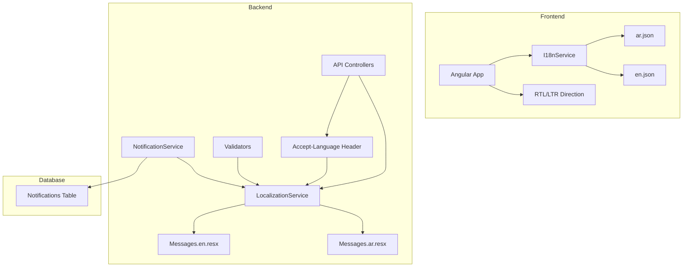

# Arabic Language Support Implementation Plan

## Current State Analysis

### Frontend (Angular) - ✅ Well Implemented
The frontend already has excellent Arabic language support:

| Component | Status | Details |
|-----------|--------|---------|
| Translation Files | ✅ Complete | [`ar.json`](construction-cms/src/assets/i18n/ar.json) and [`en.json`](construction-cms/src/assets/i18n/en.json) exist |
| I18n Service | ✅ Complete | [`I18nService`](construction-cms/src/app/core/i18n/i18n.service.ts) with RTL support |
| Default Language | ✅ Arabic | Default is set to Arabic (`'ar'`) |
| RTL Support | ✅ Complete | `updateDocumentDirection()` handles RTL/LTR |
| Language Switcher | ✅ Complete | Component exists for switching languages |
| Translation Usage | ✅ Widespread | `TranslateModule` used across components |

### Backend (.NET) - ❌ Needs Implementation
The backend lacks localization infrastructure:

| Component | Status | Issue |
|-----------|--------|-------|
| Localization Middleware | ❌ Missing | No request localization configured |
| Resource Files | ❌ Missing | No `.resx` files for translations |
| Notification Messages | ⚠️ Mixed | Some Arabic, some English hardcoded |
| Validation Messages | ⚠️ Mixed | Some Arabic, some English |
| API Error Messages | ❌ English | Most error messages in English |

---

## Implementation Plan

### Phase 1: Backend Localization Infrastructure

#### 1.1 Add Localization Services
**File:** `src/ConstructionManagement.WebApi/Program.cs`

```csharp
// Add localization services
builder.Services.AddLocalization(options => options.ResourcesPath = "Resources");

// Configure supported cultures
var supportedCultures = new[]
{
    new CultureInfo("ar"),
    new CultureInfo("en")
};

builder.Services.Configure<RequestLocalizationOptions>(options =>
{
    options.DefaultRequestCulture = new RequestCulture("ar");
    options.SupportedCultures = supportedCultures;
    options.SupportedUICultures = supportedCultures;
    
    // Allow language from Accept-Language header or custom header
    options.RequestCultureProviders.Insert(0, new CustomRequestCultureProvider(context =>
    {
        var langHeader = context.Request.Headers["Accept-Language"].FirstOrDefault();
        if (!string.IsNullOrEmpty(langHeader))
        {
            if (langHeader.StartsWith("ar")) return Task.FromResult(new ProviderCultureResult("ar"));
            if (langHeader.StartsWith("en")) return Task.FromResult(new ProviderCultureResult("en"));
        }
        return Task.FromResult<ProviderCultureResult>(null);
    }));
});
```

#### 1.2 Create Resource Files
**Directory:** `src/ConstructionManagement.Infrastructure/Resources/`

Create the following resource files:
- `Messages.ar.resx` - Arabic translations
- `Messages.en.resx` - English translations

#### 1.3 Create Localization Service
**File:** `src/ConstructionManagement.Application/Interfaces/ILocalizationService.cs`

```csharp
public interface ILocalizationService
{
    string this[string key] { get; }
    string GetString(string key, params object[] args);
    string GetNotificationTitle(NotificationType type);
    string GetNotificationMessage(string templateKey, params object[] args);
}
```

### Phase 2: Notification Templates

#### 2.1 Notification Template Keys
Create standardized notification template keys:

| Key | Arabic | English |
|-----|--------|---------|
| `Notification.New` | إشعار جديد | New Notification |
| `Notification.BudgetOverrun` | تجاوز الميزانية | Budget Overrun |
| `Notification.BudgetWarning` | تحذير: اقتراب من الميزانية | Budget Warning |
| `Notification.ProjectDelay` | تأخر المشروع | Project Delay |
| `Notification.ItemDelay` | تأخر البند | Item Delay |
| `Notification.ApprovalRequired` | موافقة مطلوبة | Approval Required |
| `Notification.ApprovalGranted` | تمت الموافقة | Approval Granted |
| `Notification.ApprovalRejected` | تم الرفض | Approval Rejected |
| `Notification.PaymentReceived` | تم استلام الدفعة | Payment Received |
| `Notification.MilestoneAchieved` | تحقيق مرحلة مهمة | Milestone Achieved |
| `Notification.Escalation` | تصعيد | Escalation |

#### 2.2 Update NotificationService
**File:** `src/ConstructionManagement.Infrastructure/Services/NotificationService.cs`

Update to use localized messages:

```csharp
public class NotificationService : INotificationService
{
    private readonly ILocalizationService _localization;
    
    public async Task SendAsync(int userId, string messageKey, params object[] args)
    {
        var message = _localization.GetString(messageKey, args);
        var title = _localization["Notification.New"];
        await CreateAndSendAsync(userId, title, message);
    }
}
```

### Phase 3: Validation Messages

#### 3.1 Create Validation Resource Files
**File:** `src/ConstructionManagement.Infrastructure/Resources/Validations.ar.resx`

| Key | Arabic Value |
|-----|--------------|
| Required | هذا الحقل مطلوب |
| Email | البريد الإلكتروني غير صالح |
| MinLength | يجب أن يكون الحد الأدنى {0} أحرف |
| MaxLength | يجب ألا يتجاوز {0} حرف |
| Range | يجب أن تكون القيمة بين {0} و {1} |
| Numeric | يجب أن يكون رقماً |

#### 3.2 Update Validators
Update FluentValidation validators to use localized messages:

```csharp
public class UpdateCompanySettingsRequestValidator : AbstractValidator<UpdateCompanySettingsRequest>
{
    public UpdateCompanySettingsRequestValidator(ILocalizationService localization)
    {
        RuleFor(x => x.DelayNotificationIntervalDays)
            .GreaterThanOrEqualTo(1).When(x => x.DelayNotificationIntervalDays.HasValue)
            .WithMessage(localization["Validation.MinInterval"]);
    }
}
```

### Phase 4: API Response Messages

#### 4.1 Standardize API Messages
Create consistent response messages:

| Key | Arabic | English |
|-----|--------|---------|
| `Api.Success` | تمت العملية بنجاح | Operation completed successfully |
| `Api.Error` | حدث خطأ | An error occurred |
| `Api.NotFound` | غير موجود | Not found |
| `Api.Unauthorized` | غير مصرح | Unauthorized |
| `Api.Forbidden` | محظور | Forbidden |
| `Api.ValidationError` | خطأ في البيانات | Validation error |

### Phase 5: Frontend Enhancements

#### 5.1 Verify Translation Completeness
Audit all translation keys in `ar.json` to ensure:
- All UI labels are translated
- All error messages are translated
- All notification messages are translated
- All validation messages are translated

#### 5.2 Add Missing Worker HR Module Translations
Add translations for the new Worker Documents & HR Module:

```json
{
  "worker_documents": {
    "title": "مستندات العامل",
    "upload": "رفع مستند",
    "my_documents": "مستنداتي",
    "contract": "عقد العمل",
    "id_copy": "صورة الهوية",
    "work_permit": "تصريح العمل",
    "safety_certificate": "شهادة السلامة",
    "medical_certificate": "الشهادة الطبية",
    "training_certificate": "شهادة التدريب",
    "performance_review": "تقييم الأداء",
    "warning": "إنذار",
    "payslip": "كشف راتب"
  },
  "worker_hr": {
    "title": "الموارد البشرية",
    "profile": "الملف الشخصي",
    "attendance": "الحضور والانصراف",
    "leave": "الإجازات",
    "payroll": "كشوف المرتبات",
    "skills": "المهارات",
    "certifications": "الشهادات",
    "performance": "تقييم الأداء",
    "safety_records": "سجلات السلامة"
  }
}
```

---

## Files to Create/Modify

### New Files
| File | Purpose |
|------|---------|
| `src/ConstructionManagement.Infrastructure/Resources/Messages.ar.resx` | Arabic message translations |
| `src/ConstructionManagement.Infrastructure/Resources/Messages.en.resx` | English message translations |
| `src/ConstructionManagement.Infrastructure/Resources/Validations.ar.resx` | Arabic validation messages |
| `src/ConstructionManagement.Infrastructure/Resources/Validations.en.resx` | English validation messages |
| `src/ConstructionManagement.Application/Interfaces/ILocalizationService.cs` | Localization service interface |
| `src/ConstructionManagement.Infrastructure/Services/LocalizationService.cs` | Localization service implementation |

### Files to Modify
| File | Changes |
|------|---------|
| `src/ConstructionManagement.WebApi/Program.cs` | Add localization middleware |
| `src/ConstructionManagement.Infrastructure/Services/NotificationService.cs` | Use localized messages |
| `src/ConstructionManagement.Infrastructure/Services/ProjectTransactionService.cs` | Use localized budget messages |
| `src/ConstructionManagement.Infrastructure/Services/ProjectDelayEscalationService.cs` | Use localized delay messages |
| `src/ConstructionManagement.Application/Validators/*.cs` | Use localized validation messages |
| `construction-cms/src/assets/i18n/ar.json` | Add missing translations |
| `construction-cms/src/assets/i18n/en.json` | Add missing translations |

---

## Implementation Priority

1. **High Priority** - Backend notification localization (most visible to users)
2. **High Priority** - Validation message localization
3. **Medium Priority** - API response message localization
4. **Medium Priority** - Frontend translation audit
5. **Low Priority** - Worker HR Module translations (new feature)

---

## Testing Checklist

- [ ] Verify Arabic is default language on fresh load
- [ ] Test language switcher functionality
- [ ] Verify RTL layout on all pages
- [ ] Test notifications appear in Arabic
- [ ] Test validation messages in Arabic
- [ ] Test API error messages in Arabic
- [ ] Test with `Accept-Language: en` header (should show English)
- [ ] Test with `Accept-Language: ar` header (should show Arabic)

---

## Architecture Diagram



---

## Next Steps

1. **Approve this plan** - Review and confirm the approach
2. **Switch to Code mode** - Implement the backend localization infrastructure
3. **Create resource files** - Add Arabic and English translations
4. **Update services** - Modify NotificationService and validators
5. **Test thoroughly** - Verify all messages appear in Arabic
