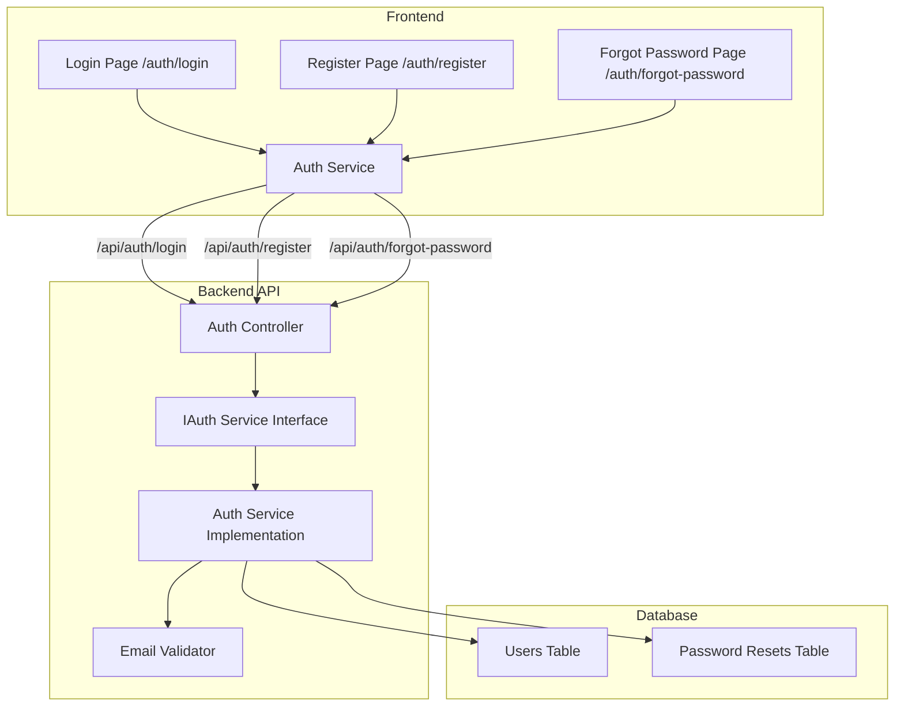

# Authentication System Implementation Plan

## Overview
Create a complete authentication system for employees/admins with Login, Register, and Forgot Password functionality. Includes email validation features.

## Architecture Diagram



## Implementation Steps

### Backend Changes

#### 1. New DTOs Needed
- **ForgotPasswordRequest.cs** - For password reset requests
- **ResetPasswordRequest.cs** - For setting new password with token
- **EmailVerificationRequest.cs** - For email verification

#### 2. IAuthService Interface Updates
```csharp
// Add to IAuthService.cs
Task<AuthResponse> RegisterAsync(RegisterRequest request);
Task<ForgotPasswordResponse> ForgotPasswordAsync(ForgotPasswordRequest request);
Task<ResetPasswordResponse> ResetPasswordAsync(ResetPasswordRequest request);
Task<bool> VerifyEmailAsync(string token);
Task<AuthResponse> ResendVerificationEmailAsync(string email);
```

#### 3. AuthController Updates
```csharp
// Add endpoints to AuthController.cs
[HttpPost("register")]
public async Task<IActionResult> Register([FromBody] RegisterRequest request)

[HttpPost("forgot-password")]
public async Task<IActionResult> ForgotPassword([FromBody] ForgotPasswordRequest request)

[HttpPost("reset-password")]
public async Task<IActionResult> ResetPassword([FromBody] ResetPasswordRequest request)

[HttpPost("verify-email")]
public async Task<IActionResult> VerifyEmail([FromBody] EmailVerificationRequest request)

[HttpPost("resend-verification")]
public async Task<IActionResult> ResendVerification([FromBody] ResendVerificationRequest request)
```

#### 4. Email Validation Features
- **Email format validation** - Validate email format using regex
- **Email uniqueness check** - Check if email already exists
- **Email domain validation** - Optional: restrict to specific domains
- **Email verification token** - Generate and send verification token
- **Email sending service** - Integration with email provider (SMTP/SendGrid/etc.)

### Frontend Changes

#### 1. New Files to Create
- **auth.service.ts** - Angular service for auth API calls
- **login.component.ts** - Login page with email validation
- **register.component.ts** - Registration page with real-time validation
- **forgot-password.component.ts** - Password recovery page
- **auth.routes.ts** - Lazy loaded auth routes

#### 2. Routes Structure
```
/auth/login         - Login page (default for unauthenticated)
/auth/register      - Registration page
/auth/forgot-password - Password recovery
/auth/verify-email  - Email verification page
```

#### 3. Frontend Email Validation Features
- Real-time email format validation
- Password strength indicator
- Password match validation
- Email availability check (async)
- Input sanitization
- Error message localization

### API Endpoints

| Method | Endpoint | Description |
|--------|----------|-------------|
| POST | /api/auth/login | User login |
| POST | /api/auth/register | User registration (with verification email) |
| POST | /api/auth/forgot-password | Request password reset |
| POST | /api/auth/reset-password | Reset password with token |
| POST | /api/auth/verify-email | Verify email with token |
| POST | /api/auth/resend-verification | Resend verification email |

### Validation Rules

#### Registration Validation
```csharp
// Backend validation rules
- FullName: Required, 2-100 characters
- Email: Required, valid email format, unique
- Password: Required, 8+ chars, 1 uppercase, 1 lowercase, 1 number, 1 special char
- Phone: Optional, valid phone format
```

#### Login Validation
```csharp
// Backend validation rules
- Email: Required, valid email format
- Password: Required
```

#### Password Reset Validation
```csharp
// Backend validation rules
- Token: Required, valid format
- NewPassword: Required, same rules as registration
- ConfirmPassword: Must match NewPassword
```

## Files to Create/Modify

### Backend
1. Create: `src/ConstructionManagement.Application/DTOs/ForgotPasswordRequest.cs`
2. Create: `src/ConstructionManagement.Application/DTOs/ResetPasswordRequest.cs`
3. Create: `src/ConstructionManagement.Application/DTOs/EmailVerificationRequest.cs`
4. Modify: `src/ConstructionManagement.Application/Interfaces/IAuthService.cs`
5. Modify: `src/ConstructionManagement.WebApi/Controllers/AuthController.cs`
6. Implement in service layer (existing AuthService)

### Frontend
1. Create: `construction-cms/src/app/core/services/auth.service.ts`
2. Create: `construction-cms/src/app/features/auth/login/login.component.ts`
3. Create: `construction-cms/src/app/features/auth/register/register.component.ts`
4. Create: `construction-cms/src/app/features/auth/forgot-password/forgot-password.component.ts`
5. Create: `construction-cms/src/app/features/auth/verify-email/verify-email.component.ts`
6. Create: `construction-cms/src/app/features/auth/auth.routes.ts`
7. Modify: `construction-cms/src/app/app.routes.ts`
8. Modify: `construction-cms/public/assets/i18n/en.json`
9. Modify: `construction-cms/public/assets/i18n/ar.json`
10. Add styles to: `construction-cms/src/app/app.scss`

## Success Criteria
- [ ] Login page accessible at `/auth/login`
- [ ] Registration page accessible at `/auth/register` with real-time validation
- [ ] Forgot password page accessible at `/auth/forgot-password`
- [ ] Email verification flow implemented
- [ ] All API endpoints return proper validation errors
- [ ] Password strength indicator on registration
- [ ] i18n support for English and Arabic
- [ ] Responsive design with modern UI

## Email Validation Implementation Details

### Backend Email Validator
```csharp
public class EmailValidator
{
    public bool IsValidEmail(string email)
    {
        // RFC 5322 compliant regex
        var regex = new Regex(@"^[^@\s]+@[^@\s]+\.[^@\s]+$");
        return regex.IsMatch(email);
    }
    
    public bool IsEmailUnique(string email)
    {
        // Check database for existing user
    }
    
    public bool IsDomainAllowed(string email)
    {
        // Optional: Check against allowed domains
    }
}
```

### Frontend Email Validation
```typescript
// Real-time validation in register component
validateEmail(email: string): Observable<ValidationResult> {
    return this.authService.checkEmailAvailability(email).pipe(
        map(available => {
            if (!this.emailValidator.isValidFormat(email)) {
                return { valid: false, message: 'Invalid email format' };
            }
            if (!available) {
                return { valid: false, message: 'Email already registered' };
            }
            return { valid: true };
        })
    );
}
```

### Password Strength Meter
```typescript
// Password strength levels
type PasswordStrength = 'weak' | 'fair' | 'good' | 'strong';

// Criteria
const hasLowerCase = /[a-z]/.test(password);
const hasUpperCase = /[A-Z]/.test(password);
const hasNumbers = /\d/.test(password);
const hasSpecialChars = /[!@#$%^&*(),.?":{}|<>]/.test(password);
const hasMinLength = password.length >= 8;
```
