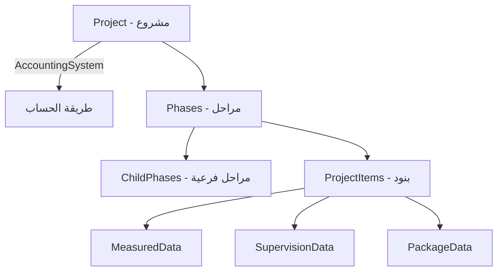

# خطة إعادة تسمية BOQ إلى ProjectItem

## نظرة عامة

### الهيكل الحالي
```
Project (مشروع)
├── Phases (مراحل) - Phase[]
│   ├── ChildPhases (مراحل فرعية)
│   └── Items (بنود) - BOQItem[]
└── BOQItems (بنود مباشرة) - BOQItem[] ❌ تكرار غير مطلوب
```

### الهيكل المستهدف
```
Project (مشروع)
└── Phases (مراحل) - Phase[]
    ├── ChildPhases (مراحل فرعية)
    └── Items (بنود) - ProjectItem[]
```

## التغييرات المطلوبة

### 1. إعادة التسمية (Rename)

| الاسم القديم | الاسم الجديد | الوصف |
|-------------|-------------|-------|
| `BOQItem` | `ProjectItem` | البند الأساسي في المشروع |
| `BOQItems` | `ProjectItems` | مجموعة البنود |
| `BOQMeasured` | `ProjectItemMeasured` | بيانات البند المقاس |
| `BOQSupervision` | `ProjectItemSupervision` | بيانات البند بالإشراف |
| `BOQPackage` | `ProjectItemPackage` | بيانات البند الباكج |
| `BOQExecutedDelta` | `ProjectItemExecutedDelta` | تغييرات الكمية المنفذة |
| `BOQProfitabilityLog` | `ProjectItemProfitabilityLog` | سجل ربحية البند |
| `BOQItemNote` | `ProjectItemNote` | ملاحظات البند |
| `IBOQItemRepository` | `IProjectItemRepository` | واجهة المستودع |
| `BOQItemRepository` | `ProjectItemRepository` | المستودع |
| `IBOQItemService` | `IProjectItemService` | واجهة الخدمة |
| `BOQItemService` | `ProjectItemService` | الخدمة |
| `BOQItemsController` | `ProjectItemsController` | وحدة التحكم |
| `BOQProgressAggregationJob` | `ProjectItemProgressAggregationJob` | مهمة الخلفية |
| `BOQService` | `ProjectItemService` | خدمة الفرونت إند |
| `enableBOQManagement` | `enableProjectItemsManagement` | إعداد تفعيل إدارة البنود |
| `clientCanSeeBOQ` | `clientCanSeeProjectItems` | إعداد رؤية العميل للبنود |
| `maxBOQItems` | `maxProjectItems` | الحد الأقصى للبنود |

### 2. إزالة التكرار (Cleanup)

#### في `Project.cs`
```csharp
// ❌ إزالة هذه المجموعة - البنود يجب أن تكون تحت المراحل فقط
public virtual ICollection<BOQItem> BOQItems { get; set; } = new List<BOQItem>();
```

#### في `ProjectItem.cs` (الجديد)
```csharp
// الاحتفاظ بـ ProjectId للتوافق مع الاستعلامات المباشرة
// لكن البند يجب أن يكون مرتبطاً بمرحلة
public int ProjectId { get; set; }
public int? PhaseId { get; set; } // يفضل أن يكون إلزامياً في المستقبل
```

---

## الملفات المتأثرة في الباكند

### Domain Entities
- [ ] `src/ConstructionManagement.Domain/Entities/BOQItem.cs` → `ProjectItem.cs`
- [ ] `src/ConstructionManagement.Domain/Entities/BOQMeasured.cs` → `ProjectItemMeasured.cs`
- [ ] `src/ConstructionManagement.Domain/Entities/BOQSupervision.cs` → `ProjectItemSupervision.cs`
- [ ] `src/ConstructionManagement.Domain/Entities/BOQPackage.cs` → `ProjectItemPackage.cs`
- [ ] `src/ConstructionManagement.Domain/Entities/BOQExecutedDelta.cs` → `ProjectItemExecutedDelta.cs`
- [ ] `src/ConstructionManagement.Domain/Entities/BOQProfitabilityLog.cs` → `ProjectItemProfitabilityLog.cs`
- [ ] `src/ConstructionManagement.Domain/Entities/BOQItemNote.cs` → `ProjectItemNote.cs`
- [ ] `src/ConstructionManagement.Domain/Entities/Project.cs` - إزالة `BOQItems` collection

### Application Layer
- [ ] `src/ConstructionManagement.Application/DTOs/BOQItemDto.cs` → `ProjectItemDto.cs`
- [ ] `src/ConstructionManagement.Application/DTOs/CreateBOQItemRequest.cs` → `CreateProjectItemRequest.cs`
- [ ] `src/ConstructionManagement.Application/DTOs/UpdateBOQItemRequest.cs` → `UpdateProjectItemRequest.cs`
- [ ] `src/ConstructionManagement.Application/Interfaces/IBOQItemService.cs` → `IProjectItemService.cs`

### Infrastructure Layer
- [ ] `src/ConstructionManagement.Infrastructure/Services/BOQItemService.cs` → `ProjectItemService.cs`
- [ ] `src/ConstructionManagement.Infrastructure/Persistence/Repositories/Interfaces/IBOQItemRepository.cs` → `IProjectItemRepository.cs`
- [ ] `src/ConstructionManagement.Infrastructure/Persistence/Repositories/BOQItemRepository.cs` → `ProjectItemRepository.cs`
- [ ] `src/ConstructionManagement.Infrastructure/Services/PhaseService.cs` - تحديث المراجع
- [ ] `src/ConstructionManagement.Infrastructure/Services/ProjectTransactionService.cs` - تحديث المراجع
- [ ] `src/ConstructionManagement.Infrastructure/Services/InvoiceService.cs` - تحديث المراجع
- [ ] `src/ConstructionManagement.Infrastructure/Services/DailyLogService.cs` - تحديث المراجع
- [ ] `src/ConstructionManagement.Infrastructure/Services/SiteMediaService.cs` - تحديث المراجع
- [ ] `src/ConstructionManagement.Infrastructure/Services/ProjectDelayEscalationService.cs` - تحديث المراجع
- [ ] `src/ConstructionManagement.Infrastructure/Services/ProjectApprovalRuleService.cs` - تحديث المراجع
- [ ] `src/ConstructionManagement.Infrastructure/Services/ClientPortalService.cs` - تحديث المراجع
- [ ] `src/ConstructionManagement.Infrastructure/Services/CompanyRequestService.cs` - تحديث المراجع
- [ ] `src/ConstructionManagement.Infrastructure/Services/ProjectSettingsService.cs` - تحديث المراجع
- [ ] `src/ConstructionManagement.Infrastructure/Jobs/BOQProgressAggregationJob.cs` → `ProjectItemProgressAggregationJob.cs`

### WebAPI Layer
- [ ] `src/ConstructionManagement.WebApi/Controllers/BOQItemsController.cs` → `ProjectItemsController.cs`
- [ ] `src/ConstructionManagement.WebApi/Controllers/CompaniesController.cs` - تحديث المراجع
- [ ] `src/ConstructionManagement.WebApi/Controllers/CompanySettingsController.cs` - تحديث المراجع
- [ ] `src/ConstructionManagement.WebApi/Controllers/TransactionsController.cs` - تحديث المراجع
- [ ] `src/ConstructionManagement.WebApi/Controllers/ProfitabilityController.cs` - تحديث المراجع
- [ ] `src/ConstructionManagement.WebApi/Controllers/InventoryController.cs` - تحديث المراجع
- [ ] `src/ConstructionManagement.WebApi/Program.cs` - تحديث تسجيل الخدمات

### Database Migrations
- [ ] إنشاء Migration لإعادة تسمية الجداول:
  - `BOQItems` → `ProjectItems`
  - `BOQMeasured` → `ProjectItemMeasured`
  - `BOQSupervision` → `ProjectItemSupervision`
  - `BOQPackages` → `ProjectItemPackages`
  - `BOQExecutedDeltas` → `ProjectItemExecutedDeltas`
  - `BOQProfitabilityLogs` → `ProjectItemProfitabilityLogs`
  - `BOQItemNotes` → `ProjectItemNotes`
- [ ] إعادة تسمية الأعمدة:
  - `BOQItemId` → `ProjectItemId`
  - `EnableBOQManagement` → `EnableProjectItemsManagement`
  - `ClientCanSeeBOQ` → `ClientCanSeeProjectItems`
  - `MaxBOQItems` → `MaxProjectItems`

---

## الملفات المتأثرة في الفرونت إند

### Services
- [ ] `construction-cms/src/app/core/services/boq.service.ts` → `project-item.service.ts`
- [ ] `construction-cms/src/app/core/services/transactions.service.ts` - تحديث المراجع
- [ ] `construction-cms/src/app/core/services/profitability.service.ts` - تحديث المراجع
- [ ] `construction-cms/src/app/core/services/companies.service.ts` - تحديث المراجع
- [ ] `construction-cms/src/app/core/services/settings.service.ts` - تحديث المراجع
- [ ] `construction-cms/src/app/core/mock/mock-data.service.ts` - تحديث المراجع

### Interfaces
- [ ] `construction-cms/src/app/shared/interfaces.ts` - تحديث:
  - `BOQItem` → `ProjectItem`
  - `CreateBOQItemRequest` → `CreateProjectItemRequest`
  - `UpdateBOQItemRequest` → `UpdateProjectItemRequest`
  - `enableBOQManagement` → `enableProjectItemsManagement`
  - `clientCanSeeBOQ` → `clientCanSeeProjectItems`
  - `maxBOQItems` → `maxProjectItems`

### Components
- [ ] `construction-cms/src/app/features/admin/projects/boq-items/boq-items.component.ts` → `project-items.component.ts`
- [ ] `construction-cms/src/app/features/admin/projects/project-detail/project-detail.component.ts` - تحديث المراجع
- [ ] `construction-cms/src/app/features/admin/projects/daily-logs/daily-logs.component.ts` - تحديث المراجع
- [ ] `construction-cms/src/app/features/admin/projects/project-settings/project-settings.component.ts` - تحديث المراجع
- [ ] `construction-cms/src/app/features/admin/project-hierarchy/boq-progress-node.component.ts` → `project-item-progress-node.component.ts`
- [ ] `construction-cms/src/app/features/admin/media/site-media-upload/site-media-upload.component.ts` - تحديث المراجع
- [ ] `construction-cms/src/app/features/admin/media/media-gallery/media-gallery.component.ts` - تحديث المراجع
- [ ] `construction-cms/src/app/features/admin/companies/company-detail/company-detail.component.ts` - تحديث المراجع
- [ ] `construction-cms/src/app/features/admin/companies/companies.component.ts` - تحديث المراجع
- [ ] `construction-cms/src/app/features/admin/company-settings/company-settings.component.ts` - تحديث المراجع
- [ ] `construction-cms/src/app/features/admin/pending-requests/pending-requests.component.ts` - تحديث المراجع
- [ ] `construction-cms/src/app/features/admin/finance/finance.component.ts` - تحديث المراجع
- [ ] `construction-cms/src/app/features/worker/daily-log/daily-log.component.ts` - تحديث المراجع

### Routes
- [ ] `construction-cms/src/app/app.routes.ts` - تحديث مسارات BOQ إلى project-items

### i18n Translation Files
- [ ] `construction-cms/src/assets/i18n/en.json` - تحديث المفاتيح
- [ ] `construction-cms/src/assets/i18n/ar.json` - تحديث المفاتيح
- [ ] `construction-cms/public/assets/i18n/en.json` - تحديث المفاتيح
- [ ] `construction-cms/public/assets/i18n/ar.json` - تحديث المفاتيح

---

## ترحيل قاعدة البيانات (Database Migration)

### SQL Script لتغيير أسماء الجداول
```sql
-- إعادة تسمية الجداول
EXEC sp_rename 'BOQItems', 'ProjectItems';
EXEC sp_rename 'BOQMeasured', 'ProjectItemMeasured';
EXEC sp_rename 'BOQSupervision', 'ProjectItemSupervision';
EXEC sp_rename 'BOQPackages', 'ProjectItemPackages';
EXEC sp_rename 'BOQExecutedDeltas', 'ProjectItemExecutedDeltas';
EXEC sp_rename 'BOQProfitabilityLogs', 'ProjectItemProfitabilityLogs';
EXEC sp_rename 'BOQItemNotes', 'ProjectItemNotes';

-- إعادة تسمية الأعمدة في جداول أخرى
EXEC sp_rename 'ItemDailyLogs.BOQItemId', 'ProjectItemId', 'COLUMN';
EXEC sp_rename 'ItemInvoices.BOQItemId', 'ProjectItemId', 'COLUMN';
EXEC sp_rename 'SiteMedias.BOQItemId', 'ProjectItemId', 'COLUMN';
EXEC sp_rename 'Transactions.BOQItemId', 'ProjectItemId', 'COLUMN';
EXEC sp_rename 'EscalationLogs.BOQItemId', 'ProjectItemId', 'COLUMN';
EXEC sp_rename 'ProjectApprovalRules.BOQItemId', 'ProjectItemId', 'COLUMN';

-- إعادة تسمية الأعمدة في CompanySettings
EXEC sp_rename 'CompanySettings.EnableBOQManagement', 'EnableProjectItemsManagement', 'COLUMN';
EXEC sp_rename 'CompanySettings.ClientCanSeeBOQ', 'ClientCanSeeProjectItems', 'COLUMN';
EXEC sp_rename 'CompanySettings.MaxBOQItems', 'MaxProjectItems', 'COLUMN';

-- إعادة تسمية الفهارس
EXEC sp_rename 'IX_ItemDailyLogs_BOQItemId', 'IX_ItemDailyLogs_ProjectItemId', 'INDEX';
EXEC sp_rename 'IX_ItemInvoices_BOQItemId', 'IX_ItemInvoices_ProjectItemId', 'INDEX';
-- ... وهكذا لباقي الفهارس
```

---

## ترتيب التنفيذ المقترح

### المرحلة 1: الباكند - Domain & Application
1. إعادة تسمية ملفات الـ Entities
2. تحديث الـ DTOs
3. تحديث الـ Interfaces

### المرحلة 2: الباكند - Infrastructure
1. إعادة تسمية الـ Services
2. إعادة تسمية الـ Repositories
3. تحديث جميع المراجع

### المرحلة 3: الباكند - WebAPI
1. إعادة تسمية الـ Controllers
2. تحديث Program.cs
3. تحديث الـ Routes

### المرحلة 4: قاعدة البيانات
1. إنشاء Migration جديد
2. اختبار الترحيل على بيئة تطوير

### المرحلة 5: الفرونت إند
1. تحديث الـ Interfaces
2. إعادة تسمية الـ Services
3. تحديث الـ Components
4. تحديث ملفات الترجمة
5. تحديث الـ Routes

### المرحلة 6: الاختبار
1. اختبار جميع الـ APIs
2. اختبار واجهة المستخدم
3. اختبار التكامل

---

## ملاحظات مهمة

1. **التوافق الخلفي**: يجب التأكد من أن الـ API endpoints القديمة تعمل أثناء فترة الانتقال
2. **الترجمة**: تحديث جميع مفاتيح الترجمة في ملفات i18n
3. **الاختبارات**: تحديث جميع اختبارات الوحدة والتكامل
4. **التوثيق**: تحديث توثيق الـ API والأكواد

---

## التغييرات الإضافية (بناءً على مراجعة المستخدم)

### 1. إزالة `Project.BOQItems`
```csharp
// ❌ إزالة من Project.cs
public virtual ICollection<BOQItem> BOQItems { get; set; } = new List<BOQItem>();
```
**السبب**: البنود يجب أن تكون تحت المراحل فقط، وليس مباشرة تحت المشروع.

### 2. إزالة `AccountingType` من `ProjectItem`
```csharp
// ❌ إزالة من ProjectItem.cs
public ConstructionManagement.Domain.Enums.CalculationMethod AccountingType { get; set; }
```
**السبب**: طريقة الحساب تُحدد على مستوى المشروع فقط (`Project.AccountingSystem`)، وجميع بنود المشروع تتبع نفس الطريقة.

### 3. تحديث `EstimatedBudget` في `ProjectItem`
```csharp
// قبل: يعتمد على AccountingType المحلي
public decimal EstimatedBudget { get { ... } }

// بعد: يعتمد على Project.AccountingSystem
public decimal EstimatedBudget
{
    get
    {
        var accountingSystem = Project?.AccountingSystem ?? CalculationMethod.Measured;
        // ... نفس المنطق لكن باستخدام accountingSystem من المشروع
    }
}
```

### 4. تحديث الـ DTOs
```csharp
// إزالة من CreateBOQItemRequest
string AccountingType  // ❌ لم تعد مطلوبة

// إزالة من BOQItemDto
string AccountingType  // ❌ لم تعد مطلوبة
```

---

## الهيكل النهائي المستهدف



**ملاحظة**: نوع البيانات (Measured/Supervision/Package) يُحدد بناءً على `Project.AccountingSystem`

---

## القرارات النهائية

| القرار | الاختيار |
|--------|----------|
| إزالة `Project.BOQItems` | ✅ نعم - البنود تحت المراحل فقط |
| إزالة `AccountingType` من البند | ✅ نعم - الاعتماد على `Project.AccountingSystem` |
| جعل `PhaseId` إلزامياً | ❌ لا - ابقِ اختيارياً للمرونة |

---

## ملخص التغييرات

### الباكند - إعادة تسمية
- `BOQItem` → `ProjectItem`
- `BOQMeasured` → `ProjectItemMeasured`
- `BOQSupervision` → `ProjectItemSupervision`
- `BOQPackage` → `ProjectItemPackage`
- `BOQExecutedDelta` → `ProjectItemExecutedDelta`
- `BOQProfitabilityLog` → `ProjectItemProfitabilityLog`
- `BOQItemNote` → `ProjectItemNote`
- `IBOQItemRepository` → `IProjectItemRepository`
- `BOQItemRepository` → `ProjectItemRepository`
- `IBOQItemService` → `IProjectItemService`
- `BOQItemService` → `ProjectItemService`
- `BOQItemsController` → `ProjectItemsController`
- `BOQProgressAggregationJob` → `ProjectItemProgressAggregationJob`

### الباكند - إزالة
- `Project.BOQItems` collection ❌
- `ProjectItem.AccountingType` property ❌
- `CreateBOQItemRequest.AccountingType` ❌
- `BOQItemDto.AccountingType` ❌

### الفرونت إند - إعادة تسمية
- `BOQService` → `ProjectItemService`
- `BOQItem` interface → `ProjectItem`
- `enableBOQManagement` → `enableProjectItemsManagement`
- `clientCanSeeBOQ` → `clientCanSeeProjectItems`
- `maxBOQItems` → `maxProjectItems`

### قاعدة البيانات
- إعادة تسمية الجداول (BOQ* → ProjectItem*)
- إعادة تسمية الأعمدة (BOQItemId → ProjectItemId)
- حذف عمود `AccountingType` من جدول البنود
- حذف عمود `EnableBOQManagement` وإضافة `EnableProjectItemsManagement`
