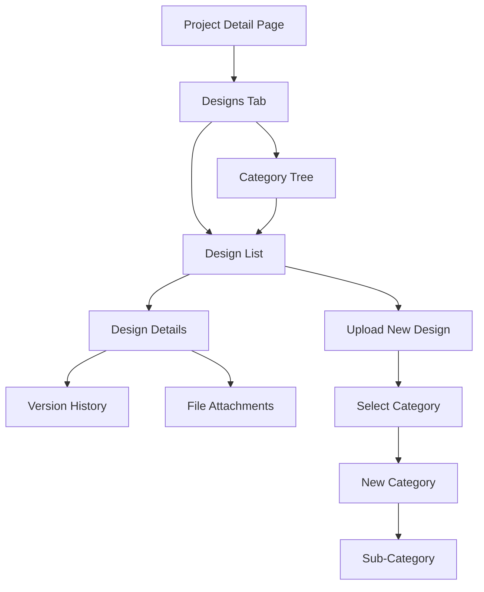
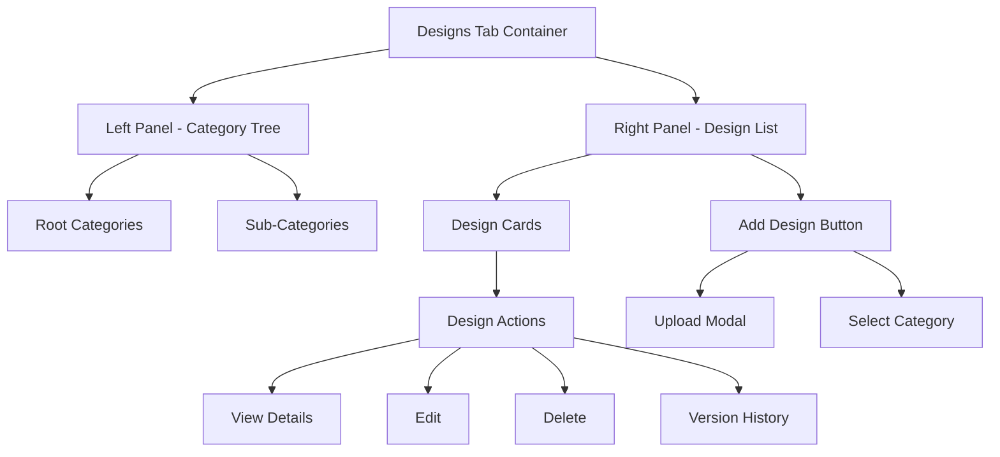
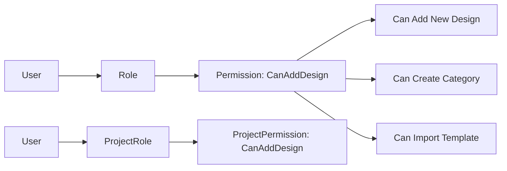

# Design Management Feature Implementation Plan

## Overview
This document outlines the comprehensive plan for implementing a Design Management feature for the Construction CMS project. The feature allows users to organize and manage project designs with hierarchical categories, versioning, file attachments, and permission-based access control.

## Requirements Summary
- **New Permission**: `CanAddDesign` - Controls who can add designs to projects
- **New Tab**: "Designs" tab on every project detail page
- **Design Status**: Draft, Active, Archived
- **File Attachments**: Support for PDF, CAD, images, and other design files
- **Versioning**: Track design revisions
- **Hierarchical Categories**: Categories can contain sub-categories and designs
- **Company Templates**: Import designs from company-wide templates

---

## Architecture Overview



---

## Database Design

### New Entities

#### 1. DesignCategory Entity
```csharp
public class DesignCategory : BaseEntity, ICompanyEntity
{
    public int? CompanyId { get; set; }      // For company-wide templates
    public int? ProjectId { get; set; }       // Null for company templates
    public string Name { get; set; } = string.Empty;
    public string? Description { get; set; }
    public int Order { get; set; } = 0;
    
    public int? ParentCategoryId { get; set; }
    public virtual DesignCategory? ParentCategory { get; set; }
    public virtual ICollection<DesignCategory> ChildCategories { get; set; } = new List<DesignCategory>();
    
    public virtual ICollection<Design> Designs { get; set; } = new List<Design>();
    
    [NotMapped]
    public bool IsRootCategory => ParentCategoryId == null;
    [NotMapped]
    public bool IsLeafCategory => !ChildCategories.Any();
}
```

#### 2. Design Entity
```csharp
public class Design : BaseEntity, ICompanyEntity
{
    public int? CompanyId { get; set; }      // For company templates
    public int ProjectId { get; set; }
    public virtual Project Project { get; set; } = null!;
    
    public string Name { get; set; } = string.Empty;
    public string? Description { get; set; }
    
    public int? CategoryId { get; set; }     // Null = root level
    public virtual DesignCategory? Category { get; set; }
    
    public DesignStatus Status { get; set; } = DesignStatus.Draft;
    
    // Versioning
    public int Version { get; set; } = 1;
    public int? ParentDesignId { get; set; }  // For versioning
    public virtual Design? ParentDesign { get; set; }
    public virtual ICollection<Design> Versions { get; set; } = new List<Design>();
    
    // File Information
    public string? FileUrl { get; set; }
    public string? FileName { get; set; }
    public long? FileSize { get; set; }
    public string? FileType { get; set; }
    
    // Metadata
    public int? CreatedByUserId { get; set; }
    public DateTime? ApprovedDate { get; set; }
    public int? ApprovedByUserId { get; set; }
}
```

#### 3. DesignVersion Entity (Optional - alternative versioning approach)
```csharp
public class DesignVersion : BaseEntity
{
    public int DesignId { get; set; }
    public virtual Design Design { get; set; } = null!;
    
    public int VersionNumber { get; set; }
    public string? FileUrl { get; set; }
    public string? ChangeNotes { get; set; }
    public int? CreatedByUserId { get; set; }
}
```

### Enums
```csharp
public enum DesignStatus
{
    Draft = 0,
    Active = 1,
    Archived = 2,
    Deprecated = 3
}
```

---

## Backend Implementation Plan

### 1. DTOs (Data Transfer Objects)

#### DesignDto
```csharp
public class DesignDto
{
    public int Id { get; set; }
    public int ProjectId { get; set; }
    public string Name { get; set; } = string.Empty;
    public string? Description { get; set; }
    public int? CategoryId { get; set; }
    public string? CategoryName { get; set; }
    public DesignStatus Status { get; set; }
    public int Version { get; set; }
    public string? FileUrl { get; set; }
    public string? FileName { get; set; }
    public long? FileSize { get; set; }
    public string? FileType { get; set; }
    public string? CreatedByUserName { get; set; }
    public DateTime CreatedAt { get; set; }
    public DateTime? UpdatedAt { get; set; }
    public int VersionCount { get; set; }
}
```

#### DesignCategoryDto
```csharp
public class DesignCategoryDto
{
    public int Id { get; set; }
    public string Name { get; set; } = string.Empty;
    public string? Description { get; set; }
    public int Order { get; set; }
    public int? ParentCategoryId { get; set; }
    public List<DesignCategoryDto> ChildCategories { get; set; } = new();
    public List<DesignDto> Designs { get; set; } = new();
    public int DesignCount { get; set; }
}
```

#### CreateDesignRequest
```csharp
public class CreateDesignRequest
{
    public string Name { get; set; } = string.Empty;
    public string? Description { get; set; }
    public int? CategoryId { get; set; }
    public IFormFile? File { get; set; }
    public DesignStatus Status { get; set; } = DesignStatus.Draft;
    public bool CreateAsNewVersion { get; set; }
    public int? ParentDesignId { get; set; }
}
```

#### CreateCategoryRequest
```csharp
public class CreateCategoryRequest
{
    public string Name { get; set; } = string.Empty;
    public string? Description { get; set; }
    public int? ParentCategoryId { get; set; }
    public int? ProjectId { get; set; }
    public int Order { get; set; } = 0;
}
```

### 2. IDesignService Interface
```csharp
public interface IDesignService
{
    // Design Operations
    Task<int> CreateDesignAsync(int projectId, CreateDesignRequest request);
    Task<DesignDto> GetDesignAsync(int designId);
    Task<IEnumerable<DesignDto>> GetProjectDesignsAsync(int projectId);
    Task UpdateDesignAsync(int designId, UpdateDesignRequest request);
    Task DeleteDesignAsync(int designId);
    Task<IEnumerable<DesignDto>> GetDesignVersionsAsync(int designId);
    
    // Category Operations
    Task<int> CreateCategoryAsync(CreateCategoryRequest request);
    Task<DesignCategoryDto> GetCategoryAsync(int categoryId);
    Task<IEnumerable<DesignCategoryDto>> GetProjectCategoriesAsync(int projectId);
    Task<IEnumerable<DesignCategoryDto>> GetCategoryTreeAsync(int projectId);
    Task UpdateCategoryAsync(int categoryId, UpdateCategoryRequest request);
    Task DeleteCategoryAsync(int categoryId);
    
    // Template Operations
    Task<IEnumerable<DesignCategoryDto>> GetCompanyDesignTemplatesAsync(int companyId);
    Task ImportDesignTemplateAsync(int companyTemplateId, int projectId);
}
```

### 3. Permission Setup
The `CanAddDesign` permission will be added to the Permission table during migration or seed data. The permission will be checked in:
- `IDesignService.CreateDesignAsync()`
- `IDesignService.CreateCategoryAsync()`

---

## Frontend Implementation Plan

### 1. Angular Interfaces

```typescript
export interface Design {
  id: number;
  projectId: number;
  name: string;
  description?: string;
  categoryId?: number;
  categoryName?: string;
  status: 'Draft' | 'Active' | 'Archived' | 'Deprecated';
  version: number;
  fileUrl?: string;
  fileName?: string;
  fileSize?: number;
  fileType?: string;
  createdByUserId: number;
  createdByUserName?: string;
  createdAt: string;
  updatedAt?: string;
  versionCount: number;
}

export interface DesignCategory {
  id: number;
  name: string;
  description?: string;
  order: number;
  parentCategoryId?: number;
  childCategories: DesignCategory[];
  designs: Design[];
  designCount: number;
}
```

### 2. Design Service
```typescript
@Injectable({ providedIn: 'root' })
export class DesignService {
  private baseUrl = '/api/designs';
  
  // Design CRUD
  getProjectDesigns(projectId: number): Observable<Design[]>;
  getDesign(id: number): Observable<Design>;
  createDesign(projectId: number, design: FormData): Observable<number>;
  updateDesign(id: number, design: FormData): Observable<void>;
  deleteDesign(id: number): Observable<void>;
  
  // Versioning
  getDesignVersions(designId: number): Observable<Design[]>;
  createNewVersion(designId: number, design: FormData): Observable<number>;
  
  // Categories
  getCategoryTree(projectId: number): Observable<DesignCategory[]>;
  createCategory(category: CreateCategoryRequest): Observable<number>;
  deleteCategory(id: number): Observable<void>;
  
  // Templates
  getCompanyTemplates(): Observable<DesignCategory[]>;
  importTemplate(templateId: number, projectId: number): Observable<void>;
}
```

### 3. Components Structure

```
features/admin/projects/
├── project-detail/
│   ├── project-detail.component.ts (updated)
│   └── designs-tab/
│       ├── designs-tab.component.ts
│       ├── design-list/
│       │   ├── design-list.component.ts
│       └── category-tree/
│           ├── category-tree.component.ts
│       ├── design-card/
│           ├── design-card.component.ts
│       └── design-modal/
│           ├── design-modal.component.ts
```

### 4. UI Layout



---

## i18n Translations

### English (en.json)
```json
{
  "project_detail": {
    "designs": "Designs",
    "designs_desc": "Project design management and versioning"
  },
  "designs": {
    "title": "Design Management",
    "add_design": "Add Design",
    "upload_file": "Upload File",
    "select_category": "Select Category",
    "create_category": "Create Category",
    "category_name": "Category Name",
    "design_name": "Design Name",
    "description": "Description",
    "version": "Version",
    "versions": "Versions",
    "status": "Status",
    "draft": "Draft",
    "active": "Active",
    "archived": "Archived",
    "deprecated": "Deprecated",
    "file_size": "File Size",
    "uploaded_by": "Uploaded By",
    "uploaded_at": "Uploaded At",
    "view_versions": "View All Versions",
    "create_new_version": "Create New Version",
    "version_history": "Version History",
    "download": "Download",
    "preview": "Preview",
    "no_designs": "No designs found",
    "no_designs_desc": "Upload your first design or import from templates",
    "import_template": "Import from Template",
    "templates": "Company Templates",
    "drag_drop_hint": "Drag and drop files here or click to browse",
    "supported_formats": "Supported formats: PDF, DWG, DXF, PNG, JPG"
  }
}
```

### Arabic (ar.json)
```json
{
  "project_detail": {
    "designs": "التصاميم"
  },
  "designs": {
    "title": "إدارة التصاميم",
    "add_design": "إضافة تصميم",
    "upload_file": "رفع ملف",
    "select_category": "اختر الفئة",
    "create_category": "إنشاء فئة",
    "category_name": "اسم الفئة",
    "design_name": "اسم التصميم",
    "description": "الوصف",
    "version": "الإصدار",
    "versions": "الإصدارات",
    "status": "الحالة",
    "draft": "مسودة",
    "active": "نشط",
    "archived": "مؤرشف",
    "deprecated": "متوقف",
    "file_size": "حجم الملف",
    "uploaded_by": "تم الرفع بواسطة",
    "uploaded_at": "تاريخ الرفع",
    "view_versions": "عرض جميع الإصدارات",
    "create_new_version": "إنشاء إصدار جديد",
    "version_history": "سجل الإصدارات",
    "download": "تحميل",
    "preview": "معاينة",
    "no_designs": "لا توجد تصاميم",
    "no_designs_desc": "قم برفع أول تصميم أو استورد من القوالب",
    "import_template": "استيراد من القالب",
    "templates": "قوالب الشركة",
    "drag_drop_hint": "اسحب وأفلت الملفات هنا أو انقر للاستعراض",
    "supported_formats": "الصيغ المدعومة: PDF, DWG, DXF, PNG, JPG"
  }
}
```

---

## Implementation Steps Detail

### Step 1: Database Entities
1. Create `DesignCategory.cs` entity
2. Create `Design.cs` entity
3. Add `DesignStatus` enum
4. Create DbContext configurations
5. Add migrations

### Step 2: Backend Services
1. Create DTOs
2. Create `IDesignService` interface
3. Create `DesignService` implementation
4. Add API endpoints in controller
5. Add permission checks

### Step 3: Frontend - Core
1. Update `interfaces.ts` with Design types
2. Create `design.service.ts`
3. Add to module imports

### Step 4: Frontend - Components
1. Create `DesignsTabComponent` - main container
2. Create `CategoryTreeComponent` - recursive tree display
3. Create `DesignListComponent` - grid/list of designs
4. Create `DesignCardComponent` - individual design display
5. Create `DesignModalComponent` - upload/edit dialog
6. Update `ProjectDetailComponent` with new tab

### Step 5: Integration
1. Add CanAddDesign permission check
2. Wire up API calls
3. Handle file uploads
4. Implement version history view

---

## Permission Model



The `CanAddDesign` permission will be:
- Added to the Permission table
- Checked at both role and project role levels
- Required for: Create Design, Create Category, Import Template
- Read access: No permission required (or separate ViewDesigns permission)

---

## File Upload Considerations

1. **Storage**: Use existing IFileStorageService
2. **Max Size**: Configurable (default 50MB)
3. **Allowed Types**: PDF, DWG, DXF, PNG, JPG, TIFF
4. **Virus Scan**: Integrate with existing scanning service
5. **Preview Generation**: For images and PDFs, generate thumbnails

---

## API Endpoints

```
GET    /api/projects/{projectId}/designs
GET    /api/projects/{projectId}/designs/categories
GET    /api/projects/{projectId}/designs/categories/tree
GET    /api/designs/{designId}
GET    /api/designs/{designId}/versions
POST   /api/projects/{projectId}/designs
POST   /api/projects/{projectId}/designs/categories
POST   /api/designs/{designId}/versions
PUT    /api/designs/{designId}
PUT    /api/designs/categories/{categoryId}
DELETE /api/designs/{designId}
DELETE /api/designs/categories/{categoryId}
POST   /api/projects/{projectId}/designs/templates/{templateId}/import
```

---

## Testing Strategy

1. **Unit Tests**:
   - DesignService CRUD operations
   - Category tree building
   - Version creation logic

2. **Integration Tests**:
   - API endpoint responses
   - Permission checks
   - File upload handling

3. **Frontend Tests**:
   - Component rendering
   - Category tree recursion
   - File upload flow
   - Permission-based UI hiding

---

## Rollout Plan

1. **Phase 1**: Backend API and database (Day 1-2)
2. **Phase 2**: Angular services and interfaces (Day 2)
3. **Phase 3**: UI components (Day 3-4)
4. **Phase 4**: Testing and bug fixes (Day 5)
5. **Phase 5**: Documentation and deployment (Day 5)

---

## Risk Mitigation

| Risk | Impact | Mitigation |
|------|--------|-----------|
| Large file uploads | Performance | Chunked uploads, progress bar |
| Complex category trees | UI UX | Pagination, lazy loading |
| Permission conflicts | Security | Centralized permission service |
| File type security | Safety | Virus scanning, type validation |
