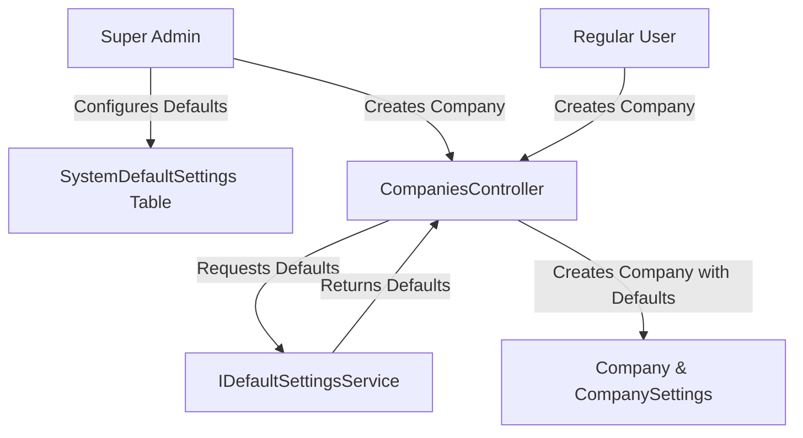

# Feature Flag Default Values Configuration Plan

## Objective
Allow Super Admin to configure default values for all feature flags in a central location, rather than having them hardcoded in the `CompanySettings` entity.

## Current State Analysis

Currently, feature flag defaults are hardcoded in two places:

### 1. CompanySettings Entity
File: `src/ConstructionManagement.Domain/Entities/CompanySettings.cs`

Default values are defined as C# property initializers:
- Core features (true by default): `EnableUserManagement`, `EnableProjectManagement`, etc.
- Premium features (false by default): `EnableInventoryManagement`, `EnableHRManagement`, etc.

### 2. CreateCompanyRequest DTO
File: `src/ConstructionManagement.Application/DTOs/CreateCompanyRequest.cs`

Defaults are also defined here with the same values.

## Problem
- If Super Admin wants to change the default for a feature (e.g., change `EnableHRManagement` from `false` to `true`), they need to modify code and redeploy
- No central place to manage system-wide defaults
- Hard to maintain consistency

## Solution Architecture

### 1. Create SystemDefaultSettings Entity
Location: `src/ConstructionManagement.Domain/Entities/SystemDefaultSettings.cs`

This entity will store the configurable defaults that Super Admin can modify:
- Single row in database (singleton pattern)
- Contains all feature flags with default values
- Includes other system-wide defaults (e.g., delay notification days, etc.)

### 2. Create IDefaultSettingsService
Location: `src/ConstructionManagement.Application/Interfaces/IDefaultSettingsService.cs`

Interface with methods:
- `GetDefaultsAsync()` - Get current default settings
- `UpdateDefaultsAsync(SystemDefaultSettings defaults)` - Update defaults (Super Admin only)
- `GetDefaultForFeature(string featureName)` - Get single feature default

### 3. Implement DefaultSettingsService
Location: `src/ConstructionManagement.Infrastructure/Services/DefaultSettingsService.cs`

Implementation that:
- Reads/writes to SystemDefaultSettings table
- Provides seed data on first run
- Validates that only one row exists (singleton)

### 4. Update Company Creation Flow
Files to modify:
- `src/ConstructionManagement.WebApi/Controllers/CompaniesController.cs`
- `src/ConstructionManagement.Application/DTOs/CreateCompanyRequest.cs`

When creating a company:
1. Fetch system defaults from `IDefaultSettingsService`
2. Use those values as the starting point
3. Allow override via request parameters

### 5. Create API Endpoint for Super Admin
Location: New controller or extend existing

- `GET /api/system-settings/defaults` - Get current defaults
- `PUT /api/system-settings/defaults` - Update defaults (Super Admin only)

### 6. Database Migration
Create migration to add `SystemDefaultSettings` table with seed data matching current defaults.

### 7. Frontend UI (Optional Enhancement)
Add admin page for Super Admin to configure defaults visually.

## Implementation Steps

### Step 1: Create SystemDefaultSettings Entity
```csharp
// src/ConstructionManagement.Domain/Entities/SystemDefaultSettings.cs
public class SystemDefaultSettings : BaseEntity
{
    // All feature flags with their defaults
    public bool DefaultEnableUserManagement { get; set; } = true;
    public bool DefaultEnableProjectManagement { get; set; } = true;
    // ... all other flags
}
```

### Step 2: Create Service Interface & Implementation
- Create `IDefaultSettingsService`
- Create `DefaultSettingsService` with seeding logic

### Step 3: Update Company Creation
Modify `CompaniesController.Create` to:
1. Inject `IDefaultSettingsService`
2. Get defaults before creating company
3. Apply defaults to new `CompanySettings`

### Step 4: Create API Controller
- Add endpoints for getting/updating defaults
- Add authorization: `[Authorize(Roles = "SystemAdmin")]`

### Step 5: Migration
- Add migration for new table
- Seed with current default values

## Affected Files

| File | Action |
|------|--------|
| `src/ConstructionManagement.Domain/Entities/SystemDefaultSettings.cs` | Create |
| `src/ConstructionManagement.Application/Interfaces/IDefaultSettingsService.cs` | Create |
| `src/ConstructionManagement.Infrastructure/Services/DefaultSettingsService.cs` | Create |
| `src/ConstructionManagement.WebApi/Controllers/SystemSettingsController.cs` | Create |
| `src/ConstructionManagement.WebApi/Program.cs` | Register service |
| `src/ConstructionManagement.WebApi/Controllers/CompaniesController.cs` | Modify |
| `src/ConstructionManagement.Application/DTOs/CreateCompanyRequest.cs` | Modify |

## Mermaid Diagram


