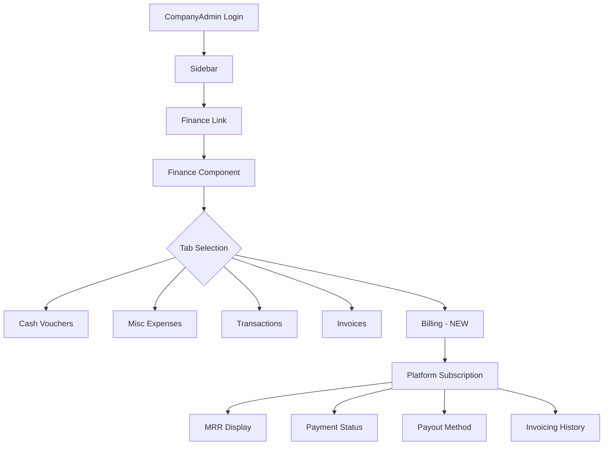

# Finance Component - Company Billing Integration Plan

## Overview

Move the **Company Billing** functionality (platform subscription, invoicing history) from the company-detail component to the finance component, making it accessible for CompanyAdmin users.

## Current State

### Company Billing Location
- **Current**: Billing tab in [`company-detail.component.ts`](construction-cms/src/app/features/admin/companies/company-detail/company-detail.component.ts:600)
- **Scope**: Platform subscription management
- **Features**:
  - MRR display ($5,240)
  - Billing interval (Monthly Recurring)
  - Next renewal date
  - Payment status
  - Payout method (VISA card)
  - Invoicing history table

### Finance Component
- **Current**: [`finance.component.ts`](construction-cms/src/app/features/admin/finance/finance.component.ts:654)
- **Status**: Orphaned (no route, no navigation)
- **Tabs**: Cash Vouchers, Misc Expenses, Transactions, Invoices

## Proposed Changes

### 1. Add Company Billing Tab to Finance Component

Add a new "Billing" tab to the finance component that shows **platform subscription details**.

**Tab Structure:**
```
Cash Vouchers | Misc Expenses | Transactions | Invoices | Billing
```

**Billing Tab Features:**
- Platform subscription MRR display
- Billing interval and next renewal
- Payment status indicator
- Payout method management
- Invoicing history table with download option

### 2. Add Route for Finance Component

**File**: [`app.routes.ts`](construction-cms/src/app/app.routes.ts)

Add route under admin children:
```typescript
{
    path: 'finance',
    loadComponent: () => import('./features/admin/finance/finance.component').then(m => m.FinanceComponent),
    canActivate: [roleGuard],
    data: { roles: ['SystemAdmin', 'CompanyAdmin'] }
}
```

### 3. Add Navigation Link

**File**: [`sidebar.component.ts`](construction-cms/src/app/layout/sidebar/sidebar.component.ts)

Add navigation item for CompanyAdmin:
```typescript
{
    label: 'Finance',
    icon: 'finance',
    route: '/admin/finance',
    roles: ['SystemAdmin', 'CompanyAdmin']
}
```

### 4. Remove Billing Tab from Company-Detail

**File**: [`company-detail.component.ts`](construction-cms/src/app/features/admin/companies/company-detail/company-detail.component.ts)

Remove:
- Billing tab from tab array (line 1029: `{ id: 'billing', label: 'Billing & Subs' }`)
- Billing-related template code (lines 599-663)
- `bills` array property (line 1037)

### 5. Update Translations

**Files**: 
- [`en.json`](construction-cms/src/assets/i18n/en.json)
- [`ar.json`](construction-cms/src/assets/i18n/ar.json)

Add translations for billing tab in finance context:
```json
"finance": {
    "tabs": {
        "billing": "Platform Billing"
    },
    "billing": {
        "mrr": "Monthly Recurring Revenue",
        "next_renewal": "Next Renewal",
        "payment_status": "Payment Status",
        "payout_method": "Payout Method",
        "invoicing_history": "Invoicing History"
    }
}
```

## Implementation Steps

### Step 1: Update Finance Component Template
- Add Billing tab button
- Add Billing tab content section with:
  - MRR display card
  - Billing info cards (interval, renewal, status)
  - Payout method card
  - Invoicing history table

### Step 2: Update Finance Component Logic
- Add billing data signals
- Add invoicing history signal
- Load billing data on init

### Step 3: Add Route
- Add finance route to app.routes.ts

### Step 4: Add Navigation
- Add finance link to sidebar

### Step 5: Clean Up Company-Detail
- Remove billing tab and related code

### Step 6: Update Translations
- Add finance.billing translations

## Data Flow



## Benefits

1. **Centralized Financial Management**: All financial operations in one place
2. **Clear Separation**: Company billing separate from project finances
3. **Better UX**: Company owners can manage all finances from one dashboard
4. **Consistent UI**: Billing follows same pattern as other financial items

## Files to Modify

| File | Action |
|------|--------|
| `finance.component.ts` | Add billing tab, logic, and template |
| `app.routes.ts` | Add finance route |
| `sidebar.component.ts` | Add finance navigation link |
| `company-detail.component.ts` | Remove billing tab and code |
| `en.json` | Add translations |
| `ar.json` | Add translations |

## Notes

- The billing data is currently hardcoded in the template
- Consider creating a `CompanyBillingService` for real API integration
- The `bills` array in company-detail contains invoicing history data
