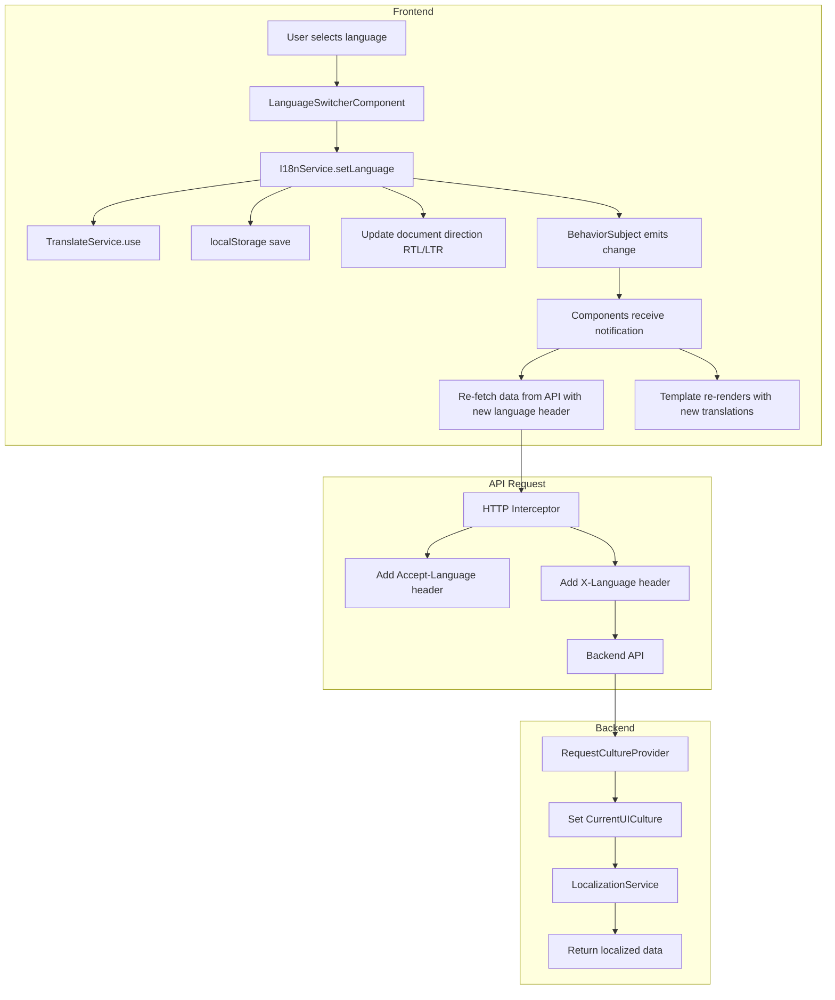

# Full Application Localization Plan

## Overview

This plan outlines the comprehensive approach to apply bilingual support (Arabic/English) across all pages and components in the Construction Management System, following the pattern established in the notifications feature.

## Current State Analysis

### Existing Infrastructure

The application already has a solid localization foundation:

1. **Frontend Translation System**
   - `@ngx-translate` library integrated
   - Translation files: [`en.json`](construction-cms/src/assets/i18n/en.json) and [`ar.json`](construction-cms/src/assets/i18n/ar.json)
   - [`I18nService`](construction-cms/src/app/core/i18n/i18n.service.ts) manages language state
   - [`LanguageSwitcherComponent`](construction-cms/src/app/layout/language-switcher/language-switcher.component.ts) for UI switching
   - [`auth.interceptor.ts`](construction-cms/src/app/core/auth/auth.interceptor.ts) sends language headers with API requests

2. **Backend Localization**
   - [`LocalizationService.cs`](src/ConstructionManagement.Infrastructure/Services/LocalizationService.cs) with resource files
   - Request culture provider reads `Accept-Language` and `X-Language` headers
   - Default language is Arabic

3. **Working Pattern (Notifications)**
   - The [`NotificationsComponent`](construction-cms/src/app/features/common/notifications/notifications.component.ts) demonstrates the correct pattern:
     - Imports `TranslateModule`
     - Uses `{{ 'key' | translate }}` pipe in templates
     - Subscribes to `i18nService.onLanguageChange()` for reactive updates
     - Uses `translate.instant()` for programmatic translations

### Identified Gaps

Based on code analysis, many components have hardcoded English text:

| Category | Components Affected |
|----------|---------------------|
| Admin - Analytics | `analytics.component.ts`, `advanced-analytics.component.ts`, `reports-generation.component.ts` |
| Admin - Companies | `companies.component.ts`, `company-detail.component.ts`, `company-settings.component.ts` |
| Admin - Projects | `projects.component.ts`, `project-detail.component.ts`, `boq-items.component.ts`, `daily-logs.component.ts` |
| Admin - Equipment | `equipment-list.component.ts`, `equipment-assignments.component.ts` |
| Admin - Safety | `safety.component.ts`, `safety-incidents.component.ts`, `safety-inspections.component.ts` |
| Admin - Quality | `quality.component.ts`, `quality-defects.component.ts`, `quality-inspections.component.ts` |
| Admin - Subcontractor | `subcontractor.component.ts`, `subcontractor-contracts.component.ts`, `subcontractor-payments.component.ts` |
| Admin - Inventory | `inventory.component.ts`, `inventory-transactions.component.ts` |
| Admin - Media | `media-gallery.component.ts`, `site-media-upload.component.ts`, `site-media-review.component.ts` |
| Admin - Access Control | `permissions.component.ts`, `roles.component.ts` |
| Client Portal | `client-dashboard.component.ts`, `client-payments.component.ts`, `client-messages.component.ts` |
| Inventory Dashboard | `inventory-overview.component.ts`, `incoming-orders.component.ts`, `my-products.component.ts`, `sales-log.component.ts` |
| Auth | `login.component.ts`, `register.component.ts`, `forgot-password.component.ts` |
| Common | `profile.component.ts`, `browse-firms.component.ts`, `dashboard.component.ts` |
| Worker | `daily-log.component.ts`, `personal-hr.component.ts` |

## Implementation Strategy

### Phase 1: Translation File Expansion

Expand the translation files with all missing keys organized by feature module.

#### Structure Convention

```json
{
  "module_name": {
    "title": "Module Title",
    "subtitle": "Module subtitle",
    "actions": {
      "create": "Create New",
      "edit": "Edit",
      "delete": "Delete",
      "save": "Save",
      "cancel": "Cancel"
    },
    "labels": {
      "field_name": "Field Label"
    },
    "messages": {
      "empty_state": "No items found",
      "success": "Operation successful",
      "error": "An error occurred"
    },
    "status": {
      "active": "Active",
      "inactive": "Inactive"
    }
  }
}
```

#### Key Naming Convention

- Use dot notation for hierarchical keys: `module.section.item`
- Use lowercase with underscores for multi-word keys: `total_revenue`
- Group related keys together under common prefixes
- Use consistent terminology across modules

### Phase 2: Component Updates

Each component needs to be updated following this pattern:

#### Step 1: Import Required Modules

```typescript
import { TranslateModule, TranslateService } from '@ngx-translate/core';
import { I18nService } from '../../../core/i18n/i18n.service';
import { Subject, takeUntil } from 'rxjs';
```

#### Step 2: Add to Imports Array

```typescript
@Component({
  standalone: true,
  imports: [CommonModule, TranslateModule, /* other imports */],
  // ...
})
```

#### Step 3: Inject Services and Setup Language Subscription

```typescript
export class ExampleComponent implements OnInit, OnDestroy {
  private destroy$ = new Subject<void>();

  constructor(
    private translate: TranslateService,
    private i18nService: I18nService
  ) {}

  ngOnInit() {
    // Subscribe to language changes for reactive updates
    this.i18nService.onLanguageChange()
      .pipe(takeUntil(this.destroy$))
      .subscribe(() => {
        // Reload any data that needs re-fetching from backend
        this.loadData();
      });
  }

  ngOnDestroy() {
    this.destroy$.next();
    this.destroy$.complete();
  }
}
```

#### Step 4: Update Template

Replace hardcoded text with translation keys:

```html
<!-- Before -->
<h1>Dashboard Overview</h1>
<p>Welcome to your dashboard</p>
<button>Create New Project</button>

<!-- After -->
<h1>{{ 'dashboard.title' | translate }}</h1>
<p>{{ 'dashboard.welcome' | translate }}</p>
<button>{{ 'dashboard.actions.create_project' | translate }}</button>
```

#### Step 5: Handle Dynamic Text in TypeScript

```typescript
// For dynamic text in TypeScript code
showMessage(count: number) {
  const message = this.translate.instant('dashboard.items_count', { count });
  // or use async version
  this.translate.get('dashboard.items_count', { count }).subscribe(msg => {
    // use msg
  });
}
```

### Phase 3: RTL Support Verification

Ensure all components properly support RTL layout:

1. Use Tailwind's RTL utilities: `rtl:`, `ltr:`
2. Use logical properties: `ms-` instead of `ml-`, `me-` instead of `mr-`
3. Test all layouts in both languages

### Phase 4: Backend Data Localization

For data coming from the backend:

1. Ensure API requests include language headers (already done via interceptor)
2. Backend should return localized content based on `Accept-Language` header
3. For dynamic re-localization, refetch data when language changes

## Detailed Component Audit

### Priority 1: Core Pages (High Traffic)

| Component | Hardcoded Strings | Translation Keys Needed |
|-----------|-------------------|------------------------|
| `dashboard.component.ts` | ~50+ | dashboard.* |
| `notifications.component.ts` | ✅ Done | notifications.* |
| `profile.component.ts` | ~20 | profile.* |
| `login.component.ts` | ~15 | auth.login.* |
| `register.component.ts` | ~25 | auth.register.* |

### Priority 2: Admin Module

| Component | Hardcoded Strings | Translation Keys Needed |
|-----------|-------------------|------------------------|
| `companies.component.ts` | ~40 | companies.* |
| `projects.component.ts` | ~60 | projects.* |
| `project-detail.component.ts` | ~100+ | projects.detail.* |
| `pending-requests.component.ts` | ~30 | pending_requests.* |
| `company-settings.component.ts` | ~80 | settings.* |

### Priority 3: Feature Modules

| Module | Components | Estimated Strings |
|--------|------------|-------------------|
| Equipment | 4 | ~80 |
| Safety | 4 | ~80 |
| Quality | 4 | ~80 |
| Subcontractor | 5 | ~100 |
| Inventory | 2 | ~40 |
| Media | 3 | ~60 |
| Analytics | 4 | ~80 |

### Priority 4: Client Portal

| Component | Hardcoded Strings | Translation Keys Needed |
|-----------|-------------------|------------------------|
| `client-dashboard.component.ts` | ~30 | client_portal.* |
| `client-payments.component.ts` | ~20 | client_portal.payments.* |
| `client-messages.component.ts` | ~15 | client_portal.messages.* |
| `client-projects.component.ts` | ~15 | client_portal.projects.* |

### Priority 5: Inventory Dashboard

| Component | Hardcoded Strings | Translation Keys Needed |
|-----------|-------------------|------------------------|
| `inventory-overview.component.ts` | ~40 | inventory_dashboard.* |
| `incoming-orders.component.ts` | ~30 | inventory_dashboard.orders.* |
| `my-products.component.ts` | ~25 | inventory_dashboard.products.* |
| `sales-log.component.ts` | ~30 | inventory_dashboard.sales.* |
| `store-settings.component.ts` | ~20 | inventory_dashboard.settings.* |

## Translation Keys Structure

### Common Keys (Already Partially Exists)

```json
{
  "common": {
    "loading": "Loading...",
    "error": "An error occurred",
    "retry": "Retry",
    "save": "Save",
    "cancel": "Cancel",
    "delete": "Delete",
    "edit": "Edit",
    "create": "Create",
    "search": "Search",
    "filter": "Filter",
    "actions": "Actions",
    "status": "Status",
    "date": "Date",
    "amount": "Amount",
    "total": "Total",
    "yes": "Yes",
    "no": "No",
    "confirm": "Confirm",
    "back": "Back",
    "next": "Next",
    "previous": "Previous",
    "view_all": "View All",
    "no_results": "No results found",
    "just_now": "Just now",
    "minutes_ago": "{{count}} minutes ago",
    "hours_ago": "{{count}} hours ago",
    "days_ago": "{{count}} days ago"
  }
}
```

### Module-Specific Keys Example (Safety)

```json
{
  "safety": {
    "title": "Safety Management",
    "subtitle": "Monitor safety compliance and incidents",
    "tabs": {
      "overview": "Overview",
      "incidents": "Incidents",
      "inspections": "Inspections",
      "trainings": "Trainings"
    },
    "stats": {
      "incidents_this_month": "Incidents This Month",
      "pass_rate": "Inspection Pass Rate",
      "trainings_completed": "Trainings Completed",
      "upcoming_trainings": "Upcoming Trainings"
    },
    "incident": {
      "title": "Incident Title",
      "severity": "Severity",
      "location": "Location",
      "date": "Incident Date",
      "description": "Description",
      "medical_attention": "Required Medical Attention",
      "report_new": "Report New Incident"
    },
    "severity": {
      "minor": "Minor",
      "moderate": "Moderate",
      "major": "Major",
      "critical": "Critical"
    }
  }
}
```

## Architecture Flow



## Implementation Checklist

### For Each Component

- [ ] Import `TranslateModule` and add to imports array
- [ ] Import `I18nService` and `TranslateService`
- [ ] Add `destroy$` Subject for cleanup
- [ ] Subscribe to `onLanguageChange()` in `ngOnInit`
- [ ] Unsubscribe in `ngOnDestroy`
- [ ] Replace all hardcoded text with translation keys
- [ ] Add translation keys to both `en.json` and `ar.json`
- [ ] Test in both languages
- [ ] Verify RTL layout in Arabic mode

### For Translation Files

- [ ] Ensure all keys exist in both language files
- [ ] Verify translations are accurate and contextually appropriate
- [ ] Use parameterized translations for dynamic content
- [ ] Maintain consistent key naming conventions

## Testing Strategy

1. **Manual Testing**
   - Switch language using the language switcher
   - Verify all text updates immediately
   - Check RTL/LTR layout switching
   - Verify data from backend is localized

2. **Automated Testing**
   - Add unit tests for translation key existence
   - Add component tests for language switching
   - Add e2e tests for critical user flows in both languages

## Files to Modify

### Translation Files
- [`construction-cms/src/assets/i18n/en.json`](construction-cms/src/assets/i18n/en.json)
- [`construction-cms/src/assets/i18n/ar.json`](construction-cms/src/assets/i18n/ar.json)

### Components (Estimated 60+ files)
All components in:
- `construction-cms/src/app/features/admin/`
- `construction-cms/src/app/features/auth/`
- `construction-cms/src/app/features/client/`
- `construction-cms/src/app/features/common/`
- `construction-cms/src/app/features/worker/`
- `construction-cms/src/app/features/inventory-dashboard/`

## Estimated Effort

| Phase | Components | Complexity |
|-------|------------|------------|
| Phase 1: Translation Files | 2 files | Medium - Large volume of keys |
| Phase 2: Core Components | ~10 | High - Many strings |
| Phase 3: Admin Module | ~25 | High - Complex components |
| Phase 4: Feature Modules | ~15 | Medium |
| Phase 5: Client/Worker Portal | ~10 | Medium |
| Phase 6: Testing | All | Medium |

## Best Practices

1. **Always use translation keys** - Never hardcode text in components
2. **Subscribe to language changes** - For components that fetch localized data
3. **Use parameterized translations** - For dynamic content like counts
4. **Test both languages** - After any changes
5. **Keep translations synchronized** - Both files should have the same keys
6. **Use meaningful key names** - Keys should describe the content, not the location
7. **Group related keys** - Use hierarchical structure for organization

## Next Steps

1. Review and approve this plan
2. Switch to Code mode to begin implementation
3. Start with Phase 1 (Translation Files Expansion)
4. Proceed with component updates in priority order
5. Test thoroughly after each phase
