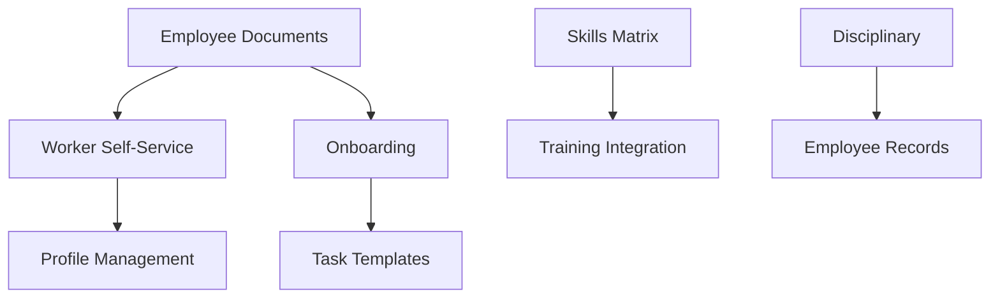

# Gap Features Implementation Plan

## Overview
This plan covers the implementation of 5 identified gap features to bring the Construction Management System to 100% completeness.

---

## 1. Worker Self-Service Portal

### Purpose
Allow workers to manage their own profiles, view their information, and perform self-service actions.

### Features
- Profile management (update personal info, contact details)
- Profile picture upload
- Emergency contact management
- Bank account details for payroll
- View own attendance history
- View own leave balance and history
- View own payslips
- Document uploads (personal documents)
- Skills self-assessment
- Training history view

### Database Entities

```csharp
// WorkerProfileUpdateRequest - Track profile change requests
public class WorkerProfileUpdateRequest : BaseEntity, ICompanyEntity
{
    public int WorkerId { get; set; }
    public User Worker { get; set; }
    public string FieldName { get; set; }  // e.g., "PhoneNumber", "Address"
    public string OldValue { get; set; }
    public string NewValue { get; set; }
    public string Status { get; set; }  // Pending, Approved, Rejected
    public int? ReviewedByUserId { get; set; }
    public User ReviewedByUser { get; set; }
    public DateTime? ReviewedAt { get; set; }
    public string? ReviewNotes { get; set; }
}

// EmergencyContact - Emergency contacts for workers
public class EmergencyContact : BaseEntity, ICompanyEntity
{
    public int UserId { get; set; }
    public User User { get; set; }
    public string Name { get; set; }
    public string Relationship { get; set; }
    public string PhoneNumber { get; set; }
    public string? AlternativePhone { get; set; }
    public string? Email { get; set; }
    public string? Address { get; set; }
    public bool IsPrimary { get; set; }
}

// BankAccount - Bank details for payroll
public class BankAccount : BaseEntity, ICompanyEntity
{
    public int UserId { get; set; }
    public User User { get; set; }
    public string BankName { get; set; }
    public string AccountNumber { get; set; }
    public string AccountHolderName { get; set; }
    public string? IBAN { get; set; }
    public string? BranchCode { get; set; }
    public bool IsActive { get; set; }
}
```

### API Endpoints
- GET /api/workers/me - Get current worker profile
- PUT /api/workers/me - Update profile
- POST /api/workers/me/photo - Upload profile photo
- GET/POST/PUT/DELETE /api/workers/me/emergency-contacts
- GET/POST/PUT/DELETE /api/workers/me/bank-account
- GET /api/workers/me/attendance
- GET /api/workers/me/leave-balance
- GET /api/workers/me/payslips

---

## 2. Employee Onboarding Workflow

### Purpose
Streamline the onboarding process for new employees with automated task tracking.

### Features
- Onboarding template management
- Task assignment per department/role
- Document collection checklist
- Progress tracking
- Automated reminders
- Onboarding completion certificate

### Database Entities

```csharp
// OnboardingTemplate - Template for onboarding processes
public class OnboardingTemplate : BaseEntity, ICompanyEntity
{
    public string Name { get; set; }
    public string? Description { get; set; }
    public int? DepartmentId { get; set; }
    public int? RoleId { get; set; }
    public int EstimatedDays { get; set; }
    public bool IsActive { get; set; }
    public int CreatedByUserId { get; set; }
    public User CreatedByUser { get; set; }
    public ICollection<OnboardingTaskTemplate> TaskTemplates { get; set; }
}

// OnboardingTaskTemplate - Template for individual tasks
public class OnboardingTaskTemplate : BaseEntity
{
    public int OnboardingTemplateId { get; set; }
    public OnboardingTemplate Template { get; set; }
    public string Title { get; set; }
    public string? Description { get; set; }
    public string Category { get; set; }  // Documentation, Training, Setup, etc.
    public int Order { get; set; }
    public int EstimatedDays { get; set; }
    public bool IsRequired { get; set; }
    public string? AssignedToRole { get; set; }
}

// OnboardingProcess - Instance of onboarding for an employee
public class OnboardingProcess : BaseEntity, ICompanyEntity
{
    public int EmployeeId { get; set; }
    public User Employee { get; set; }
    public int TemplateId { get; set; }
    public OnboardingTemplate Template { get; set; }
    public DateTime StartDate { get; set; }
    public DateTime? TargetCompletionDate { get; set; }
    public DateTime? CompletedAt { get; set; }
    public string Status { get; set; }  // InProgress, Completed, Overdue
    public int Progress { get; set; }  // Percentage
    public int AssignedToUserId { get; set; }  // HR/Manager responsible
    public User AssignedToUser { get; set; }
    public ICollection<OnboardingTask> Tasks { get; set; }
}

// OnboardingTask - Individual task in an onboarding process
public class OnboardingTask : BaseEntity
{
    public int OnboardingProcessId { get; set; }
    public OnboardingProcess Process { get; set; }
    public string Title { get; set; }
    public string? Description { get; set; }
    public string Category { get; set; }
    public int Order { get; set; }
    public string Status { get; set; }  // Pending, InProgress, Completed, Skipped
    public DateTime? DueDate { get; set; }
    public DateTime? CompletedAt { get; set; }
    public int? CompletedByUserId { get; set; }
    public User CompletedByUser { get; set; }
    public string? Notes { get; set; }
    public ICollection<OnboardingTaskDocument> RequiredDocuments { get; set; }
}

// OnboardingTaskDocument - Documents required for a task
public class OnboardingTaskDocument : BaseEntity
{
    public int OnboardingTaskId { get; set; }
    public OnboardingTask Task { get; set; }
    public string DocumentName { get; set; }
    public bool IsRequired { get; set; }
    public bool IsUploaded { get; set; }
    public string? FilePath { get; set; }
    public DateTime? UploadedAt { get; set; }
}
```

### API Endpoints
- CRUD /api/onboarding/templates
- CRUD /api/onboarding/tasks
- POST /api/onboarding/start - Start onboarding for employee
- GET /api/onboarding/{processId}
- PUT /api/onboarding/{processId}/tasks/{taskId}
- POST /api/onboarding/{processId}/complete
- GET /api/onboarding/employee/{employeeId}

---

## 3. Disciplinary Actions Tracking

### Purpose
Track disciplinary actions, warnings, and corrective measures for employees.

### Features
- Warning types configuration
- Warning issuance workflow
- Action tracking
- Appeal process
- Escalation rules
- History and reports

### Database Entities

```csharp
// DisciplinaryActionType - Types of disciplinary actions
public class DisciplinaryActionType : BaseEntity, ICompanyEntity
{
    public string Name { get; set; }  // Verbal Warning, Written Warning, Suspension, etc.
    public string? Description { get; set; }
    public int SeverityLevel { get; set; }  // 1-5
    public int? Points { get; set; }  // Points that accumulate
    public int? ValidityPeriodDays { get; set; }  // How long before expiring
    public bool IsActive { get; set; }
}

// DisciplinaryAction - Disciplinary action record
public class DisciplinaryAction : BaseEntity, ICompanyEntity
{
    public int EmployeeId { get; set; }
    public User Employee { get; set; }
    public int ActionTypeId { get; set; }
    public DisciplinaryActionType ActionType { get; set; }
    public string Reason { get; set; }
    public string? Description { get; set; }
    public DateTime IncidentDate { get; set; }
    public DateTime IssueDate { get; set; }
    public int IssuedByUserId { get; set; }
    public User IssuedByUser { get; set; }
    public string Status { get; set; }  // Active, Appealed, Rescinded, Expired
    public DateTime? ExpiryDate { get; set; }
    public string? DocumentPath { get; set; }
    public ICollection<DisciplinaryAppeal> Appeals { get; set; }
}

// DisciplinaryAppeal - Appeal against disciplinary action
public class DisciplinaryAppeal : BaseEntity
{
    public int DisciplinaryActionId { get; set; }
    public DisciplinaryAction Action { get; set; }
    public string Reason { get; set; }
    public DateTime SubmittedAt { get; set; }
    public string Status { get; set; }  // Pending, Approved, Rejected
    public int? ReviewedByUserId { get; set; }
    public User ReviewedByUser { get; set; }
    public DateTime? ReviewedAt { get; set; }
    public string? ReviewNotes { get; set; }
}

// EmployeeDisciplinaryRecord - Summary record for quick lookup
public class EmployeeDisciplinaryRecord : BaseEntity, ICompanyEntity
{
    public int EmployeeId { get; set; }
    public User Employee { get; set; }
    public int TotalPoints { get; set; }
    public int ActiveWarnings { get; set; }
    public DateTime? LastWarningDate { get; set; }
    public DateTime? NextExpiryDate { get; set; }
}
```

### API Endpoints
- CRUD /api/disciplinary/types
- CRUD /api/disciplinary/actions
- POST /api/disciplinary/actions/{id}/appeal
- PUT /api/disciplinary/appeals/{id}/review
- GET /api/disciplinary/employee/{employeeId}
- GET /api/disciplinary/reports

---

## 4. Skills Matrix

### Purpose
Track employee skills, competencies, and identify skill gaps.

### Features
- Skills catalog management
- Skill categories
- Competency levels
- Employee skill assessments
- Skill gap analysis
- Training recommendations
- Certification tracking per skill

### Database Entities

```csharp
// SkillCategory - Category of skills
public class SkillCategory : BaseEntity, ICompanyEntity
{
    public string Name { get; set; }
    public string? Description { get; set; }
    public int DisplayOrder { get; set; }
    public bool IsActive { get; set; }
    public ICollection<Skill> Skills { get; set; }
}

// Skill - Individual skill
public class Skill : BaseEntity, ICompanyEntity
{
    public int CategoryId { get; set; }
    public SkillCategory Category { get; set; }
    public string Name { get; set; }
    public string? Description { get; set; }
    public string? MeasurementCriteria { get; set; }
    public bool IsActive { get; set; }
    public ICollection<EmployeeSkill> EmployeeSkills { get; set; }
}

// CompetencyLevel - Levels of competency
public class CompetencyLevel : BaseEntity, ICompanyEntity
{
    public string Name { get; set; }  // Beginner, Intermediate, Advanced, Expert
    public int Level { get; set; }  // 1-5
    public string? Description { get; set; }
    public int Points { get; set; }
}

// EmployeeSkill - Employee's skill assessment
public class EmployeeSkill : BaseEntity, ICompanyEntity
{
    public int EmployeeId { get; set; }
    public User Employee { get; set; }
    public int SkillId { get; set; }
    public Skill Skill { get; set; }
    public int CompetencyLevelId { get; set; }
    public CompetencyLevel CompetencyLevel { get; set; }
    public DateTime AssessedAt { get; set; }
    public int AssessedByUserId { get; set; }
    public User AssessedByUser { get; set; }
    public DateTime? ExpiryDate { get; set; }
    public string? Notes { get; set; }
    public int? CertificationId { get; set; }
    public Certification Certification { get; set; }
}

// SkillRequirement - Required skills for roles/projects
public class SkillRequirement : BaseEntity, ICompanyEntity
{
    public string EntityType { get; set; }  // Role, Project, Task
    public int EntityId { get; set; }
    public int SkillId { get; set; }
    public Skill Skill { get; set; }
    public int MinimumCompetencyLevelId { get; set; }
    public CompetencyLevel MinimumCompetencyLevel { get; set; }
    public bool IsRequired { get; set; }
    public int? NumberOfPeople { get; set; }
}

// SkillGapAnalysis - Cached gap analysis results
public class SkillGapAnalysis : BaseEntity, ICompanyEntity
{
    public int EmployeeId { get; set; }
    public User Employee { get; set; }
    public int SkillId { get; set; }
    public Skill Skill { get; set; }
    public int CurrentLevel { get; set; }
    public int RequiredLevel { get; set; }
    public int Gap { get; set; }
    public string? RecommendedTraining { get; set; }
    public DateTime AnalyzedAt { get; set; }
}
```

### API Endpoints
- CRUD /api/skills/categories
- CRUD /api/skills
- CRUD /api/skills/competency-levels
- GET/POST/PUT/DELETE /api/skills/employee/{employeeId}
- POST /api/skills/assess - Assess employee skill
- GET /api/skills/gap-analysis/{employeeId}
- GET /api/skills/gap-analysis/project/{projectId}
- POST /api/skills/requirements

---

## 5. Employee Documents Management

### Purpose
Centralized document management for employee-related documents.

### Features
- Document categories (contracts, IDs, certificates, etc.)
- Document expiry tracking
- Automated expiry alerts
- Document versioning
- Access control
- Bulk upload

### Database Entities

```csharp
// EmployeeDocumentCategory - Categories for employee documents
public class EmployeeDocumentCategory : BaseEntity, ICompanyEntity
{
    public string Name { get; set; }  // Contract, ID, Certificate, etc.
    public string? Description { get; set; }
    public bool HasExpiry { get; set; }
    public int? ExpiryAlertDays { get; set; }  // Days before expiry to alert
    public bool IsRequired { get; set; }
    public int DisplayOrder { get; set; }
    public bool IsActive { get; set; }
}

// EmployeeDocument - Employee document record
public class EmployeeDocument : BaseEntity, ICompanyEntity
{
    public int EmployeeId { get; set; }
    public User Employee { get; set; }
    public int CategoryId { get; set; }
    public EmployeeDocumentCategory Category { get; set; }
    public string DocumentName { get; set; }
    public string? Description { get; set; }
    public string FilePath { get; set; }
    public string FileName { get; set; }
    public long FileSize { get; set; }
    public string MimeType { get; set; }
    public DateTime? IssueDate { get; set; }
    public DateTime? ExpiryDate { get; set; }
    public string Status { get; set; }  // Active, Expired, Archived
    public bool IsVerified { get; set; }
    public int? VerifiedByUserId { get; set; }
    public User VerifiedByUser { get; set; }
    public DateTime? VerifiedAt { get; set; }
    public int UploadedByUserId { get; set; }
    public User UploadedByUser { get; set; }
    public ICollection<EmployeeDocumentVersion> Versions { get; set; }
}

// EmployeeDocumentVersion - Document version history
public class EmployeeDocumentVersion : BaseEntity
{
    public int EmployeeDocumentId { get; set; }
    public EmployeeDocument Document { get; set; }
    public int Version { get; set; }
    public string FilePath { get; set; }
    public string FileName { get; set; }
    public long FileSize { get; set; }
    public string? ChangeNotes { get; set; }
    public int UploadedByUserId { get; set; }
    public User UploadedByUser { get; set; }
    public DateTime UploadedAt { get; set; }
}

// DocumentExpiryAlert - Alerts for expiring documents
public class DocumentExpiryAlert : BaseEntity, ICompanyEntity
{
    public int DocumentId { get; set; }
    public EmployeeDocument Document { get; set; }
    public DateTime ExpiryDate { get; set; }
    public int DaysUntilExpiry { get; set; }
    public string AlertType { get; set; }  // 30 days, 14 days, 7 days, 1 day
    public bool IsSent { get; set; }
    public DateTime? SentAt { get; set; }
    public ICollection<int> RecipientUserIds { get; set; }
}
```

### API Endpoints
- CRUD /api/employee-documents/categories
- GET /api/employee-documents/employee/{employeeId}
- POST /api/employee-documents/upload
- GET /api/employee-documents/{id}
- PUT /api/employee-documents/{id}
- DELETE /api/employee-documents/{id}
- GET /api/employee-documents/{id}/versions
- POST /api/employee-documents/{id}/verify
- GET /api/employee-documents/expiring
- GET /api/employee-documents/reports

---

## Implementation Order

### Phase 1: Foundation (Week 1)
1. Employee Documents Management
   - Most foundational - other features depend on document storage
   - Required for onboarding

### Phase 2: Core HR (Week 2)
2. Worker Self-Service Portal
   - Builds on documents
   - Basic profile management

3. Employee Onboarding Workflow
   - Uses documents
   - Integrates with worker portal

### Phase 3: Advanced HR (Week 3)
4. Skills Matrix
   - Standalone but integrates with training
   - Uses certifications

5. Disciplinary Actions Tracking
   - Standalone module
   - Integrates with employee records

---

## Technical Requirements

### Backend
- .NET 9 WebAPI
- Entity Framework Core
- SQL Server

### Frontend
- Angular 18+
- Angular Material
- TypeScript

### Shared
- RESTful API design
- JWT authentication
- Role-based authorization
- Multi-tenancy support

### File Storage
- Local file storage (existing)
- Support for cloud storage (future)

---

## Estimated Effort

| Feature | Backend | Frontend | Total |
|---------|---------|----------|-------|
| Employee Documents | 2 days | 2 days | 4 days |
| Worker Self-Service | 2 days | 3 days | 5 days |
| Onboarding | 3 days | 3 days | 6 days |
| Skills Matrix | 3 days | 3 days | 6 days |
| Disciplinary | 2 days | 2 days | 4 days |
| **Total** | **12 days** | **13 days** | **25 days** |

---

## Dependencies


