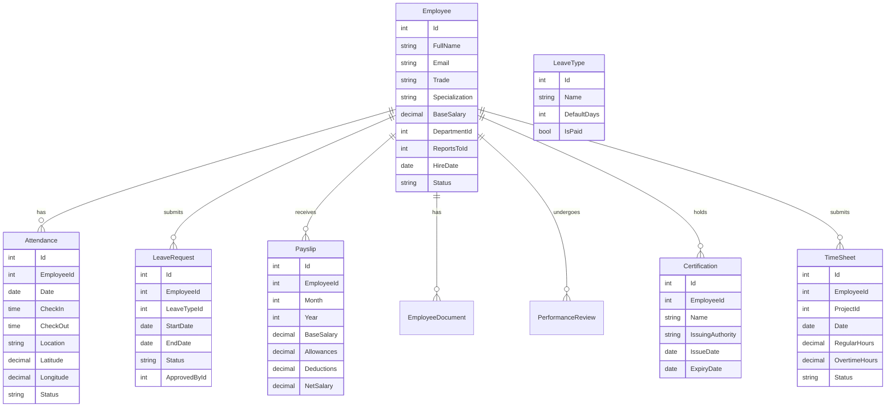

# HR & People Management - Gap Analysis for Construction Management System

## Current Implementation

### Existing Features
1. **HR Component** (`admin/hr/hr.component.ts`)
   - Basic user listing with name, role, status, salary
   - Role permission matrix display
   - Notes drawer for individual users
   - Stats: Total Users, Working, Absent, Total Payroll

2. **Personal HR Component** (`worker/personal-hr/personal-hr.component.ts`)
   - Monthly compensation display
   - Leave allowance tracking
   - Pending requests count
   - Work days/utilization metrics
   - Financial ledger tab
   - Leave/vacation request tab

---

## Missing Critical Features for Construction Industry

### 1. Attendance & Time Tracking
| Feature | Description | Priority |
|---------|-------------|----------|
| Daily Attendance | Check-in/check-out with GPS location | High |
| Time Sheets | Daily/weekly work hours logging | High |
| Overtime Tracking | Overtime hours with approval workflow | High |
| Shift Management | Shift scheduling and assignment | Medium |
| Biometric Integration | Fingerprint/face recognition for site workers | Medium |

### 2. Leave Management
| Feature | Description | Priority |
|---------|-------------|----------|
| Leave Types Configuration | Annual, sick, emergency, maternity, paternity | High |
| Leave Balance Tracking | Automatic calculation and carry-forward | High |
| Leave Calendar | Visual calendar showing team availability | High |
| Leave Approval Workflow | Multi-level approval chain | High |
| Leave Policy Settings | Company-specific leave rules | Medium |

### 3. Payroll Management
| Feature | Description | Priority |
|---------|-------------|----------|
| Salary Structure | Base salary, allowances, deductions | High |
| Payroll Processing | Monthly payroll calculation and generation | High |
| Payslips | Digital payslip generation and distribution | High |
| Tax Calculations | Income tax, social insurance calculations | High |
| Bonus & Incentives | Performance bonuses, project completion bonuses | Medium |
| Deductions Management | Late deductions, advance recovery | Medium |

### 4. Recruitment & Onboarding
| Feature | Description | Priority |
|---------|-------------|----------|
| Job Postings | Create and manage job openings | Medium |
| Application Tracking | Track candidate applications | Medium |
| Interview Scheduling | Schedule and manage interviews | Medium |
| Offer Management | Generate and send offer letters | Medium |
| Onboarding Checklist | New hire documentation and orientation | High |
| Probation Tracking | Probation period management | Medium |

### 5. Performance Management
| Feature | Description | Priority |
|---------|-------------|----------|
| Performance Reviews | Annual/quarterly performance evaluations | Medium |
| KPI Tracking | Key performance indicators per role | Medium |
| Skills Matrix | Worker skills and certifications | High |
| Training Records | Safety training, certifications tracking | High |
| Career Development | Promotion and career path planning | Low |

### 6. Construction-Specific Features
| Feature | Description | Priority |
|---------|-------------|----------|
| Trade/Specialization | Worker trade classification - electrician, plumber, etc. | High |
| Certification Tracking | Trade licenses, safety certifications expiry | High |
| Project Assignment History | Which projects worker has been assigned to | High |
| Daily Worker Dispatch | Daily allocation of workers to projects/sites | High |
| Crew Management | Group workers into crews/teams | Medium |
| Equipment Qualifications | Which equipment worker can operate | Medium |
| Safety Compliance | Safety training completion, violations | High |

### 7. Employee Lifecycle
| Feature | Description | Priority |
|---------|-------------|----------|
| Employee Documents | Contracts, ID copies, certifications | High |
| Employment Contracts | Contract generation and management | High |
| Transfer/Rotation | Department or project transfers | Medium |
| Termination/Offboarding | Exit process, final settlement | High |
| Re-hiring | Previous employee re-employment | Low |

### 8. Reporting & Analytics
| Feature | Description | Priority |
|---------|-------------|----------|
| Headcount Reports | By department, project, trade | High |
| Attendance Reports | Daily, weekly, monthly attendance | High |
| Turnover Analysis | Employee turnover rates and trends | Medium |
| Cost Analysis | Labor cost per project | High |
| Utilization Reports | Worker utilization rates | Medium |
| Overtime Reports | Overtime hours and costs | Medium |

---

## Recommended Implementation Phases

### Phase 1: Core HR Essentials
1. **Attendance Module**
   - Daily attendance check-in/check-out
   - GPS location capture for site workers
   - Attendance calendar view
   - Late/absent tracking

2. **Leave Management**
   - Leave types configuration
   - Leave request and approval workflow
   - Leave balance calculation
   - Team leave calendar

3. **Employee Documents**
   - Document upload and management
   - Document expiry alerts
   - Certification tracking

### Phase 2: Payroll & Financial
1. **Payroll Processing**
   - Salary structure setup
   - Monthly payroll calculation
   - Payslip generation
   - Tax and deduction management

2. **Advanced Time Tracking**
   - Timesheet submission and approval
   - Overtime management
   - Shift scheduling

### Phase 3: Performance & Development
1. **Performance Management**
   - Performance review cycles
   - KPI tracking
   - Skills matrix

2. **Training & Certifications**
   - Training records
   - Certification expiry tracking
   - Safety compliance

### Phase 4: Construction-Specific
1. **Worker Dispatch**
   - Daily worker allocation
   - Crew management
   - Project assignment

2. **Trade Management**
   - Trade/specialization tracking
   - Equipment operator qualifications
   - Safety compliance tracking

---

## Database Entities Required

---

## API Endpoints Required

### Attendance
- `GET /api/attendance` - Get attendance records
- `POST /api/attendance/check-in` - Check in
- `POST /api/attendance/check-out` - Check out
- `GET /api/attendance/report` - Attendance report

### Leave Management
- `GET /api/leave-types` - Get leave types
- `GET /api/leave-requests` - Get leave requests
- `POST /api/leave-requests` - Submit leave request
- `PUT /api/leave-requests/{id}/approve` - Approve leave
- `PUT /api/leave-requests/{id}/reject` - Reject leave
- `GET /api/leave-balance` - Get leave balance

### Payroll
- `GET /api/payroll` - Get payroll records
- `POST /api/payroll/process` - Process monthly payroll
- `GET /api/payroll/payslips` - Get payslips
- `GET /api/payroll/payslips/{id}` - Get payslip details

### Certifications
- `GET /api/certifications` - Get certifications
- `POST /api/certifications` - Add certification
- `PUT /api/certifications/{id}` - Update certification
- `GET /api/certifications/expiring` - Get expiring certifications

### Time Sheets
- `GET /api/timesheets` - Get timesheets
- `POST /api/timesheets` - Submit timesheet
- `PUT /api/timesheets/{id}/approve` - Approve timesheet

---

## Frontend Components Required

### New Components
1. `attendance.component.ts` - Attendance dashboard and check-in
2. `leave-management.component.ts` - Leave requests and calendar
3. `payroll.component.ts` - Payroll processing and payslips
4. `certifications.component.ts` - Certification tracking
5. `timesheet.component.ts` - Time sheet submission
6. `employee-detail.component.ts` - Full employee profile
7. `onboarding.component.ts` - New hire onboarding
8. `performance-review.component.ts` - Performance evaluations

### Enhanced Existing Components
1. `hr.component.ts` - Add tabs for different HR functions
2. `personal-hr.component.ts` - Add more employee self-service features

---

## Summary

The current HR implementation is basic and lacks many features essential for a construction management system. The most critical gaps are:

1. **Attendance Tracking** - Essential for site workers
2. **Leave Management** - Full workflow needed
3. **Payroll Processing** - Critical for any HR system
4. **Certification Tracking** - Construction-specific requirement
5. **Time Sheets** - Project time tracking

Implementing these features will provide a comprehensive HR solution tailored for the construction industry.
