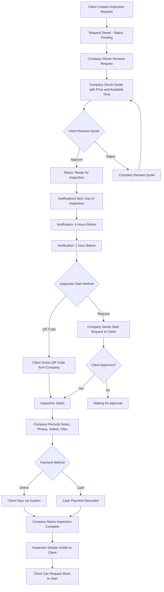
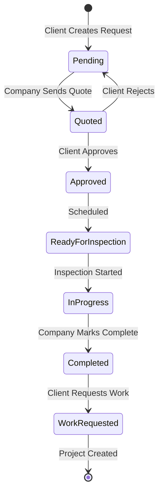

# Inspection Feature Implementation Plan (المعاينات)

## Overview

This feature enables property inspection management for construction companies. Clients can request inspections for properties (homes, villas, etc.), and companies can manage the entire inspection workflow from request to completion.

## Business Workflow



## Entity Status Flow



## Database Entities

### 1. InspectionRequest
Main entity for inspection requests.

| Property | Type | Description |
|----------|------|-------------|
| Id | int | Primary key |
| CompanyId | int | FK to Company |
| ClientUserId | int | FK to User who requested |
| PropertyType | enum | Villa, Apartment, House, Land, Commercial, Other |
| PropertyTypeName | string | Custom property type name if Other |
| Title | string | Inspection title/name |
| Description | string | Detailed description of required work |
| ApproximateArea | decimal | Area in square meters |
| Address | string | Full address |
| Latitude | decimal? | GPS latitude |
| Longitude | decimal? | GPS longitude |
| Status | enum | Request status |
| InspectionFee | decimal? | Fee charged by company |
| ScheduledDate | DateTime? | Agreed inspection date |
| ScheduledTimeStart | TimeSpan? | Start time |
| ScheduledTimeEnd | TimeSpan? | End time |
| ActualStartTime | DateTime? | When inspection actually started |
| ActualEndTime | DateTime? | When inspection completed |
| Notes | string? | General notes |
| CreatedAt | DateTime | Creation timestamp |
| UpdatedAt | DateTime? | Last update timestamp |

### 2. InspectionTimeSlot
Available time slots proposed by client or company.

| Property | Type | Description |
|----------|------|-------------|
| Id | int | Primary key |
| InspectionRequestId | int | FK to InspectionRequest |
| ProposedBy | enum | Client or Company |
| Date | DateTime | Proposed date |
| TimeStart | TimeSpan | Start time |
| TimeEnd | TimeSpan | End time |
| IsSelected | bool | Whether this slot was selected |
| IsAvailable | bool | Whether company is available |

### 3. InspectionQuote
Company pricing and terms.

| Property | Type | Description |
|----------|------|-------------|
| Id | int | Primary key |
| InspectionRequestId | int | FK to InspectionRequest |
| CompanyUserId | int | FK to User who created quote |
| InspectionFee | decimal | Proposed inspection fee |
| Currency | string | Currency code |
| ValidUntil | DateTime | Quote expiration date |
| Terms | string? | Terms and conditions |
| Status | enum | Pending, Accepted, Rejected, Expired |
| CreatedAt | DateTime | Creation timestamp |
| RespondedAt | DateTime? | Client response timestamp |

### 4. InspectionSession
Active inspection tracking.

| Property | Type | Description |
|----------|------|-------------|
| Id | int | Primary key |
| InspectionRequestId | int | FK to InspectionRequest |
| VerificationCode | string | QR code verification string |
| StartedAt | DateTime | When inspection started |
| EndedAt | DateTime? | When inspection ended |
| StartMethod | enum | QRCode or ApprovalRequest |
| StartVerifiedByClient | bool | Client verified start |
| CompanyUserId | int | FK to User conducting inspection |
| ClientLocationVerified | bool | GPS verification of client location |

### 5. InspectionDocument
Photos, videos, and files attached to inspection.

| Property | Type | Description |
|----------|------|-------------|
| Id | int | Primary key |
| InspectionRequestId | int | FK to InspectionRequest |
| Type | enum | Photo, Video, Document, Other |
| FileName | string | Original file name |
| FilePath | string | Storage path |
| FileSize | long | File size in bytes |
| MimeType | string | MIME type |
| Description | string? | Document description |
| UploadedByUserId | int | FK to User who uploaded |
| UploadedAt | DateTime | Upload timestamp |

### 6. InspectionPayment
Payment for inspection fee.

| Property | Type | Description |
|----------|------|-------------|
| Id | int | Primary key |
| InspectionRequestId | int | FK to InspectionRequest |
| Amount | decimal | Payment amount |
| Currency | string | Currency code |
| PaymentMethod | enum | Online, Cash |
| TransactionReference | string? | Payment gateway reference |
| Status | enum | Pending, Completed, Failed, Refunded |
| PaidAt | DateTime? | Payment timestamp |
| PaidByUserId | int | FK to User who paid |

### 7. InspectionWorkRequest
Client request to start work based on inspection.

| Property | Type | Description |
|----------|------|-------------|
| Id | int | Primary key |
| InspectionRequestId | int | FK to InspectionRequest |
| ClientUserId | int | FK to User requesting |
| Status | enum | Pending, Accepted, Rejected, Converted |
| Message | string? | Client message |
| CompanyResponse | string? | Company response |
| CreatedAt | DateTime | Request timestamp |
| RespondedAt | DateTime? | Response timestamp |
| ConvertedToProjectId | int? | FK to Project if converted |

## Enums

### InspectionStatus
```csharp
public enum InspectionStatus
{
    Pending = 1,           // Created, waiting for company review
    Quoted = 2,            // Company sent quote, waiting for client
    Approved = 3,          // Client approved quote
    Rejected = 4,          // Client rejected quote
    ReadyForInspection = 5, // Scheduled and ready
    InProgress = 6,        // Inspection currently happening
    Completed = 7,         // Inspection finished
    Cancelled = 8          // Cancelled by either party
}
```

### PropertyType
```csharp
public enum PropertyType
{
    Villa = 1,
    Apartment = 2,
    House = 3,
    Land = 4,
    Commercial = 5,
    Office = 6,
    Other = 99
}
```

### QuoteStatus
```csharp
public enum QuoteStatus
{
    Pending = 1,
    Accepted = 2,
    Rejected = 3,
    Expired = 4
}
```

### InspectionStartMethod
```csharp
public enum InspectionStartMethod
{
    QRCode = 1,           // Client scans QR from company
    ApprovalRequest = 2   // Company requests, client approves
}
```

### InspectionDocumentType
```csharp
public enum InspectionDocumentType
{
    Photo = 1,
    Video = 2,
    Document = 3,
    Other = 4
}
```

### InspectionPaymentStatus
```csharp
public enum InspectionPaymentStatus
{
    Pending = 1,
    Completed = 2,
    Failed = 3,
    Refunded = 4
}
```

### WorkRequestStatus
```csharp
public enum WorkRequestStatus
{
    Pending = 1,
    Accepted = 2,
    Rejected = 3,
    Converted = 4
}
```

## API Endpoints

### Client Endpoints
| Method | Endpoint | Description |
|--------|----------|-------------|
| POST | /api/inspections | Create inspection request |
| GET | /api/inspections | List client inspections |
| GET | /api/inspections/{id} | Get inspection details |
| PUT | /api/inspections/{id} | Update inspection request |
| DELETE | /api/inspections/{id} | Cancel inspection |
| POST | /api/inspections/{id}/time-slots | Add available time slots |
| POST | /api/inspections/{id}/quotes/{quoteId}/accept | Accept quote |
| POST | /api/inspections/{id}/quotes/{quoteId}/reject | Reject quote |
| POST | /api/inspections/{id}/verify-start | Verify inspection start via QR |
| POST | /api/inspections/{id}/approve-start | Approve company start request |
| POST | /api/inspections/{id}/pay | Pay inspection fee |
| POST | /api/inspections/{id}/request-work | Request work to start |

### Company Endpoints
| Method | Endpoint | Description |
|--------|----------|-------------|
| GET | /api/companies/{companyId}/inspections | List company inspections |
| GET | /api/companies/{companyId}/inspections/{id} | Get inspection details |
| POST | /api/companies/{companyId}/inspections/{id}/quotes | Send quote |
| POST | /api/companies/{companyId}/inspections/{id}/time-slots | Propose time slots |
| POST | /api/companies/{companyId}/inspections/{id}/start | Start inspection |
| POST | /api/companies/{companyId}/inspections/{id}/documents | Upload document |
| GET | /api/companies/{companyId}/inspections/{id}/documents | List documents |
| DELETE | /api/companies/{companyId}/inspections/{id}/documents/{docId} | Delete document |
| POST | /api/companies/{companyId}/inspections/{id}/complete | Mark inspection complete |
| POST | /api/companies/{companyId}/inspections/{id}/confirm-payment | Confirm cash payment |
| GET | /api/companies/{companyId}/inspections/{id}/qr-code | Get QR code for verification |

## Notification Events

| Event | Recipients | Timing |
|-------|------------|--------|
| InspectionRequestCreated | Company Owner | Immediately |
| QuoteSent | Client | Immediately |
| QuoteAccepted | Company Owner | Immediately |
| QuoteRejected | Company Owner | Immediately |
| InspectionReminder_Day | Client, Company | Day of inspection, 8:00 AM |
| InspectionReminder_4Hours | Client, Company | 4 hours before |
| InspectionReminder_1Hour | Client, Company | 1 hour before |
| InspectionStarted | Client | When company starts |
| InspectionCompleted | Client | When company marks complete |
| PaymentReceived | Company | When payment processed |
| WorkRequestReceived | Company | When client requests work |

## Frontend Components

### Client Side
1. **InspectionRequestFormComponent** - Create/edit inspection request
2. **InspectionListComponent** - List client inspections with status
3. **InspectionDetailComponent** - View inspection details
4. **InspectionQuoteComponent** - View and respond to quotes
5. **InspectionVerificationComponent** - QR code scanner and approval
6. **InspectionPaymentComponent** - Payment form
7. **WorkRequestComponent** - Request work to start

### Company Side
1. **CompanyInspectionListComponent** - List incoming inspections
2. **CompanyInspectionDetailComponent** - View and manage inspection
3. **InspectionQuoteFormComponent** - Create and send quotes
4. **InspectionTimeSlotsComponent** - Manage available time slots
5. **InspectionSessionComponent** - Active inspection management
6. **InspectionDocumentsComponent** - Upload and manage documents
7. **InspectionQRCodeComponent** - Display QR code for client scanning

## Implementation Steps

### Phase 1: Backend Foundation
1. Create domain entities
2. Update ApplicationDbContext
3. Create EF migration
4. Create DTOs
5. Create service interface
6. Implement service

### Phase 2: API Layer
1. Create InspectionsController
2. Implement all endpoints
3. Add notification integration
4. Add payment integration

### Phase 3: Frontend
1. Create Angular service
2. Create client components
3. Create company components
4. Add routes
5. Add translations (Arabic/English)

### Phase 4: Integration
1. QR code generation and scanning
2. Push notifications
3. Email notifications
4. Payment gateway integration

## Security Considerations

1. **Company Isolation**: All inspection data must be isolated by company
2. **Client Authorization**: Only the requesting client can view their inspections
3. **QR Code Security**: Verification codes should be single-use and time-limited
4. **Payment Security**: Use existing payment infrastructure with encryption
5. **File Upload Security**: Validate file types and scan for malware

## Additional Features and Suggestions

### 1. Inspection Checklist/Templates
Companies can create predefined inspection checklists for different property types:
- **InspectionTemplate** - Template with checklist items
- **InspectionChecklistItem** - Individual checklist items
- **InspectionResponse** - Responses to checklist items during inspection

This helps standardize inspections and ensures nothing is missed.

### 2. Rating and Review System
After inspection completion:
- **InspectionReview** - Client can rate the inspection service (1-5 stars)
- **ReviewComment** - Written feedback
- Reviews visible on company profile for future clients

### 3. Cost Estimation
Company can provide detailed cost estimate:
- **InspectionCostEstimate** - Detailed breakdown of expected costs
- **CostEstimateItem** - Individual line items (materials, labor, etc.)
- Helps client make informed decisions

### 4. Rescheduling and Cancellation
- **InspectionRescheduleRequest** - Request to change date/time
- **CancellationReason** - Track why inspections are cancelled
- **CancellationFee** - Optional fee for late cancellations
- Automatic rescheduling workflow

### 5. Multi-Company Quotes
Allow clients to request quotes from multiple companies:
- **QuoteComparison** - Side-by-side comparison view
- **Competitive pricing** - Better deals for clients
- **Company response tracking** - See which companies responded

### 6. Inspection Report Generation
Generate professional PDF reports:
- **ReportTemplate** - Customizable report templates
- **InspectionReport** - Generated report with all details
- Include photos, notes, cost estimates, recommendations
- Shareable with stakeholders

### 7. In-App Communication
Built-in messaging for inspection discussions:
- **InspectionChat** - Chat thread for each inspection
- **ChatMessage** - Individual messages
- **Attachment support** - Share files in chat
- Reduces need for external communication

### 8. Map Integration
Enhanced location features:
- **Google Maps integration** - Show inspection location
- **Directions** - Navigate to inspection site
- **Nearby inspections** - Optimize company route planning
- **Location verification** - Confirm arrival at correct location

### 9. Weather Integration
Check weather for outdoor inspections:
- **Weather API integration** - Forecast for scheduled date
- **Weather alerts** - Notify if conditions are unsuitable
- **Automatic rescheduling suggestions** - Propose better dates

### 10. Digital Signatures
Capture signatures during inspection:
- **ClientSignature** - Client acknowledgment
- **CompanySignature** - Inspector acknowledgment
- **Timestamped** - When signatures were captured
- Legal documentation for contracts

### 11. Audio Notes
Voice recording for hands-free note taking:
- **AudioNote** - Voice recording attachment
- **Transcription** - Optional speech-to-text
- Useful during active inspection

### 12. Team Assignment
Assign multiple team members:
- **InspectionTeamMember** - Team members assigned to inspection
- **Role assignment** - Lead inspector, assistant, etc.
- **Team availability** - Check team schedules

### 13. Follow-up Inspections
Schedule related inspections:
- **FollowUpInspection** - Link to original inspection
- **Progress tracking** - Compare before/after
- **Recurring schedule** - Regular inspection intervals

### 14. Inspection History
Track all inspections for a property:
- **PropertyInspectionHistory** - All inspections at same address
- **Historical data** - Compare changes over time
- **Property profile** - Build comprehensive property record

### 15. Offline Mode
Support for areas with poor connectivity:
- **Offline data capture** - Store locally when offline
- **Background sync** - Upload when connection restored
- **Conflict resolution** - Handle sync conflicts

### 16. Integration with Projects
Seamless conversion to project:
- **ProjectFromInspection** - Create project from inspection data
- **Data inheritance** - Copy relevant details
- **Reference link** - Link project to original inspection
- **Budget import** - Use cost estimate as project budget

### 17. Analytics Dashboard
Company insights:
- **Inspection metrics** - Completion rates, average time, etc.
- **Revenue tracking** - Income from inspections
- **Client conversion** - Inspections that became projects
- **Performance trends** - Identify improvement areas

### 18. Custom Fields
Flexible data capture:
- **InspectionCustomField** - Company-specific fields
- **FieldType** - Text, number, date, select, etc.
- **Required/Optional** - Validation rules
- **DefaultValue** - Pre-populate common values

### 19. SMS Notifications
Additional notification channel:
- **SMS for critical events** - Confirmations, reminders
- **WhatsApp integration** - Popular in some regions
- **Customizable preferences** - User chooses channels

### 20. Recurring Inspections
For ongoing maintenance:
- **RecurringInspectionSchedule** - Define frequency
- **Auto-generation** - Create new inspections automatically
- **Maintenance contracts** - Link to service agreements

## Recommended Priority Implementation

### Phase 1 - Core (Must Have)
1. Basic inspection request and workflow
2. Quote system
3. Scheduling with time slots
4. QR code verification
5. Document upload
6. Payment processing
7. Notifications

### Phase 2 - Enhanced (Should Have)
1. Inspection checklists/templates
2. Cost estimation
3. Rescheduling workflow
4. In-app chat
5. Map integration
6. Digital signatures
7. Inspection reports

### Phase 3 - Advanced (Nice to Have)
1. Rating/review system
2. Multi-company quotes
3. Weather integration
4. Audio notes
5. Offline mode
6. Analytics dashboard
7. Custom fields

## Files to Create

### Backend
- `src/ConstructionManagement.Domain/Entities/Inspection.cs`
- `src/ConstructionManagement.Application/DTOs/InspectionDTOs.cs`
- `src/ConstructionManagement.Application/Interfaces/IInspectionService.cs`
- `src/ConstructionManagement.Infrastructure/Services/InspectionService.cs`
- `src/ConstructionManagement.WebApi/Controllers/InspectionsController.cs`

### Frontend
- `construction-cms/src/app/core/services/inspection.service.ts`
- `construction-cms/src/app/features/admin/inspections/` (company side)
- `construction-cms/src/app/features/client/inspections/` (client side)

### Migrations
- `src/ConstructionManagement.Infrastructure/Migrations/YYYYMMDDHHMMSS_AddInspectionFeature.cs`
