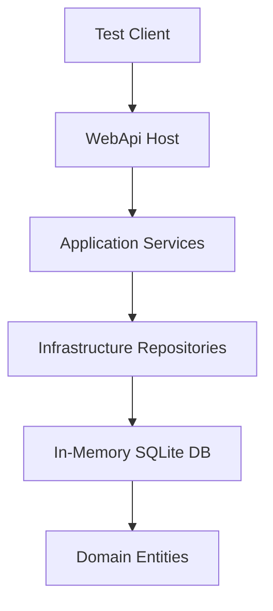
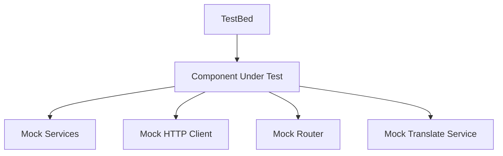

# Integration Tests Plan for Construction CMS

## Executive Summary

This document outlines a comprehensive strategy for implementing integration tests for both the frontend (Angular) and backend (.NET) components of the Construction CMS application.

## Current State Analysis

### Backend Testing Infrastructure
- **Framework**: xUnit with .NET 9.0
- **Tools**: Moq (mocking), FluentAssertions (assertions), Entity Framework InMemory
- **Existing Tests**: 
  - Unit tests in `tests/ConstructionManagement.Tests/Unit/`
  - Integration tests in `tests/ConstructionManagement.Tests/Integration/`
  - Test base class: `IntegrationTestBase.cs` with in-memory SQLite database
- **Coverage**: Services, repositories, and domain logic

### Frontend Testing Infrastructure
- **Framework**: Angular 20 with Karma + Jasmine
- **Status**: Test infrastructure configured but **no tests exist yet**
- **Configuration**: `angular.json` has test builder configured
- **Dependencies**: `@types/jasmine`, `jasmine-core`, `karma`, `karma-jasmine`, etc.

## Integration Test Strategy

### Backend Integration Tests

#### 1. API Endpoint Integration Tests
**Purpose**: Test HTTP endpoints end-to-end with real database interactions

**Test Categories**:
- Authentication & Authorization
- Project Management
- Daily Log Operations
- BOQ (Bill of Quantities) Management
- Financial Transactions
- Media Upload & Review
- Safety Management
- Equipment Management
- Document Management
- Quality Control
- Analytics & Reporting

**Implementation Approach**:


**Key Test Scenarios**:
1. **Authentication Flow**
   - User registration with valid data
   - User login with correct credentials
   - Token generation and validation
   - Password reset flow
   - Role-based access control

2. **Project Lifecycle**
   - Create project with all required fields
   - Update project settings
   - Assign team members
   - Change project status
   - Delete project (soft delete)

3. **Daily Log Operations**
   - Open day for logging
   - Add work entries
   - Upload site photos
   - Close day with validation
   - Reopen closed day with authorization

4. **Financial Transactions**
   - Create invoice
   - Process payment
   - Track cash flow
   - Generate financial reports

#### 2. Service Layer Integration Tests
**Purpose**: Test business logic with real database and external dependencies

**Test Categories**:
- AuthService (authentication & JWT)
- ProjectService (project CRUD & operations)
- DailyLogService (daily work logging)
- BOQItemService (BOQ management)
- InvoiceService (invoicing)
- SiteMediaService (media handling)
- NotificationService (notifications)
- SafetyService (safety records)
- EquipmentService (equipment management)

**Implementation Pattern**:
```csharp
[Fact]
public async Task ServiceMethod_WithValidInput_ReturnsExpectedResult()
{
    // Arrange
    var entity = SeedTestData();
    var service = CreateService();

    // Act
    var result = await service.MethodAsync(entity.Id);

    // Assert
    result.Should().NotBeNull();
    result.Property.Should().Be(expectedValue);
}
```

#### 3. Database Integration Tests
**Purpose**: Test data persistence, relationships, and constraints

**Test Categories**:
- Entity relationships (one-to-many, many-to-many)
- Cascade delete behavior
- Unique constraints
- Data validation
- Transaction rollback on errors
- Multi-tenant data isolation

### Frontend Integration Tests

#### 1. Component Integration Tests
**Purpose**: Test Angular components with real services and dependencies

**Test Categories**:
- Authentication Components (Login, Register)
- Dashboard Components
- Project Management Components
- Daily Log Components
- BOQ Components
- Financial Components
- Media Components
- Safety Components
- Equipment Components
- Document Components

**Implementation Approach**:


**Key Test Scenarios**:
1. **Authentication Flow**
   - Login form validation
   - Successful login redirects to dashboard
   - Failed login shows error message
   - Logout clears session

2. **Dashboard**
   - Loads project statistics
   - Displays recent activity
   - Shows notifications
   - Handles role-based visibility

3. **Project Management**
   - Create project form validation
   - Submit creates project via API
   - List displays all projects
   - Filter and search functionality
   - Edit project updates data

4. **Daily Log**
   - Open day for logging
   - Add work entry
   - Upload photos
   - Close day with confirmation
   - View historical logs

**Implementation Pattern**:
```typescript
describe('ComponentName', () => {
  let component: ComponentName;
  let fixture: ComponentFixture<ComponentName>;
  let mockService: jasmine.SpyObj<ServiceType>;

  beforeEach(async () => {
    mockService = jasmine.createSpyObj('ServiceType', ['method1', 'method2']);
    await TestBed.configureTestingModule({
      declarations: [ComponentName],
      providers: [
        { provide: ServiceType, useValue: mockService }
      ]
    }).compileComponents();

    fixture = TestBed.createComponent(ComponentName);
    component = fixture.componentInstance;
  });

  it('should create', () => {
    expect(component).toBeTruthy();
  });

  it('should load data on init', async () => {
    mockService.method1.and.returnValue(of(mockData));
    await component.ngOnInit();
    expect(component.data).toEqual(mockData);
  });
});
```

#### 2. Service Integration Tests
**Purpose**: Test Angular services with real HTTP client and API

**Test Categories**:
- AuthService (authentication)
- ProjectService (project operations)
- DailyLogService (daily logging)
- BOQService (BOQ management)
- InvoiceService (invoicing)
- MediaService (media handling)
- NotificationService (notifications)
- I18nService (internationalization)

**Implementation Pattern**:
```typescript
describe('ServiceName', () => {
  let service: ServiceName;
  let httpMock: HttpTestingController;

  beforeEach(() => {
    TestBed.configureTestingModule({
      imports: [HttpClientTestingModule],
      providers: [ServiceName]
    });
    service = TestBed.inject(ServiceName);
    httpMock = TestBed.inject(HttpTestingController);
  });

  it('should fetch data', () => {
    const mockData = { id: 1, name: 'Test' };
    service.getData().subscribe(data => {
      expect(data).toEqual(mockData);
    });

    const req = httpMock.expectOne('/api/endpoint');
    req.flush(mockData);
  });
});
```

#### 3. E2E Integration Tests
**Purpose**: Test complete user workflows across multiple components

**Test Categories**:
- User registration and login flow
- Create project and add team members
- Complete daily log workflow
- Upload and review media
- Generate and view reports
- Multi-role user scenarios

**Tools**: Cypress or Playwright (recommended for Angular)

**Implementation Pattern**:
```typescript
describe('User Workflow', () => {
  it('should complete project creation workflow', () => {
    cy.visit('/login');
    cy.get('[data-testid="email"]').type('user@test.com');
    cy.get('[data-testid="password"]').type('password123');
    cy.get('[data-testid="login-btn"]').click();

    cy.url().should('include', '/dashboard');
    cy.get('[data-testid="create-project-btn"]').click();

    cy.get('[data-testid="project-name"]').type('Test Project');
    cy.get('[data-testid="submit-btn"]').click();

    cy.contains('Project created successfully').should('be.visible');
  });
});
```

## Implementation Roadmap

### Phase 1: Backend API Integration Tests (Priority: High)
- [ ] Set up WebApplicationFactory for API testing
- [ ] Create test base class for API tests
- [ ] Implement authentication endpoint tests
- [ ] Implement project management endpoint tests
- [ ] Implement daily log endpoint tests
- [ ] Implement financial transaction endpoint tests

### Phase 2: Backend Service Integration Tests (Priority: High)
- [ ] Enhance existing service tests with real database
- [ ] Add transaction rollback tests
- [ ] Add multi-tenant isolation tests
- [ ] Add concurrency handling tests
- [ ] Add error handling and validation tests

### Phase 3: Frontend Component Integration Tests (Priority: Medium)
- [ ] Set up TestBed configuration
- [ ] Create test utilities and helpers
- [ ] Implement authentication component tests
- [ ] Implement dashboard component tests
- [ ] Implement project management component tests
- [ ] Implement daily log component tests

### Phase 4: Frontend Service Integration Tests (Priority: Medium)
- [ ] Set up HttpClientTestingModule
- [ ] Create mock data factories
- [ ] Implement authentication service tests
- [ ] Implement project service tests
- [ ] Implement daily log service tests
- [ ] Implement BOQ service tests

### Phase 5: E2E Integration Tests (Priority: Low)
- [ ] Set up Cypress/Playwright
- [ ] Create page object models
- [ ] Implement critical user workflow tests
- [ ] Implement cross-browser tests
- [ ] Implement visual regression tests

## Test Data Management

### Backend Test Data
- **Seed Data**: Use `IntegrationTestBase` methods for consistent test data
- **Factories**: Create factory methods for complex entities
- **Fixtures**: JSON fixtures for static test data
- **Cleanup**: Automatic cleanup in test base class

### Frontend Test Data
- **Mock Data**: Create mock data objects in test files
- **Fixtures**: JSON fixtures for static test data
- **Factories**: Helper functions to generate test data
- **Response Interceptors**: Mock HTTP responses consistently

## Continuous Integration

### Backend CI Pipeline
```yaml
# Example GitHub Actions workflow
name: Backend Tests
on: [push, pull_request]
jobs:
  test:
    runs-on: ubuntu-latest
    steps:
      - uses: actions/checkout@v3
      - name: Setup .NET
        uses: actions/setup-dotnet@v3
        with:
          dotnet-version: '9.0'
      - name: Restore dependencies
        run: dotnet restore
      - name: Build
        run: dotnet build --no-restore
      - name: Run tests
        run: dotnet test --no-build --verbosity normal --collect:"XPlat Code Coverage"
      - name: Upload coverage
        uses: codecov/codecov-action@v3
```

### Frontend CI Pipeline
```yaml
# Example GitHub Actions workflow
name: Frontend Tests
on: [push, pull_request]
jobs:
  test:
    runs-on: ubuntu-latest
    steps:
      - uses: actions/checkout@v3
      - name: Setup Node.js
        uses: actions/setup-node@v3
        with:
          node-version: '20'
      - name: Install dependencies
        run: npm ci
        working-directory: ./construction-cms
      - name: Run tests
        run: npm test -- --watch=false --browsers=ChromeHeadless
        working-directory: ./construction-cms
      - name: Run E2E tests
        run: npm run e2e
        working-directory: ./construction-cms
```

## Test Coverage Goals

### Backend Coverage Targets
- **Overall**: 80% minimum
- **Application Layer**: 85%
- **Domain Layer**: 90%
- **Infrastructure Layer**: 75%
- **API Controllers**: 80%

### Frontend Coverage Targets
- **Overall**: 70% minimum
- **Services**: 80%
- **Components**: 70%
- **Guards**: 85%
- **Pipes**: 80%

## Best Practices

### Backend Testing
1. **Use In-Memory Database**: Fast and isolated tests
2. **Arrange-Act-Assert Pattern**: Clear test structure
3. **Descriptive Test Names**: Explain what is being tested
4. **One Assertion Per Test**: Focused and maintainable
5. **Mock External Dependencies**: Isolate unit under test
6. **Test Happy Path & Edge Cases**: Comprehensive coverage
7. **Use FluentAssertions**: Readable and expressive assertions

### Frontend Testing
1. **Use TestBed**: Angular's testing utility
2. **Mock Services**: Isolate component logic
3. **Test User Interactions**: Click, type, submit
4. **Test Async Operations**: Promises and observables
4. **Use Data Attributes**: Select elements by test IDs
5. **Test Accessibility**: ARIA attributes and keyboard navigation
6. **Test Responsive Design**: Different screen sizes
7. **Test Error States**: Validation and error messages

## Tools and Dependencies

### Backend
- **Testing Framework**: xUnit 2.9.2
- **Mocking**: Moq 4.20.72
- **Assertions**: FluentAssertions 7.0.0
- **Database**: Entity Framework InMemory 9.0.1
- **API Testing**: Microsoft.AspNetCore.Mvc.Testing 9.0.0
- **Coverage**: coverlet.collector 6.0.2

### Frontend
- **Testing Framework**: Jasmine 5.9.0
- **Test Runner**: Karma 6.4.0
- **HTTP Testing**: HttpClientTestingModule
- **E2E Testing**: Cypress or Playwright (to be added)
- **Coverage**: karma-coverage 2.2.0

## Next Steps

1. **Review and Approve Plan**: Get stakeholder approval on this plan
2. **Set Up Development Environment**: Ensure all tools are installed
3. **Create Test Infrastructure**: Set up base classes and utilities
4. **Implement Priority Tests**: Start with high-priority test categories
5. **Integrate with CI**: Set up automated test runs
6. **Monitor Coverage**: Track and improve test coverage
7. **Refactor as Needed**: Improve tests based on feedback

## Success Criteria

- [ ] All critical user flows have integration tests
- [ ] Backend API coverage meets 80% target
- [ ] Frontend component coverage meets 70% target
- [ ] Tests run automatically on every commit
- [ ] Test execution time is under 10 minutes
- [ ] No flaky tests in the test suite
- [ ] Documentation is complete and up-to-date
