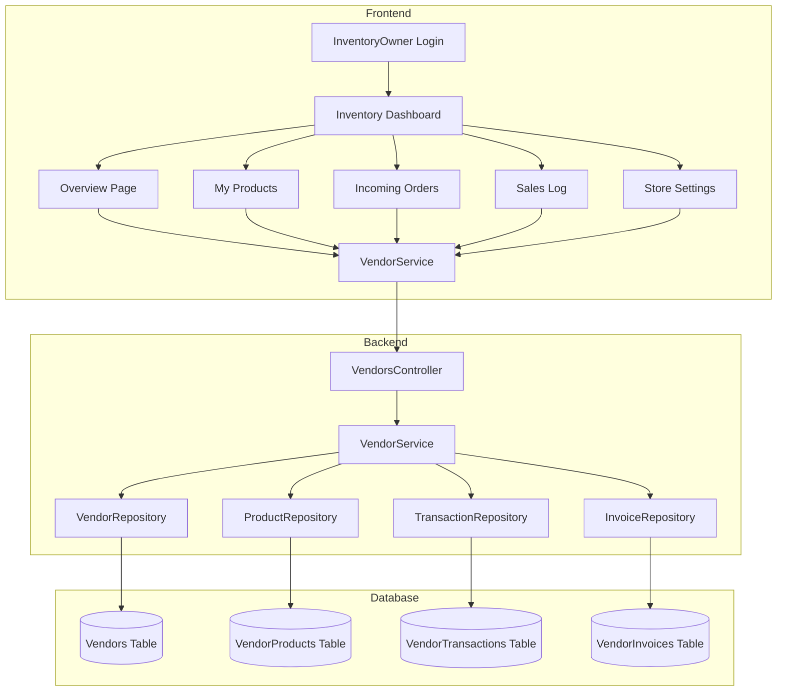
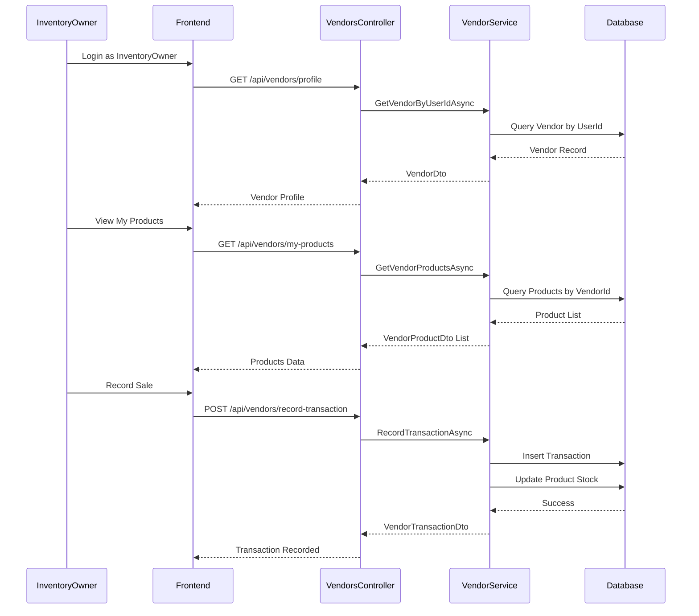

# Inventory Owner E-commerce System - Implementation Plan

## Overview

This plan outlines the remaining work to complete the Inventory Owner E-commerce System. The goal is to empower "Inventory Owners" to operate as independent suppliers on the platform, managing their own catalog of materials and viewing orders placed by other companies.

## Current Implementation Status

### Backend - COMPLETED

| Component | Status | Details |
|-----------|--------|---------|
| [`AuthService.cs`](src/ConstructionManagement.Infrastructure/Services/AuthService.cs) | DONE | Auto-creates Vendor record for InventoryOwner registration with `IsPublic=true` |
| [`VendorProduct.cs`](src/ConstructionManagement.Domain/Entities/VendorProduct.cs) | DONE | Has `QuantityInStock`, `LowStockThreshold`, `PurchasePrice` properties |
| [`VendorTransaction.cs`](src/ConstructionManagement.Domain/Entities/VendorTransaction.cs) | DONE | Tracks inventory movements with type, quantity, price, reference |
| [`VendorsController.cs`](src/ConstructionManagement.WebApi/Controllers/VendorsController.cs) | DONE | Has profile, products, transactions endpoints |
| [`VendorService.cs`](src/ConstructionManagement.Infrastructure/Services/VendorService.cs) | DONE | Implements all required service methods |
| [`IVendorService.cs`](src/ConstructionManagement.Application/Interfaces/IVendorService.cs) | DONE | Interface defines all required operations |

### Frontend - PARTIALLY COMPLETED

| Component | Status | Details |
|-----------|--------|---------|
| [`inventory-dashboard.routes.ts`](construction-cms/src/app/features/inventory-dashboard/inventory-dashboard.routes.ts) | DONE | Routes defined with role guard |
| [`inventory-layout.component.ts`](construction-cms/src/app/features/inventory-dashboard/inventory-layout.component.ts) | DONE | Basic layout with sidebar/topbar |
| [`auth.service.ts`](construction-cms/src/app/core/services/auth.service.ts) | DONE | Navigation logic handles InventoryOwner type |
| [`login.component.ts`](construction-cms/src/app/features/auth/login/login.component.ts) | DONE | Redirects to /inventory-dashboard for type 3 |
| [`register.component.ts`](construction-cms/src/app/features/auth/register/register.component.ts) | DONE | Redirects to /inventory-dashboard for type 3 |
| [`sidebar.component.ts`](construction-cms/src/app/layout/sidebar/sidebar.component.ts) | DONE | Has inventory owner menu items |
| [`vendor.service.ts`](construction-cms/src/app/core/services/vendor.service.ts) | PARTIAL | Missing inventory-specific methods |

### Frontend - STUB COMPONENTS NEEDING IMPLEMENTATION

| Component | Current State |
|-----------|---------------|
| [`inventory-overview.component.ts`](construction-cms/src/app/features/inventory-dashboard/pages/inventory-overview/inventory-overview.component.ts) | Placeholder only |
| [`my-products.component.ts`](construction-cms/src/app/features/inventory-dashboard/pages/my-products/my-products.component.ts) | Placeholder only |
| [`incoming-orders.component.ts`](construction-cms/src/app/features/inventory-dashboard/pages/incoming-orders/incoming-orders.component.ts) | Placeholder only |
| [`sales-log.component.ts`](construction-cms/src/app/features/inventory-dashboard/pages/sales-log/sales-log.component.ts) | Placeholder only |
| [`store-settings.component.ts`](construction-cms/src/app/features/inventory-dashboard/pages/store-settings/store-settings.component.ts) | Placeholder only |

---

## Remaining Implementation Work

### 1. Frontend: VendorService Enhancement

**File:** [`vendor.service.ts`](construction-cms/src/app/core/services/vendor.service.ts)

Add the following methods:

```typescript
// Inventory Owner specific methods
getMyProducts(): Observable<VendorProduct[]>
addMyProduct(product: CreateVendorProductRequest): Observable<VendorProduct>
updateMyProduct(id: number, product: UpdateVendorProductRequest): Observable<VendorProduct>

// Transaction management
recordTransaction(request: CreateVendorTransactionRequest): Observable<VendorTransaction>
getMyTransactions(): Observable<VendorTransaction[]>

// Orders/Invoices for this vendor
getMyOrders(): Observable<VendorInvoice[]>
getMyStats(): Observable<VendorStats>

// Location update
updateLocation(latitude: number, longitude: number): Observable<Vendor>
```

**New Interfaces Needed:**

```typescript
export interface VendorTransaction {
  id: number;
  vendorId: number;
  vendorProductId: number;
  productName: string;
  transactionType: 'Sale' | 'Purchase' | 'Adjustment' | 'InitialStock' | 'Return' | 'Loss';
  quantity: number;
  unitPrice: number;
  totalAmount: number;
  transactionDate: Date;
  notes?: string;
  referenceNumber?: string;
}

export interface VendorStats {
  totalSales: number;
  totalRevenue: number;
  totalProfit: number;
  totalProducts: number;
  lowStockCount: number;
  pendingOrders: number;
  recentTransactions: VendorTransaction[];
}
```

---

### 2. Frontend: InventoryOverviewComponent

**File:** [`inventory-overview.component.ts`](construction-cms/src/app/features/inventory-dashboard/pages/inventory-overview/inventory-overview.component.ts)

**Features:**
- Stats cards showing: Revenue, Orders, Profit, Low Stock Items
- Recent activity list - last 5 transactions
- Quick action buttons: Add Product, Record Sale

**Implementation Details:**
- Call `VendorService.getMyStats()` on init
- Display loading state while fetching
- Handle error states gracefully
- Use responsive grid for stats cards

---

### 3. Frontend: MyProductsComponent

**File:** [`my-products.component.ts`](construction-cms/src/app/features/inventory-dashboard/pages/my-products/my-products.component.ts)

**Features:**
- Table displaying all products with columns:
  - Name, Category, Unit, Price, Stock, Cost, Status
- Add new product button - opens modal/form
- Edit product - inline or modal
- Delete product - with confirmation
- Low stock indicator - highlight items below threshold
- Stock adjustment quick action

**Implementation Details:**
- Call `VendorService.getMyProducts()` on init
- Implement reactive form for add/edit
- Include validation for price, quantity fields
- Show success/error toasts on operations

---

### 4. Frontend: IncomingOrdersComponent

**File:** [`incoming-orders.component.ts`](construction-cms/src/app/features/inventory-dashboard/pages/incoming-orders/incoming-orders.component.ts)

**Features:**
- List of VendorInvoices created by companies against this vendor
- Filter by status: Pending, Approved, Rejected
- Search by invoice number or company name
- View invoice details - modal or expandable row
- Export to PDF option - optional

**Implementation Details:**
- Call `VendorService.getMyOrders()` on init
- Display company name, invoice number, amount, date, status
- Show material type and description
- Link to original project if available

---

### 5. Frontend: SalesLogComponent

**File:** [`sales-log.component.ts`](construction-cms/src/app/features/inventory-dashboard/pages/sales-log/sales-log.component.ts)

**Features:**
- Two tabs: Record Sale and Transaction History
- **Record Sale Tab:**
  - Select product from dropdown
  - Enter quantity
  - Auto-calculate total based on product price
  - Optional: customer name, notes
  - Submit button - creates Sale transaction
- **Add Stock Tab:**
  - Select product
  - Enter quantity and cost
  - Submit - creates Purchase transaction
- **Transaction History:**
  - Filterable table of all transactions
  - Date range filter
  - Type filter

**Implementation Details:**
- Use reactive forms with validation
- Call `VendorService.recordTransaction()` for submissions
- Refresh list after successful transaction
- Show confirmation dialog for stock adjustments

---

### 6. Frontend: StoreSettingsComponent

**File:** [`store-settings.component.ts`](construction-cms/src/app/features/inventory-dashboard/pages/store-settings/store-settings.component.ts)

**Features:**
- Store profile form: Name, Phone, Email, Address, Notes
- **Location Picker:**
  - Map interface using Leaflet or similar
  - Click to set location
  - Display current location marker
  - Latitude/Longitude display
- Visibility warning banner:
  - "Without a set location, your store will not appear in 'Nearby' searches"
- Save button - updates profile and location

**Implementation Details:**
- Integrate mapping library - Leaflet with Angular wrapper
- Call `VendorService.getMyProfile()` on init
- Call `VendorService.updateMyProfile()` on save
- Call `VendorService.updateLocation()` for location updates
- Show success toast on save

---

### 7. Backend: Additional Endpoints

**File:** [`VendorsController.cs`](src/ConstructionManagement.WebApi/Controllers/VendorsController.cs)

Add the following endpoints:

```csharp
// GET: api/vendors/my-orders
[HttpGet("my-orders")]
public async Task<ActionResult<IEnumerable<VendorInvoiceDto>>> GetMyOrders()
{
    var userId = GetCurrentUserId();
    var vendor = await _vendorService.GetVendorByUserIdAsync(userId);
    if (vendor == null) return NotFound("Vendor profile not found");
    
    var invoices = await _vendorService.GetInvoicesByVendorAsync(vendor.Id);
    return Ok(invoices);
}

// GET: api/vendors/my-stats
[HttpGet("my-stats")]
public async Task<ActionResult<VendorStatsDto>> GetMyStats()
{
    var userId = GetCurrentUserId();
    var stats = await _vendorService.GetVendorStatsByUserIdAsync(userId);
    if (stats == null) return NotFound("Vendor profile not found");
    return Ok(stats);
}

// POST: api/vendors/my-location
[HttpPost("my-location")]
public async Task<ActionResult> UpdateMyLocation([FromBody] UpdateLocationRequest request)
{
    var userId = GetCurrentUserId();
    await _vendorService.UpdateVendorLocationAsync(userId, request.Latitude, request.Longitude);
    return Ok();
}
```

---

### 8. Backend: VendorService Enhancements

**File:** [`VendorService.cs`](src/ConstructionManagement.Infrastructure/Services/VendorService.cs)

Add methods:

```csharp
public async Task<VendorStatsDto?> GetVendorStatsByUserIdAsync(int userId)
{
    var vendor = await GetVendorByUserIdAsync(userId);
    if (vendor == null) return null;
    
    var products = await GetVendorProductsAsync(vendor.Id);
    var transactions = await GetVendorTransactionsAsync(vendor.Id);
    var invoices = await GetInvoicesByVendorAsync(vendor.Id);
    
    // Calculate stats
    var sales = transactions.Where(t => t.TransactionType == "Sale");
    var totalRevenue = sales.Sum(t => t.TotalAmount);
    var totalCost = sales.Sum(t => t.Quantity * products.First(p => p.Id == t.VendorProductId).PurchasePrice);
    
    return new VendorStatsDto
    {
        TotalSales = sales.Count(),
        TotalRevenue = totalRevenue,
        TotalProfit = totalRevenue - totalCost,
        TotalProducts = products.Count(),
        LowStockCount = products.Count(p => p.QuantityInStock <= p.LowStockThreshold),
        PendingOrders = invoices.Count(i => i.ApprovalStatus == "Pending"),
        RecentTransactions = transactions.Take(5).ToList()
    };
}

public async Task UpdateVendorLocationAsync(int userId, double latitude, double longitude)
{
    var vendor = await _vendorRepository.AsQueryable()
        .FirstOrDefaultAsync(v => v.UserId == userId);
    
    if (vendor == null) throw new KeyNotFoundException("Vendor not found");
    
    vendor.Latitude = latitude;
    vendor.Longitude = longitude;
    vendor.UpdatedAt = DateTime.UtcNow;
    
    await _unitOfWork.SaveChangesAsync();
}
```

---

### 9. Backend: New DTOs

**File:** [`VendorDto.cs`](src/ConstructionManagement.Application/DTOs/Vendor/VendorDto.cs) - Add new DTOs

```csharp
public class VendorStatsDto
{
    public int TotalSales { get; set; }
    public decimal TotalRevenue { get; set; }
    public decimal TotalProfit { get; set; }
    public int TotalProducts { get; set; }
    public int LowStockCount { get; set; }
    public int PendingOrders { get; set; }
    public List<VendorTransactionDto> RecentTransactions { get; set; } = new();
}

public class UpdateLocationRequest
{
    public double Latitude { get; set; }
    public double Longitude { get; set; }
}
```

---

## Architecture Diagram



---

## Component Interaction Flow



---

## Implementation Order

1. **Backend Enhancements** - Add missing endpoints and service methods
2. **Frontend VendorService** - Add new methods and interfaces
3. **InventoryOverviewComponent** - Dashboard landing page
4. **MyProductsComponent** - Product catalog management
5. **SalesLogComponent** - Transaction recording
6. **IncomingOrdersComponent** - View company orders
7. **StoreSettingsComponent** - Location picker and profile
8. **Integration Testing** - Verify complete flow

---

## Verification Checklist

- [ ] Register as Inventory Owner - verify Vendor record created
- [ ] Login as Inventory Owner - verify redirect to /inventory-dashboard
- [ ] Add product - verify appears in catalog with stock
- [ ] Record sale - verify stock decreases, transaction logged
- [ ] Add stock - verify stock increases, transaction logged
- [ ] Set location - verify coordinates saved
- [ ] Login as Company Admin - search for vendor
- [ ] Create invoice for vendor - verify appears in vendor's incoming orders
- [ ] View order as Inventory Owner - verify invoice visible

---

## Dependencies

### Frontend
- Angular 17+ with standalone components
- TailwindCSS for styling
- Angular Reactive Forms
- RxJS for state management
- Optional: Leaflet for maps

### Backend
- .NET 8
- Entity Framework Core
- Existing infrastructure services

---

## Notes

- The backend infrastructure is largely complete
- Frontend components are stubs needing full implementation
- Location picker requires mapping library integration
- Consider adding real-time notifications for new orders
- Future enhancement: Mobile-responsive design optimization