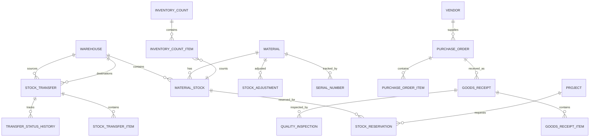

# Inventory & Warehouse Missing Features Analysis

## Executive Summary

This document analyzes the current state of the Inventory & Warehouse management system in the Construction Management System and identifies missing features that would make it a complete, enterprise-ready solution.

---

## Current Implementation Overview

### Existing Entities

| Entity | Purpose | Status |
|--------|---------|--------|
| [`Material`](src/ConstructionManagement.Domain/Entities/Material.cs) | Material definition with SKU, barcode, category | ✅ Implemented |
| [`MaterialCategory`](src/ConstructionManagement.Domain/Entities/MaterialCategory.cs) | Material categorization | ✅ Implemented |
| [`MaterialStock`](src/ConstructionManagement.Domain/Entities/MaterialStock.cs) | Stock levels per warehouse | ✅ Implemented |
| [`MaterialRequest`](src/ConstructionManagement.Domain/Entities/MaterialRequest.cs) | Material request workflow | ✅ Implemented |
| [`MaterialRequestItem`](src/ConstructionManagement.Domain/Entities/MaterialRequestItem.cs) | Request line items | ✅ Implemented |
| [`MaterialConsumption`](src/ConstructionManagement.Domain/Entities/MaterialConsumption.cs) | Material consumption tracking | ✅ Implemented |
| [`Warehouse`](src/ConstructionManagement.Domain/Entities/Warehouse.cs) | Company warehouse | ✅ Implemented |
| [`InventoryWarehouse`](src/ConstructionManagement.Domain/Entities/InventoryWarehouse.cs) | Inventory owner warehouse | ✅ Implemented |
| [`InventoryStock`](src/ConstructionManagement.Domain/Entities/InventoryStock.cs) | Stock in inventory warehouses | ✅ Implemented |
| [`InventoryOrder`](src/ConstructionManagement.Domain/Entities/InventoryOrder.cs) | Order from company to inventory owner | ✅ Implemented |
| [`Vendor`](src/ConstructionManagement.Domain/Entities/Vendor.cs) | Supplier management | ✅ Implemented |
| [`VendorTransaction`](src/ConstructionManagement.Domain/Entities/VendorTransaction.cs) | Basic transaction tracking | ✅ Implemented |

### Existing Features

- ✅ Material CRUD with SKU/Barcode support
- ✅ Multi-warehouse support
- ✅ Stock level tracking (current, reserved, available)
- ✅ Material request workflow (pending, approved, rejected, fulfilled)
- ✅ Material consumption tracking with project linkage
- ✅ Vendor management
- ✅ Basic transaction types (Sale, Purchase, Adjustment)
- ✅ Discount tiers and promotions
- ✅ Recurring orders
- ✅ Customer loyalty tiers

---

## Missing Features

### 1. Stock Transfer Management 🔴 Critical

**Description:** Ability to transfer stock between warehouses with full tracking.

**Missing Components:**
- `StockTransfer` entity for transfer orders
- `StockTransferItem` entity for transfer line items
- Transfer status workflow (Draft, InTransit, Received, Cancelled)
- In-transit inventory tracking
- Transfer approval workflow
- Transfer cost tracking

**Business Impact:**
- Cannot move materials between warehouses
- No visibility of materials in transit
- Manual workarounds required for stock redistribution

---

### 2. Stock Adjustment & Inventory Counting 🔴 Critical

**Description:** Formal stock adjustment process with reason codes and cycle counting.

**Missing Components:**
- `StockAdjustment` entity with reason codes
- `InventoryCount` entity for cycle counting
- `InventoryCountItem` entity for count line items
- Adjustment types (Gain, Loss, Damage, Theft, Correction)
- Variance tracking and reporting
- Approval workflow for adjustments
- Period/Annual inventory count scheduling

**Business Impact:**
- No audit trail for stock corrections
- Cannot perform systematic inventory counts
- No variance analysis

---

### 3. Purchase Order Management 🔴 Critical

**Description:** Complete purchase order workflow for procuring materials from suppliers.

**Missing Components:**
- `PurchaseOrder` entity
- `PurchaseOrderItem` entity
- PO status workflow (Draft, Submitted, Approved, Ordered, Partial, Received, Closed)
- Goods Receipt Note (GRN) entity
- PO-GRN-Invoice matching (3-way match)
- Supplier quotation comparison
- PO approval workflow

**Business Impact:**
- Cannot formally order from suppliers
- No tracking of expected deliveries
- No procurement cost control

---

### 4. Goods Receipt & Inspection 🟡 Important

**Description:** Receive goods against purchase orders with quality inspection.

**Missing Components:**
- `GoodsReceipt` entity
- `GoodsReceiptItem` entity
- `QualityInspection` entity for received goods
- Inspection checklist
- Accept/Reject/Partial accept workflow
- Return to supplier process

**Business Impact:**
- No formal receiving process
- Cannot track quality issues at receipt
- No link between PO and actual receipt

---

### 5. Serial & Lot Tracking 🟡 Important

**Description:** Track materials by serial number or lot/batch number.

**Missing Components:**
- `SerialNumber` entity for serialized items
- `LotNumber` entity for batch tracking
- Serial/lot history tracking
- Expiration tracking by lot
- Recall management

**Business Impact:**
- Cannot track individual items
- No traceability for quality issues
- Cannot manage recalls effectively

---

### 6. Inventory Valuation Methods 🟡 Important

**Description:** Support for multiple inventory costing methods.

**Missing Components:**
- FIFO (First In, First Out) valuation
- LIFO (Last In, First Out) valuation
- Weighted Average Cost
- Standard Cost
- Inventory valuation reports
- Cost layer tracking

**Business Impact:**
- Inaccurate inventory valuation
- Cannot comply with different accounting standards
- No cost trend analysis

---

### 7. Stock Alerts & Notifications 🟡 Important

**Description:** Automated alerts for inventory events.

**Missing Components:**
- Low stock alerts with thresholds
- Expiration alerts
- Reorder point notifications
- Overstock alerts
- Slow-moving/obsolete stock alerts
- Alert configuration per item/category

**Business Impact:**
- Risk of stockouts
- Expired materials not detected
- Manual monitoring required

---

### 8. Warehouse Zone & Bin Management 🟢 Nice to Have

**Description:** Detailed warehouse layout management.

**Missing Components:**
- `WarehouseZone` entity (receiving, storage, picking, shipping)
- `WarehouseBin` entity (aisle, shelf, bin)
- Zone/bin capacity tracking
- Picking path optimization
- Storage rules by material type

**Business Impact:**
- Inefficient warehouse operations
- Difficulty locating items
- Suboptimal space utilization

---

### 9. Return Management 🟡 Important

**Description:** Handle returns from projects and to suppliers.

**Missing Components:**
- `MaterialReturn` entity (from project to warehouse)
- `SupplierReturn` entity (to supplier)
- Return reason codes
- Credit note generation
- Return approval workflow

**Business Impact:**
- Cannot process returns systematically
- No tracking of returned materials
- Financial discrepancies

---

### 10. Damaged/Defective Stock Management 🟡 Important

**Description:** Track and manage damaged or defective materials.

**Missing Components:**
- `DamagedStock` entity
- Damage type categorization
- Quarantine area management
- Write-off process with approval
- Insurance claim support

**Business Impact:**
- Damaged goods mixed with good stock
- No accountability for damages
- Financial loss not tracked

---

### 11. Inventory Reports & Analytics 🟡 Important

**Description:** Comprehensive reporting for inventory management.

**Missing Components:**
- Stock movement report
- Inventory aging report
- Slow-moving/obsolete stock report
- Stock valuation report
- ABC analysis
- Inventory turnover analysis
- Supplier performance report
- Stock forecast report

**Business Impact:**
- Lack of visibility into inventory performance
- Cannot make data-driven decisions
- Manual report generation

---

### 12. Inventory Forecasting 🟢 Nice to Have

**Description:** Predict future inventory needs based on historical data.

**Missing Components:**
- Demand forecasting algorithms
- Safety stock calculation
- Lead time analysis
- Seasonal demand patterns
- Reorder quantity optimization (EOQ)

**Business Impact:**
- Overstocking or understocking
- Capital tied up in excess inventory
- Project delays due to stockouts

---

### 13. Barcode/QR Code Integration 🟡 Important

**Description:** Full barcode/QR code support for operations.

**Missing Components:**
- Barcode label printing
- Mobile barcode scanning
- QR code generation for items
- Scan-based transactions
- Integration with handheld devices

**Business Impact:**
- Manual data entry errors
- Slow warehouse operations
- No real-time tracking

---

### 14. Reservation & Allocation 🟡 Important

**Description:** Reserve stock for specific projects or orders.

**Missing Components:**
- `StockReservation` entity
- Reservation expiration
- Allocation rules
- Hard vs soft allocation
- Reservation conflict resolution

**Business Impact:**
- Double allocation of stock
- Project material conflicts
- Manual coordination required

---

### 15. Kit/BOM Management 🟢 Nice to Have

**Description:** Manage material kits and bills of materials.

**Missing Components:**
- `MaterialKit` entity
- `KitComponent` entity
- Kit assembly/disassembly
- BOM for construction assemblies
- Kit pricing

**Business Impact:**
- Cannot group related materials
- Manual kit preparation
- Inefficient picking

---

## Priority Matrix

```
┌─────────────────────────────────────────────────────────────────┐
│                    PRIORITY MATRIX                               │
├─────────────────────────────────────────────────────────────────┤
│                                                                  │
│  CRITICAL (Must Have)                                           │
│  ├── Stock Transfer Management                                  │
│  ├── Stock Adjustment & Inventory Counting                      │
│  └── Purchase Order Management                                  │
│                                                                  │
│  IMPORTANT (Should Have)                                        │
│  ├── Goods Receipt & Inspection                                 │
│  ├── Serial & Lot Tracking                                      │
│  ├── Inventory Valuation Methods                                │
│  ├── Stock Alerts & Notifications                               │
│  ├── Return Management                                          │
│  ├── Damaged/Defective Stock Management                         │
│  ├── Inventory Reports & Analytics                              │
│  ├── Barcode/QR Code Integration                                │
│  └── Reservation & Allocation                                   │
│                                                                  │
│  NICE TO HAVE (Could Have)                                      │
│  ├── Warehouse Zone & Bin Management                            │
│  ├── Inventory Forecasting                                      │
│  └── Kit/BOM Management                                         │
│                                                                  │
└─────────────────────────────────────────────────────────────────┘
```

---

## Recommended Implementation Phases

### Phase 1: Core Operations (Critical)
1. Stock Transfer Management
2. Stock Adjustment & Inventory Counting
3. Purchase Order Management

### Phase 2: Enhanced Operations (Important)
4. Goods Receipt & Inspection
5. Stock Alerts & Notifications
6. Barcode/QR Code Integration
7. Return Management
8. Damaged Stock Management

### Phase 3: Advanced Features (Important)
9. Serial & Lot Tracking
10. Inventory Valuation Methods
11. Reservation & Allocation
12. Inventory Reports & Analytics

### Phase 4: Optimization (Nice to Have)
13. Warehouse Zone & Bin Management
14. Inventory Forecasting
15. Kit/BOM Management

---

## Entity Relationship Diagram (Proposed)



---

## Conclusion

The current inventory/warehouse system has a solid foundation with basic material management, stock tracking, and order processing. However, it lacks several critical features needed for complete warehouse operations:

**Top 3 Gaps:**
1. **No Stock Transfer** - Cannot move materials between warehouses
2. **No Formal Adjustments** - No audit trail for stock corrections
3. **No Purchase Orders** - Cannot formally procure from suppliers

Implementing these missing features will transform the system into a comprehensive inventory management solution suitable for construction industry requirements.
