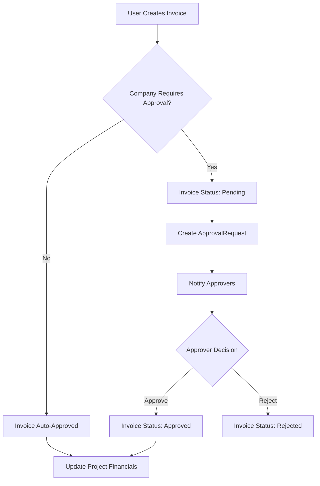

# Invoice Management Feature Plan

## Overview

This document outlines the architecture and implementation plan for the invoice management feature in the Construction Management System. The feature allows users to upload and manage two types of invoices: **Disbursement Authorization** (اذن صرف) and **Purchase Invoice** (فاتورة شراء), both linked to project items.

## Requirements Summary

### Invoice Types
1. **Disbursement Authorization** (اذن صرف): Records money going out
2. **Purchase Invoice** (فاتورة شراء): Records purchases made

### Common Fields for Both Types
- Description (optional)
- Invoice images (multiple images supported)
- Uploader information
- Invoice value/amount
- Project item association (mandatory)
- Upload date

### Key Features
1. **Project-level Invoice Tab**: Inside each project, a tab showing project items with their invoices
2. **Company Owner Invoice Page**: A dedicated page for company owners to view all company invoices
3. **Approval Workflow**: Configurable approval based on company settings
4. **Search and Filter**: Full-text search and column-based sorting

## Architecture Design

### Database Schema Changes

#### Modify `ItemInvoice` Entity
The existing [`ItemInvoice`](src/ConstructionManagement.Domain/Entities/ItemInvoice.cs) entity will be extended with:

```csharp
// Add to existing ItemInvoice entity
public InvoiceType Type { get; set; } = InvoiceType.PurchaseInvoice;

// New enum
public enum InvoiceType
{
    DisbursementAuthorization = 1,  // اذن صرف
    PurchaseInvoice = 2             // فاتورة شراء
}

// Add multiple image support
public virtual ICollection<InvoiceImage> Images { get; set; } = new List<InvoiceImage>();
```

#### New `InvoiceImage` Entity
For supporting multiple images per invoice:

```csharp
public class InvoiceImage : BaseEntity
{
    public int ItemInvoiceId { get; set; }
    [ForeignKey(nameof(ItemInvoiceId))]
    public virtual ItemInvoice Invoice { get; set; } = null!;
    
    public string ImagePath { get; set; } = string.Empty;
    public string? OriginalFileName { get; set; }
    public long? FileSize { get; set; }
    public string? ContentType { get; set; }
    public int DisplayOrder { get; set; }
}
```

### API Endpoints

#### Invoice CRUD Operations
| Method | Endpoint | Description |
|--------|----------|-------------|
| POST | `api/projects/{projectId}/items/{itemId}/invoices` | Create invoice for item |
| GET | `api/projects/{projectId}/invoices` | Get all project invoices |
| GET | `api/projects/{projectId}/items/{itemId}/invoices` | Get item invoices |
| GET | `api/invoices/{invoiceId}` | Get single invoice details |
| PUT | `api/invoices/{invoiceId}` | Update invoice |
| DELETE | `api/invoices/{invoiceId}` | Delete invoice |
| POST | `api/invoices/{invoiceId}/images` | Add image to invoice |
| DELETE | `api/invoices/{invoiceId}/images/{imageId}` | Remove image |

#### Company Owner Endpoints
| Method | Endpoint | Description |
|--------|----------|-------------|
| GET | `api/companies/{companyId}/invoices` | Get all company invoices |
| GET | `api/invoices` | Get all invoices (filtered by user company) |

#### Approval Workflow
| Method | Endpoint | Description |
|--------|----------|-------------|
| POST | `api/invoices/{invoiceId}/review` | Approve/reject invoice |

### Frontend Components

#### 1. Invoice Tab in Project Detail
Location: Inside [`ProjectDetailComponent`](construction-cms/src/app/features/admin/projects/project-detail/project-detail.component.ts)

The Invoices Tab has **two switchable views**:

```
Project Detail Page
├── Designs Tab
├── Phases Tab
├── Items Tab
├── Invoices Tab (NEW)
│   ├── View Toggle Switch
│   │   ├── [Items View] - Flat list of items
│   │   └── [Phases View] - Hierarchical phases tree
│   │
│   ├── ITEMS VIEW (Flat)
│   │   ├── Project Items List
│   │   │   └── Item Row
│   │   │       ├── Item Name
│   │   │       ├── Invoice Count Badge
│   │   │       └── Expand Button
│   │   └── Item Invoices Panel (expanded)
│   │       ├── Invoice Cards
│   │       └── Add Invoice Button
│   │
│   └── PHASES VIEW (Hierarchical)
│       ├── Phase Node
│       │   ├── Phase Name
│       │   ├── Invoice Count Badge
│       │   └── Expand Button
│       ├── Sub-Phase Node (nested)
│       │   ├── Sub-Phase Name
│       │   └── Items List
│       │       └── Item Row
│       │           ├── Item Name
│       │           ├── Invoice Count Badge
│       │           └── Expand Button
│       └── Item Invoices Panel (expanded)
│           ├── Invoice Cards
│           └── Add Invoice Button
```

**View Toggle UI:**
```
┌─────────────────────────────────────────────────────────────┐
│  Invoices                              [Items] [Phases]     │
├─────────────────────────────────────────────────────────────┤
│                                                             │
│  ITEMS VIEW:                                                │
│  ┌─────────────────────────────────────────────────────┐   │
│  │ 📋 Foundation Work                    3 invoices ▼  │   │
│  └─────────────────────────────────────────────────────┘   │
│  ┌─────────────────────────────────────────────────────┐   │
│  │ 📋 Structural Steel                   1 invoice ▼   │   │
│  └─────────────────────────────────────────────────────┘   │
│                                                             │
│  PHASES VIEW:                                               │
│  ┌─────────────────────────────────────────────────────┐   │
│  │ 📁 Phase 1: Foundation                  5 invoices ▼│   │
│  │   ├── 📁 Sub-phase: Excavation         2 invoices   │   │
│  │   │   └── 📋 Excavation Item           2 invoices   │   │
│  │   └── 📁 Sub-phase: Concrete           3 invoices   │   │
│  │       └── 📋 Pouring Item              3 invoices   │   │
│  └─────────────────────────────────────────────────────┘   │
└─────────────────────────────────────────────────────────────┘
```

#### 2. Invoice Upload Modal
A modal component for creating new invoices:

```
Invoice Upload Modal
├── Invoice Type Selector
│   ├── Disbursement Authorization
│   └── Purchase Invoice
├── Project Item Selector (dropdown)
├── Amount Input
├── Description Textarea
├── Image Upload Zone (multiple)
├── Invoice Date Picker
└── Submit/Cancel Buttons
```

#### 3. Company Invoices Page
A new page for company owners at `/admin/invoices`:

```
Company Invoices Page
├── Header with Stats
│   ├── Total Invoices Count
│   ├── Pending Count
│   └── Total Amount
├── Filters Bar
│   ├── Project Filter
│   ├── Item Filter
│   ├── Type Filter
│   ├── Status Filter
│   └── Date Range
├── Invoices Table
│   ├── Invoice Number
│   ├── Type
│   ├── Project Name
│   ├── Item Name
│   ├── Amount
│   ├── Status
│   ├── Date
│   └── Actions
└── Invoice Detail Modal
```

### State Management

The feature will use Angular signals for reactive state management:

```typescript
// Invoice state signals
invoices = signal<InvoiceDto[]>([]);
selectedInvoice = signal<InvoiceDto | null>(null);
isLoading = signal(false);
filters = signal<InvoiceFilters>({
  projectId: null,
  itemId: null,
  type: null,
  status: null,
  dateFrom: null,
  dateTo: null
});
```

### Approval Workflow Integration

The invoice approval will integrate with the existing [`ApprovalRequest`](src/ConstructionManagement.Domain/Entities/ApprovalRequest.cs) system:



### Configuration

The approval requirement will be controlled by existing company settings:
- `CompanySettings.enableInvoiceReview` - Enable/disable approval workflow
- `CompanySettings.invoiceApproverRole` - Role required to approve

## Implementation Steps

### Phase 1: Backend Changes
1. Add `InvoiceType` enum to domain
2. Add `InvoiceImage` entity
3. Update `ItemInvoice` with new fields
4. Create database migration
5. Create DTOs for invoice operations
6. Implement service methods
7. Create controller endpoints

### Phase 2: Frontend Services
1. Update [`InvoicesService`](construction-cms/src/app/core/services/invoices.service.ts) with new methods
2. Add new interfaces for invoice types and images
3. Implement image upload handling

### Phase 3: UI Components
1. Create invoice upload modal component
2. Add invoices tab to project detail
3. Create company invoices page
4. Add invoice detail view modal

### Phase 4: Integration
1. Add routing for new pages
2. Update sidebar navigation
3. Add translations (AR/EN)
4. Test approval workflow integration

## File Structure

### Backend Files to Create/Modify
```
src/
├── ConstructionManagement.Domain/
│   ├── Entities/
│   │   ├── ItemInvoice.cs (modify)
│   │   └── InvoiceImage.cs (new)
│   └── Enums/
│       └── InvoiceType.cs (new)
├── ConstructionManagement.Application/
│   ├── DTOs/
│   │   ├── InvoiceDto.cs (modify)
│   │   ├── CreateInvoiceRequest.cs (modify)
│   │   └── InvoiceImageDto.cs (new)
│   └── Services/
│       └── InvoiceService.cs (new/modify)
└── ConstructionManagement.API/
    └── Controllers/
        └── InvoicesController.cs (modify)
```

### Frontend Files to Create/Modify
```
construction-cms/src/app/
├── core/
│   └── services/
│       └── invoices.service.ts (modify)
├── features/admin/
│   ├── invoices/
│   │   ├── invoices.component.ts (new) - Company owner invoices page
│   │   └── invoice-detail-modal.component.ts (new)
│   └── projects/
│       └── project-detail/
│           ├── invoices-tab/
│           │   ├── invoices-tab.component.ts (new) - Main tab with view toggle
│           │   ├── invoices-items-view.component.ts (new) - Flat items view
│           │   └── invoices-phases-view.component.ts (new) - Hierarchical phases view
│           └── invoice-upload-modal.component.ts (new)
└── shared/
    └── interfaces.ts (modify)
```

### Invoice Tab Component Structure

```typescript
// invoices-tab.component.ts
@Component({
  selector: 'app-invoices-tab',
  standalone: true,
  template: `
    <div class="invoices-tab">
      <!-- View Toggle -->
      <div class="view-toggle">
        <button [class.active]="viewMode === 'items'" (click)="viewMode = 'items'">
          Items View
        </button>
        <button [class.active]="viewMode === 'phases'" (click)="viewMode = 'phases'">
          Phases View
        </button>
      </div>
      
      <!-- Conditional Views -->
      @switch (viewMode) {
        @case ('items') {
          <app-invoices-items-view 
            [projectId]="projectId" 
            [items]="items"
            (addInvoice)="openUploadModal($event)">
          </app-invoices-items-view>
        }
        @case ('phases') {
          <app-invoices-phases-view 
            [projectId]="projectId" 
            [phases]="phases"
            (addInvoice)="openUploadModal($event)">
          </app-invoices-phases-view>
        }
      }
    </div>
  `
})
export class InvoicesTabComponent {
  viewMode: 'items' | 'phases' = 'items';
  // ...
}
```

## Translations

### English (en.json)
```json
{
  "invoices": {
    "title": "Invoices",
    "disbursement_authorization": "Disbursement Authorization",
    "purchase_invoice": "Purchase Invoice",
    "upload_invoice": "Upload Invoice",
    "select_type": "Select Invoice Type",
    "select_item": "Select Project Item",
    "amount": "Amount",
    "description": "Description",
    "upload_images": "Upload Images",
    "invoice_date": "Invoice Date",
    "no_invoices": "No invoices found",
    "pending_approval": "Pending Approval",
    "approved": "Approved",
    "rejected": "Rejected"
  }
}
```

### Arabic (ar.json)
```json
{
  "invoices": {
    "title": "الفواتير",
    "disbursement_authorization": "اذن صرف",
    "purchase_invoice": "فاتورة شراء",
    "upload_invoice": "رفع فاتورة",
    "select_type": "اختر نوع الفاتورة",
    "select_item": "اختر بند المشروع",
    "amount": "القيمة",
    "description": "الوصف",
    "upload_images": "رفع الصور",
    "invoice_date": "تاريخ الفاتورة",
    "no_invoices": "لا توجد فواتير",
    "pending_approval": "في انتظار الموافقة",
    "approved": "معتمدة",
    "rejected": "مرفوضة"
  }
}
```

## Security Considerations

1. **Authorization**: Only users with appropriate roles can create/view invoices
2. **Company Isolation**: Users can only access invoices from their own company
3. **File Upload Security**: Validate file types and sizes for image uploads
4. **Audit Trail**: Track who created, modified, and approved each invoice

## Performance Considerations

1. **Pagination**: Implement server-side pagination for large invoice lists
2. **Lazy Loading**: Load invoice images on demand
3. **Caching**: Cache frequently accessed invoice data
4. **Indexing**: Add database indexes on frequently queried fields (projectId, itemId, status, date)

## Testing Checklist

- [ ] Create disbursement authorization invoice
- [ ] Create purchase invoice
- [ ] Upload multiple images
- [ ] View invoice details
- [ ] Approve/reject invoice (with approval workflow enabled)
- [ ] Auto-approve invoice (with approval workflow disabled)
- [ ] Filter invoices by project
- [ ] Filter invoices by item
- [ ] Filter invoices by type
- [ ] Filter invoices by status
- [ ] Sort invoices by each column
- [ ] Search invoices
- [ ] Delete invoice (with appropriate permissions)
- [ ] Company owner view all invoices
