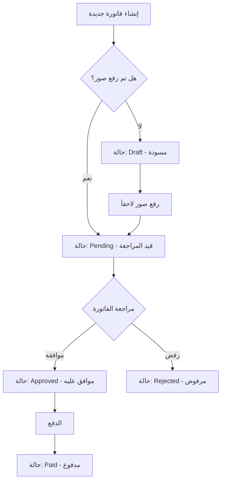
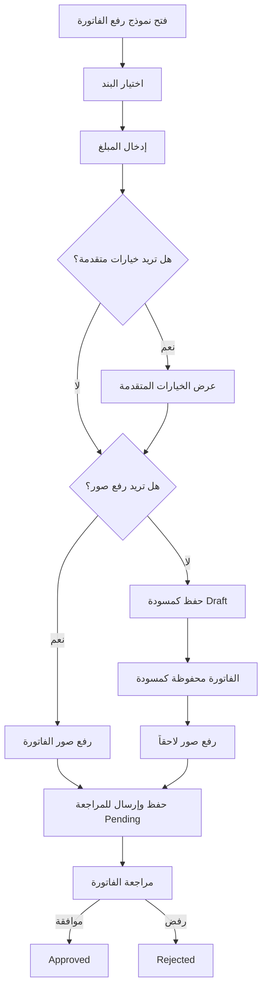

# خطة تبسيط نظام الفواتير

## المشكلة الحالية
نظام الفواتير الحالي يتطلب حقولاً كثيرة إلزامية، بينما المطلوب هو تبسيط الفاتورة لتسهيل عملية رفع الفواتير على شركة الإنشاء.

## المتطلبات الجديدة

### الحقول المطلوبة (إلزامية):
| الحقل | الوصف |
|-------|-------|
| البند (Project Item) | البند المرتبط بالفاتورة |
| المبلغ (Amount) | قيمة الفاتورة |

### الحقول الاختيارية:
| الحقل | الوصف | القيمة الافتراضية |
|-------|-------|-------------------|
| رقم الفاتورة | رقم الفاتورة من المورد | يُولّد تلقائياً |
| نوع الفاتورة | اذن صرف / فاتورة شراء | فاتورة شراء |
| تاريخ الفاتورة | تاريخ إصدار الفاتورة | تاريخ اليوم |
| تاريخ الاستحقاق | تاريخ استحقاق الدفع | null |
| الضريبة | نسبة ومبلغ الضريبة | 0 |
| الاستقطاع | نسبة ومبلغ الاستقطاع | 0 |
| العملة | EGP, USD, EUR, SAR | EGP |
| المورد/البائع | اسم المورد | null |
| الوصف | ملاحظات إضافية | null |
| الصور | صور الفاتورة | null |

---

## ⭐ سير العمل الجديد (Workflow)

### قاعدة مهمة: الصور تحدد حالة الفاتورة



### حالات الفاتورة:
| الحالة | الوصف | متى تحدث |
|--------|-------|----------|
| **Draft** | مسودة | عند إنشاء فاتورة بدون صور |
| **Pending** | قيد المراجعة | عند إنشاء فاتورة مع صور أو رفع صور لمسودة |
| **Approved** | موافق عليه | بعد موافقة المراجع |
| **Rejected** | مرفوض | بعد رفض المراجع |
| **Paid** | مدفوع | بعد تسجيل الدفع |
| **Cancelled** | ملغى | عند إلغاء الفاتورة |

### قواعد الانتقال بين الحالات:
- Draft → Pending: عند رفع صورة واحدة على الأقل
- Draft → Cancelled: يمكن إلغاء المسودة
- Pending → Approved: موافقة المراجع
- Pending → Rejected: رفض المراجع
- Pending → Draft: يمكن إعادة للمسودة لإضافة تعديلات
- Approved → Paid: تسجيل الدفع
- Approved → Cancelled: إلغاء بعد الموافقة (حالات خاصة)

---

## التغييرات المطلوبة

### 1. Backend - تحديث DTOs

#### الملف: `src/ConstructionManagement.Application/DTOs/InvoiceDto.cs`

```csharp
// تبسيط CreateInvoiceRequest
public record CreateInvoiceRequest(
    int ProjectItemId,           // مطلوب
    decimal NetAmount,           // مطلوب - المبلغ الإجمالي
    string? InvoiceType = null,  // اختياري - افتراضي: PurchaseInvoice
    string? InvoiceNumber = null, // اختياري - يُولّد تلقائياً
    DateTime? InvoiceDate = null, // اختياري - افتراضي: تاريخ اليوم
    DateTime? DueDate = null,
    decimal? SubTotal = null,    // اختياري - افتراضي: NetAmount
    decimal? TaxRate = null,
    decimal? TaxAmount = null,
    decimal? RetentionRate = null,
    decimal? RetentionAmount = null,
    string? Currency = null,     // اختياري - افتراضي: EGP
    string? Description = null,
    string? SupplierVendor = null,
    string? AttachmentPath = null
);
```

### 2. Backend - تحديث InvoiceService

#### الملف: `src/ConstructionManagement.Infrastructure/Services/InvoiceService.cs`

**التغييرات المطلوبة في دالة `CreateInvoiceAsync`:**

```csharp
public async Task<int> CreateInvoiceAsync(CreateInvoiceRequest request, int createdByUserId, int companyId)
{
    // تعيين القيم الافتراضية
    var invoiceType = string.IsNullOrEmpty(request.InvoiceType) 
        ? InvoiceType.PurchaseInvoice 
        : InvoiceTypeExtensions.FromString(request.InvoiceType) ?? InvoiceType.PurchaseInvoice;
    
    var invoiceDate = request.InvoiceDate ?? DateTime.UtcNow;
    var currency = string.IsNullOrEmpty(request.Currency) ? "EGP" : request.Currency;
    var subTotal = request.SubTotal ?? request.NetAmount;
    
    // توليد رقم الفاتورة تلقائياً إذا لم يُحدد
    var invoiceNumber = request.InvoiceNumber;
    if (string.IsNullOrEmpty(invoiceNumber))
    {
        var year = invoiceDate.Year;
        invoiceNumber = await GenerateInvoiceNumberAsync(year);
    }
    
    // ⭐ تحديد الحالة الأولية بناءً على وجود صور
    // سيتم تحديث الحالة لاحقاً عند رفع الصور
    var initialStatus = InvoiceStatus.Draft;
    
    // ... باقي الكود
}
```

**إضافة دالة جديدة لرفع الصور وتحديث الحالة:**

```csharp
public async Task<int> AddInvoiceImageAsync(int invoiceId, string imagePath, string? originalFileName, long? fileSize, string? contentType, string? description = null)
{
    // ... الكود الحالي لرفع الصورة ...
    
    // ⭐ تحديث حالة الفاتورة من Draft إلى Pending
    var invoice = await _invoiceRepository.GetByIdAsync(invoiceId);
    if (invoice != null && invoice.StatusEnum == InvoiceStatus.Draft)
    {
        // التحقق من أن هذه أول صورة
        var imageCount = await _invoiceImageRepository.AsQueryable()
            .Where(i => i.ItemInvoiceId == invoiceId)
            .CountAsync();
        
        if (imageCount > 0) // يوجد صورة واحدة على الأقل
        {
            invoice.StatusEnum = InvoiceStatus.Pending;
            await _unitOfWork.SaveChangesAsync();
        }
    }
    
    return image.Id;
}
```

### 3. Frontend - تحديث نموذج رفع الفاتورة

#### الملف: `construction-cms/src/app/features/admin/projects/project-detail/invoice-upload-modal/invoice-upload-modal.component.ts`

**التغييرات المطلوبة:**

1. **تبسيط النموذج الأساسي:**
   - إظهار فقط: البند + المبلغ + رفع الصور (اختياري)
   - إخفاء باقي الحقول في قسم "خيارات متقدمة" (Advanced Options)

2. **تحديث الـ Form:**
```typescript
form = {
    projectItemId: null as number | null,  // مطلوب
    netAmount: null as number | null,       // مطلوب
    // الحقول الاختيارية مع قيم افتراضية
    invoiceType: 'PurchaseInvoice' as InvoiceType,
    invoiceDate: new Date().toISOString().split('T')[0],
    currency: 'EGP',
    // باقي الحقول مخفية
    invoiceNumber: '',
    dueDate: '',
    subTotal: null as number | null,
    taxRate: 0,
    taxAmount: 0,
    retentionRate: 0,
    retentionAmount: 0,
    description: '',
    supplierVendor: ''
};
```

3. **تحديث التحقق من صحة النموذج:**
```typescript
isFormValid(): boolean {
    return !!(
        this.form.projectItemId &&
        this.form.netAmount &&
        this.form.netAmount > 0
    );
}
```

4. **⭐ تحديث منطق رفع الصور:**
```typescript
async submitForm(): Promise<void> {
    // ... إنشاء الفاتورة ...
    
    // رفع الصور إذا وجدت
    if (result?.invoiceId && this.selectedFiles.length > 0) {
        for (const file of this.selectedFiles) {
            await this.invoicesService.addInvoiceImage(result.invoiceId, file).toPromise();
        }
        // الفاتورة ستنتقل تلقائياً من Draft إلى Pending
    }
    
    // إذا لم توجد صور، الفاتورة تبقى في حالة Draft
}
```

5. **إضافة قسم "خيارات متقدمة":**
```html
<!-- قسم الخيارات المتقدمة (مخفي افتراضياً) -->
<div class="mt-4">
    <button type="button" (click)="showAdvanced = !showAdvanced" class="text-sm text-cyan-600">
        {{ showAdvanced ? 'إخفاء الخيارات المتقدمة' : 'عرض الخيارات المتقدمة' }}
    </button>
    
    @if (showAdvanced) {
        <div class="mt-4 space-y-4 p-4 bg-slate-50 rounded-xl">
            <!-- رقم الفاتورة -->
            <!-- نوع الفاتورة -->
            <!-- الضريبة -->
            <!-- الاستقطاع -->
            <!-- المورد -->
            <!-- الوصف -->
        </div>
    }
</div>
```

6. **⭐ إضافة مؤشر حالة الفاتورة:**
```html
<!-- عرض حالة الفاتورة المتوقعة -->
@if (selectedFiles.length === 0) {
    <div class="p-3 bg-amber-50 dark:bg-amber-900/20 rounded-xl border border-amber-200 dark:border-amber-800">
        <p class="text-sm text-amber-700 dark:text-amber-300">
            ⚠️ سيتم حفظ الفاتورة كمسودة (Draft) حتى يتم رفع صور الفاتورة
        </p>
    </div>
} @else {
    <div class="p-3 bg-emerald-50 dark:bg-emerald-900/20 rounded-xl border border-emerald-200 dark:border-emerald-800">
        <p class="text-sm text-emerald-700 dark:text-emerald-300">
            ✓ سيتم إرسال الفاتورة للمراجعة بعد الحفظ
        </p>
    </div>
}
```

### 4. Frontend - تحديث الخدمة

#### الملف: `construction-cms/src/app/core/services/invoices.service.ts`

```typescript
export interface CreateInvoiceRequest {
    projectItemId: number;      // مطلوب
    netAmount: number;          // مطلوب
    invoiceType?: string;       // اختياري
    invoiceNumber?: string;     // اختياري
    invoiceDate?: string;       // اختياري
    dueDate?: string;
    subTotal?: number;
    taxRate?: number;
    taxAmount?: number;
    retentionRate?: number;
    retentionAmount?: number;
    currency?: string;
    description?: string;
    supplierVendor?: string;
    attachmentPath?: string;
}
```

---

## ⭐ مخطط التدفق المحدث



---

## ترتيب التنفيذ

1. **Backend** - تحديث DTOs
2. **Backend** - تحديث InvoiceService (CreateInvoiceAsync + AddInvoiceImageAsync)
3. **Frontend** - تحديث الخدمة
4. **Frontend** - تحديث النموذج
5. **Frontend** - إضافة مؤشر حالة الفاتورة
6. **اختبار** - التأكد من عمل النظام

---

## ملاحظات إضافية

- يجب الحفاظ على التوافق مع النظام القديم (Backward Compatibility)
- الحقول الاختيارية يجب أن تكون nullable في قاعدة البيانات
- يجب تحديث الترجمات في ملفات i18n
- ⭐ يجب إضافة رسالة توضيحية للمستخدم عن حالة الفاتورة
