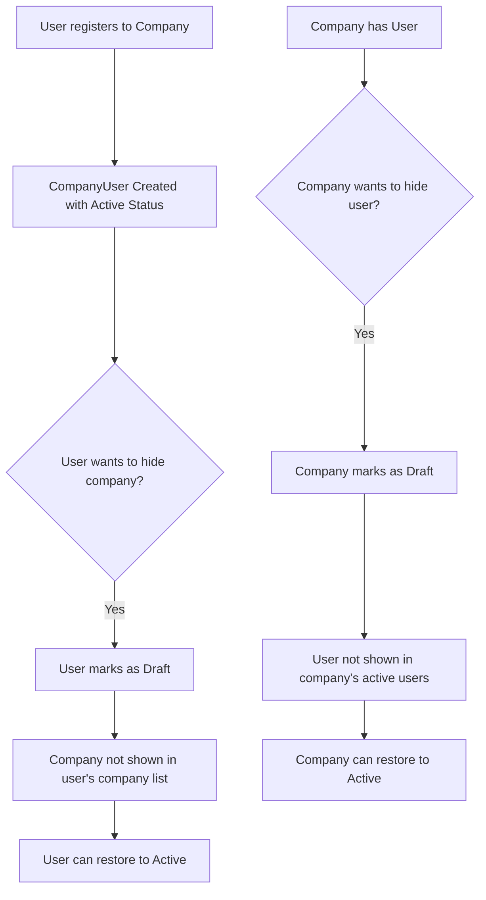

# Multi-Company Draft Status Implementation Plan

## Overview
Enable users/clients to register to multiple companies without requiring a primary company. Both users and companies can mark relationships as "Draft" to hide them from active lists, with ability to restore them back to Active.

## Requirements Summary

### User Side
- User can see companies they registered to
- User can switch between multiple companies
- User can mark a company as "Draft" (hides it from their company list)
- User can restore a Draft company back to Active

### Company Side  
- Company can make a user/worker as "Draft" (not delete them)
- Draft users won't appear in active users list
- Company can restore Draft users back to Active

## Current Architecture Analysis

### Existing Components
1. **ContractStatus Enum** - Already has `Draft = 4` status
2. **CompanyUser Entity** - Has `Status`, `IsPrimary` fields
3. **CompanyUserRepository** - Has methods for CRUD operations
4. **Frontend AuthService** - Has `getActiveCompanies()` filtering by `status === 'Active'`

### What Already Exists
```csharp
// ContractStatus.cs
public enum ContractStatus
{
    Pending = 0,
    Active = 1,
    Terminated = 2,
    Suspended = 3,
    Draft = 4  // Already exists!
}
```

## Implementation Plan

### Step 1: Backend - Repository Updates
- [ ] Add method `GetByUserIdIncludingDraftAsync` - gets all companies including Draft
- [ ] Add method `GetByCompanyIdIncludingDraftAsync` - gets all users including Draft
- [ ] Add method `GetDraftByUserIdAsync` - gets only Draft company associations for user
- [ ] Add method `GetDraftByCompanyIdAsync` - gets only Draft users for company

### Step 2: Backend - DTOs
- [ ] Create `UpdateCompanyUserStatusRequest` DTO
- [ ] Create `CompanyUserStatusDto` for response

### Step 3: Backend - Service Layer
- [ ] Add service methods for toggling Draft/Active status
- [ ] Add validation to prevent unauthorized status changes

### Step 4: Backend - API Controllers
- [ ] Add endpoints to CompanyUser controller:
  - `PUT /api/company-users/{id}/status` - Update status
  - `GET /api/company-users/user/{userId}/all` - Get all including Draft
  - `GET /api/company-users/company/{companyId}/all` - Get all including Draft

### Step 5: Frontend - Auth Service Updates
- [ ] Add `getAllCompanies()` method that returns all including Draft
- [ ] Add `getDraftCompanies()` method for Draft companies only
- [ ] Add method to toggle company to Draft/Active

### Step 6: Frontend - UI Components
- [ ] Update company switcher to show Draft companies differently
- [ ] Add "Move to Draft" / "Restore" option in company list
- [ ] Add UI in HR/Users page for company to manage Draft status

## Data Flow



## API Endpoints Design

### For User Side (Client/Worker)
```
PUT /api/company-users/{companyUserId}/user-status
Body: { "status": "Draft" | "Active" }
```

### For Company Side
```
PUT /api/company-users/{companyUserId}/company-status  
Body: { "status": "Draft" | "Active" }

GET /api/company-users/company/{companyId}/with-draft
GET /api/company-users/user/{userId}/with-draft
```

## Frontend Changes

### Auth Service
```typescript
// Current
getActiveCompanies(): CompanyAssociation[] {
    return u.companies.filter(c => c.status === 'Active');
}

// New methods needed
getDraftCompanies(): CompanyAssociation[]
getAllCompanies(): CompanyAssociation[]
toggleCompanyDraftStatus(companyId: number, isDraft: boolean): Observable<any>
```

### Company Switcher UI
- Show Draft companies with visual indicator (grayed out/dimmed)
- Add option to "Hide from list" (move to Draft)
- Add option to "Show again" (restore from Draft)

### HR Users Page (Company Side)
- Add "Move to Draft" action in user context menu
- Show Draft users in separate section or with filter
- Add "Restore" option for Draft users
