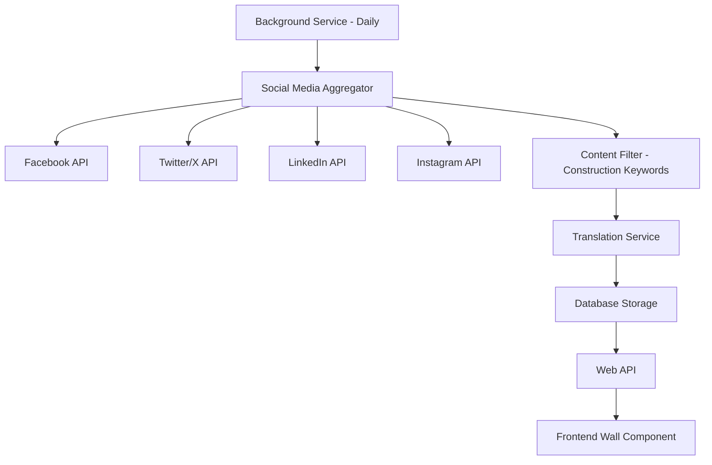

# New Features Implementation Plan

## Overview

This document outlines the implementation plan for three new features in the Construction Management System:

1. **Vendor Bill Upload Enhancement** - Allow users to select vendors or enter outside vendor names when uploading bills
2. **Vendor Delivery Cost Tiers** - Enable vendors to set delivery cost tiers per product for automatic price calculation
3. **Social Media Wall** - Aggregate construction-related content from social media platforms with Arabic translation

---

## Feature 1: Vendor Bill Upload Enhancement

### Business Requirements

- Users uploading bills can select an existing vendor from the system OR enter an outside vendor name
- All vendors (inside or outside system) have their invoices and orders tracked
- Company owners can view:
  - Vendors they deal with
  - Which projects each vendor is associated with
  - Total money paid to each vendor
  - All bills for each vendor

### Current System Analysis

The existing system already has:
- [`Vendor`](src/ConstructionManagement.Domain/Entities/Vendor.cs) entity with basic fields
- [`VendorInvoice`](src/ConstructionManagement.Domain/Entities/VendorInvoice.cs) entity for bill tracking
- [`VendorsController`](src/ConstructionManagement.WebApi/Controllers/VendorsController.cs) with invoice creation endpoints
- [`VendorService`](src/ConstructionManagement.Infrastructure/Services/VendorService.cs) for business logic
- [`vendor.service.ts`](construction-cms/src/app/core/services/vendor.service.ts) frontend service

### Implementation Steps

#### Backend Changes

1. **Update Vendor Entity**
   - Add `IsExternalVendor` boolean flag to distinguish system vendors from ad-hoc vendors
   - Add `ExternalVendorSource` string to track where the vendor name came from

2. **Update VendorInvoice Entity**
   - Add `ExternalVendorName` nullable string for one-time vendor entries
   - Make `VendorId` nullable to support invoices without system vendor

3. **Create VendorRelationship Entity**
   - Track vendor-project relationships
   - Track total paid amount per vendor per project
   - Track order count

4. **Update CreateVendorInvoiceRequest DTO**
   - Support both `VendorId` (existing vendor) and `NewVendorName` (outside vendor)
   - Auto-create vendor record for outside vendors with `IsExternalVendor = true`

5. **Add New API Endpoints**
   - `GET /api/vendors/with-stats` - Get all vendors with invoice counts and totals
   - `GET /api/vendors/{vendorId}/projects` - Get projects associated with vendor
   - `GET /api/vendors/{vendorId}/bills` - Get all bills for a vendor
   - `GET /api/vendors/dashboard` - Get vendor dashboard for company owner

6. **Update VendorService**
   - Add method to get vendor statistics per project
   - Add method to get vendor dashboard data
   - Handle external vendor creation during invoice upload

#### Frontend Changes

1. **Update Invoice Upload Modal**
   - Add vendor selection dropdown with search
   - Add "Outside Vendor" option with text input
   - Show vendor suggestions as user types

2. **Add Vendors Tab to Finance Page**
   - Create new tab in [`finance.component.ts`](construction-cms/src/app/features/admin/finance/finance.component.ts)
   - Show vendor list with:
     - Vendor name
     - Total invoices count
     - Total amount paid
     - Projects count
   - Add click to view vendor detail

3. **Create Vendor Detail Modal/Page**
   - Show vendor information
   - List all projects with this vendor
   - Show all bills/invoices
   - Show payment history

### Database Schema Changes

```sql
-- Add columns to Vendors table
ALTER TABLE Vendors ADD IsExternalVendor BIT NOT NULL DEFAULT 0;
ALTER TABLE Vendors ADD ExternalVendorSource NVARCHAR(100) NULL;

-- Make VendorId nullable in VendorInvoices
ALTER TABLE VendorInvoices ALTER COLUMN VendorId INT NULL;

-- Add external vendor name column
ALTER TABLE VendorInvoices ADD ExternalVendorName NVARCHAR(200) NULL;

-- Create VendorProjectStats table for tracking
CREATE TABLE VendorProjectStats (
    Id INT PRIMARY KEY IDENTITY,
    VendorId INT NOT NULL,
    ProjectId INT NOT NULL,
    CompanyId INT NOT NULL,
    TotalInvoices INT DEFAULT 0,
    TotalAmount DECIMAL(18,2) DEFAULT 0,
    LastInvoiceDate DATETIME2 NULL,
    FOREIGN KEY (VendorId) REFERENCES Vendors(Id),
    FOREIGN KEY (ProjectId) REFERENCES Projects(Id),
    FOREIGN KEY (CompanyId) REFERENCES Companies(Id)
);
```

### API Endpoints Summary

| Method | Endpoint | Description |
|--------|----------|-------------|
| GET | `/api/vendors/with-stats` | Get all vendors with statistics |
| GET | `/api/vendors/{id}/projects` | Get projects for vendor |
| GET | `/api/vendors/{id}/bills` | Get all bills for vendor |
| GET | `/api/vendors/dashboard` | Get vendor dashboard for owner |
| POST | `/api/vendors/invoices` | Create invoice (supports external vendor) |

---

## Feature 2: Vendor Delivery Cost Tiers

### Business Requirements

- Each vendor can set delivery cost tiers per product
- Example: 500kg-1000kg = 10 EGP/km, 1000kg-15000kg = 20 EGP/km
- System calculates best price for users automatically
- Supports weight-based and distance-based pricing

### Implementation Steps

#### Backend Changes

1. **Create DeliveryCostTier Entity**
   ```
   - Id: int
   - VendorProductId: int (FK to VendorProduct)
   - MinWeightKg: decimal
   - MaxWeightKg: decimal
   - PricePerKm: decimal
   - FixedFee: decimal (optional base fee)
   - IsActive: bool
   ```

2. **Update VendorProduct Entity**
   - Add navigation to DeliveryCostTiers
   - Add `HasDeliveryPricing` computed property

3. **Create DeliveryCostCalculationService**
   - Calculate delivery cost based on weight and distance
   - Find applicable tier for given weight
   - Support multiple calculation modes

4. **Add API Endpoints**
   - `GET /api/vendors/products/{productId}/delivery-tiers`
   - `POST /api/vendors/products/{productId}/delivery-tiers`
   - `PUT /api/vendors/products/{productId}/delivery-tiers`
   - `POST /api/vendors/calculate-delivery` - Calculate delivery cost

5. **Create DTOs**
   - `DeliveryCostTierDto`
   - `CreateDeliveryCostTierRequest`
   - `DeliveryCalculationRequest`
   - `DeliveryCalculationResult`

#### Frontend Changes

1. **Update Vendor Product Management**
   - Add delivery tiers section to product form
   - Allow adding multiple tiers with weight ranges
   - Validate tier ranges (no gaps, no overlaps)

2. **Create Delivery Cost Calculator Component**
   - Input: weight, distance
   - Output: calculated delivery cost
   - Show breakdown by tier

3. **Update Marketplace/Product Listing**
   - Show delivery cost estimate
   - Allow users to compare delivery costs between vendors

### Database Schema

```sql
CREATE TABLE DeliveryCostTiers (
    Id INT PRIMARY KEY IDENTITY,
    VendorProductId INT NOT NULL,
    MinWeightKg DECIMAL(18,2) NOT NULL,
    MaxWeightKg DECIMAL(18,2) NOT NULL,
    PricePerKm DECIMAL(18,2) NOT NULL,
    FixedFee DECIMAL(18,2) DEFAULT 0,
    IsActive BIT NOT NULL DEFAULT 1,
    CreatedAt DATETIME2 NOT NULL DEFAULT GETUTCDATE(),
    UpdatedAt DATETIME2 NOT NULL DEFAULT GETUTCDATE(),
    FOREIGN KEY (VendorProductId) REFERENCES VendorProducts(Id)
);

CREATE INDEX IX_DeliveryCostTiers_Product ON DeliveryCostTiers(VendorProductId);
CREATE INDEX IX_DeliveryCostTiers_Weight ON DeliveryCostTiers(MinWeightKg, MaxWeightKg);
```

### Delivery Cost Calculation Logic

```csharp
public decimal CalculateDeliveryCost(int productId, decimal weightKg, decimal distanceKm)
{
    var tier = await _context.DeliveryCostTiers
        .Where(t => t.VendorProductId == productId 
            && t.IsActive
            && weightKg >= t.MinWeightKg 
            && weightKg < t.MaxWeightKg)
        .FirstOrDefaultAsync();
    
    if (tier == null)
        throw new NoDeliveryTierFoundException(weightKg);
    
    return tier.FixedFee + (tier.PricePerKm * distanceKm);
}
```

---

## Feature 3: Social Media Wall

### Business Requirements

- Aggregate construction-related content from social media platforms
- Platforms: Facebook, Twitter/X, LinkedIn, Instagram
- Daily automatic updates
- Arabic translation option for all content
- Public page accessible to anyone

### Architecture Overview



### Implementation Steps

#### Backend Changes

1. **Create SocialMediaPost Entity**
   ```
   - Id: int
   - Platform: enum (Facebook, Twitter, LinkedIn, Instagram)
   - OriginalPostId: string
   - AuthorName: string
   - AuthorHandle: string
   - AuthorProfileUrl: string
   - Content: string (original text)
   - ContentArabic: string (translated)
   - MediaUrls: JSON (list of images/videos)
   - PostUrl: string
   - PostedAt: DateTime
   - FetchedAt: DateTime
   - LikesCount: int
   - SharesCount: int
   - IsConstructionRelated: bool
   - Keywords: string (matched keywords)
   ```

2. **Create SocialMediaSource Entity**
   ```
   - Id: int
   - Platform: enum
   - SourceType: enum (Account, Hashtag, Keyword)
   - SourceValue: string (username or hashtag)
   - IsActive: bool
   - LastFetchedAt: DateTime?
   ```

3. **Create Background Service**
   - `SocialMediaFetchService` - Runs daily to fetch new content
   - Uses Hangfire or similar for scheduling

4. **Create Social Media Connectors**
   - Interface `ISocialMediaConnector`
   - Implementations for each platform
   - Handle API authentication and rate limits

5. **Create Translation Service**
   - Integrate with translation API (Google Translate, Azure Translator, or DeepL)
   - Cache translations to avoid repeated API calls
   - Handle Arabic text direction

6. **Add API Endpoints**
   - `GET /api/social-wall` - Get paginated posts
   - `GET /api/social-wall/{id}` - Get single post
   - `POST /api/social-wall/sources` - Add source (admin only)
   - `GET /api/social-wall/sources` - List sources

#### Frontend Changes

1. **Create Social Wall Component**
   - Grid/List view of posts
   - Platform icons and badges
   - Show original/translated toggle
   - Infinite scroll pagination

2. **Create Post Card Component**
   - Author info with avatar
   - Post content with translation toggle
   - Media display (images/videos)
   - Engagement stats
   - Link to original post

3. **Add Filters**
   - Filter by platform
   - Filter by date range
   - Search in content

4. **Add to Navigation**
   - Add Social Wall menu item
   - Make publicly accessible

### Database Schema

```sql
CREATE TABLE SocialMediaPosts (
    Id INT PRIMARY KEY IDENTITY,
    Platform INT NOT NULL,
    OriginalPostId NVARCHAR(100) NOT NULL,
    AuthorName NVARCHAR(200) NOT NULL,
    AuthorHandle NVARCHAR(100) NULL,
    AuthorProfileUrl NVARCHAR(500) NULL,
    AuthorAvatarUrl NVARCHAR(500) NULL,
    Content NVARCHAR(MAX) NOT NULL,
    ContentArabic NVARCHAR(MAX) NULL,
    MediaUrls NVARCHAR(MAX) NULL,
    PostUrl NVARCHAR(500) NOT NULL,
    PostedAt DATETIME2 NOT NULL,
    FetchedAt DATETIME2 NOT NULL DEFAULT GETUTCDATE(),
    LikesCount INT DEFAULT 0,
    CommentsCount INT DEFAULT 0,
    SharesCount INT DEFAULT 0,
    IsConstructionRelated BIT DEFAULT 1,
    Keywords NVARCHAR(500) NULL,
    UNIQUE (Platform, OriginalPostId)
);

CREATE TABLE SocialMediaSources (
    Id INT PRIMARY KEY IDENTITY,
    Platform INT NOT NULL,
    SourceType INT NOT NULL,
    SourceValue NVARCHAR(200) NOT NULL,
    IsActive BIT NOT NULL DEFAULT 1,
    LastFetchedAt DATETIME2 NULL,
    FetchCount INT DEFAULT 0
);

CREATE INDEX IX_SocialMediaPosts_PostedAt ON SocialMediaPosts(PostedAt DESC);
CREATE INDEX IX_SocialMediaPosts_Platform ON SocialMediaPosts(Platform);
```

### Construction Keywords for Filtering

```csharp
public static class ConstructionKeywords
{
    public static readonly string[] English = {
        "construction", "building", "architecture", "civil engineering",
        "concrete", "steel", "cement", "infrastructure", "real estate",
        "contractor", "project management", "site work", "excavation"
    };
    
    public static readonly string[] Arabic = {
        "بناء", "تشييد", "مقاولات", "هندسة مدنية", "خرسانة",
        "حديد", "اسمنت", "مشاريع", "إنشاءات", "عقارات"
    };
}
```

### API Integration Notes

| Platform | API | Authentication | Rate Limits |
|----------|-----|----------------|-------------|
| Facebook | Graph API | OAuth 2.0 | 200 calls/hour |
| Twitter/X | API v2 | OAuth 2.0 Bearer | 450 requests/15min |
| LinkedIn | Marketing API | OAuth 2.0 | 100,000 calls/day |
| Instagram | Graph API | OAuth 2.0 | 200 calls/hour |

### Translation Service Options

1. **Azure Translator** (Recommended)
   - Free tier: 2M characters/month
   - Supports Arabic with high quality
   - Easy integration with .NET

2. **Google Cloud Translation**
   - Free tier: 500K characters/month
   - Good Arabic support

3. **DeepL**
   - Higher quality but no free tier
   - Limited Arabic support

---

## Implementation Order

### Phase 1: Vendor Bill Upload Enhancement
1. Database migrations
2. Backend entity and service updates
3. API endpoints
4. Frontend invoice upload modal
5. Finance page vendors tab
6. Vendor detail view

### Phase 2: Vendor Delivery Cost Tiers
1. Database migrations
2. Backend entities and service
3. API endpoints
4. Frontend product management
5. Delivery calculator component
6. Marketplace integration

### Phase 3: Social Media Wall
1. Database migrations
2. Backend entities
3. Social media connectors
4. Translation service
5. Background fetch service
6. API endpoints
7. Frontend wall component
8. Navigation and routing

---

## Technical Considerations

### Security
- Validate vendor ownership for all vendor operations
- Sanitize social media content before display
- Rate limit social media API calls
- Store API credentials securely in Azure Key Vault

### Performance
- Cache vendor statistics
- Paginate social wall posts
- Use background jobs for social media fetching
- Index frequently queried columns

### Scalability
- Consider using message queues for social media processing
- Implement caching layer for translated content
- Use CDN for social media images

---

## Testing Strategy

### Unit Tests
- Vendor service methods
- Delivery cost calculation
- Social media content filtering
- Translation service

### Integration Tests
- API endpoints
- Database operations
- External API integrations

### E2E Tests
- Complete vendor bill upload flow
- Delivery cost calculation flow
- Social wall browsing

---

## Dependencies

### NuGet Packages
- `Microsoft.EntityFrameworkCore` (existing)
- `Hangfire` or `Azure.WebJobs` for background tasks
- `Azure.AI.Translation.Text` for translation

### NPM Packages
- No new major dependencies required
- Consider `ngxs` for state management if needed

---

## Questions Resolved

1. ✅ Outside vendors are saved to the system for tracking
2. ✅ Delivery cost tiers are per product per vendor
3. ✅ Social wall is public, auto-updates daily, aggregates construction content
4. ✅ Translation is automatic with toggle option
