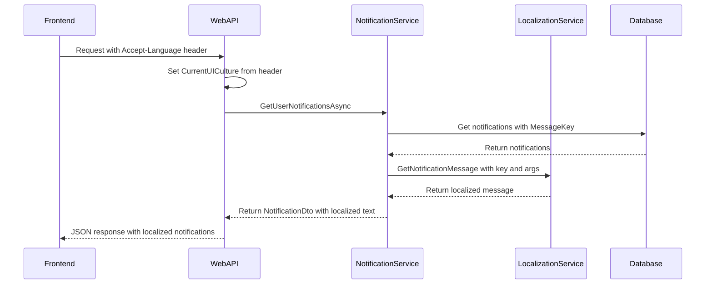

# Notification Localization Implementation Plan

## Overview

This plan addresses the requirement to display notifications in Arabic when the user's language is Arabic, and in English when the language is English.

## Current State Analysis

### Infrastructure Already in Place

The system already has a robust localization infrastructure:

1. **Backend Localization Service** ([`LocalizationService.cs`](src/ConstructionManagement.Infrastructure/Services/LocalizationService.cs))
   - Uses .NET's `IStringLocalizer` for resource-based localization
   - Supports Arabic (`ar`) and English (`en`) cultures
   - Has methods for `GetNotificationTitle()` and `GetNotificationMessage()`

2. **Resource Files**
   - [`LocalizationService.ar.resx`](src/ConstructionManagement.Infrastructure/Resources/Services/LocalizationService.ar.resx) - Arabic translations
   - [`LocalizationService.en.resx`](src/ConstructionManagement.Infrastructure/Resources/Services/LocalizationService.en.resx) - English translations
   - Contains notification title and message keys

3. **Notification Entity** ([`Notification.cs`](src/ConstructionManagement.Domain/Entities/Notification.cs))
   - Has `MessageKey`, `TitleKey`, and `MessageArgs` fields for localization
   - Allows storing localization keys alongside the original message

4. **NotificationService** ([`NotificationService.cs`](src/ConstructionManagement.Infrastructure/Services/NotificationService.cs))
   - `LocalizeNotification()` method re-localizes at display time based on current culture
   - Stores both original message AND localization keys when creating notifications

5. **Frontend Language Support**
   - [`auth.interceptor.ts`](construction-cms/src/app/core/auth/auth.interceptor.ts) sends `Accept-Language` and `X-Language` headers
   - [`language-switcher.component.ts`](construction-cms/src/app/layout/language-switcher/language-switcher.component.ts) allows language switching
   - Stores language preference in localStorage as `app-language`

6. **Backend Request Localization** ([`Program.cs`](src/ConstructionManagement.WebApi/Program.cs))
   - Custom `RequestCultureProvider` reads from `Accept-Language`, `X-Language` headers and query string
   - Defaults to Arabic if no language is specified

### Identified Gaps

Several notification creation calls use hardcoded Arabic text instead of localization keys:

| File | Line | Issue |
|------|------|-------|
| [`ProjectTransactionService.cs`](src/ConstructionManagement.Infrastructure/Services/ProjectTransactionService.cs) | 231-237 | Hardcoded Arabic messages for budget notifications |
| [`ApprovalEscalationJob.cs`](src/ConstructionManagement.Infrastructure/BackgroundJobs/ApprovalEscalationJob.cs) | 140-141 | Hardcoded Arabic message for escalation |
| [`InMemoryNotificationQueue.cs`](src/ConstructionManagement.Infrastructure/Services/InMemoryNotificationQueue.cs) | 191-196 | Does not pass localization keys |
| [`CashVoucherService.cs`](src/ConstructionManagement.Infrastructure/Services/CashVoucherService.cs) | 104-112 | Uses `CreateNotificationAsync` without keys |
| [`MiscExpenseService.cs`](src/ConstructionManagement.Infrastructure/Services/MiscExpenseService.cs) | 115-123 | Uses `CreateNotificationAsync` without keys |

## Implementation Plan

### Step 1: Add Missing Resource Keys

Add the following keys to both resource files:

**English (LocalizationService.en.resx):**
```xml
<data name="NotificationMessage.BudgetOverrun.Critical" xml:space="preserve">
  <value>Critical Escalation: Budget Overrun - Item {0} exceeded budget ({1})</value>
</data>
<data name="NotificationMessage.BudgetWarning.Approaching" xml:space="preserve">
  <value>Warning: Budget Approach - Item {0} has consumed 90% of its budget</value>
</data>
<data name="NotificationMessage.ApprovalEscalation" xml:space="preserve">
  <value>Approval request for {0} (ID: {1}) has been escalated to {2} role due to delay in previous step.</value>
</data>
<data name="NotificationTitle.BudgetOverrun" xml:space="preserve">
  <value>Budget Overrun</value>
</data>
<data name="NotificationTitle.BudgetWarning" xml:space="preserve">
  <value>Budget Warning</value>
</data>
```

**Arabic (LocalizationService.ar.resx):**
```xml
<data name="NotificationMessage.BudgetOverrun.Critical" xml:space="preserve">
  <value>تصعيد حرج: تجاوز الميزانية - البند {0} تجاوز الميزانية ({1})</value>
</data>
<data name="NotificationMessage.BudgetWarning.Approaching" xml:space="preserve">
  <value>تحذير: اقتراب من الميزانية - البند {0} استهلك 90% من ميزانيته</value>
</data>
<data name="NotificationMessage.ApprovalEscalation" xml:space="preserve">
  <value>تم تصعيد طلب موافقة {0} (رقم {1}) إلى دور {2} بسبب التأخير في الخطوة السابقة.</value>
</data>
<data name="NotificationTitle.BudgetOverrun" xml:space="preserve">
  <value>تجاوز الميزانية</value>
</data>
<data name="NotificationTitle.BudgetWarning" xml:space="preserve">
  <value>تحذير: اقتراب من الميزانية</value>
</data>
```

### Step 2: Update ProjectTransactionService

**File:** [`ProjectTransactionService.cs`](src/ConstructionManagement.Infrastructure/Services/ProjectTransactionService.cs)

**Current Code (Lines 229-238):**
```csharp
if (totalSpent >= criticalThreshold)
{
    await _notificationService.CreateAndSendAsync(boqItem.Project.OwnerUserId, "تصعيد حرج: تجاوز الميزانية",
        $"البند {boqItem.ItemName} تجاوز الميزانية ({totalSpent:P1})", $"/projects/{projectId}", NotificationType.BudgetOverrun);
}
else if (totalSpent >= warningThreshold)
{
    await _notificationService.CreateAndSendAsync(userId, "تحذير: اقتراب من الميزانية",
        $"البند {boqItem.ItemName} استهلك 90% من ميزانيته", $"/projects/{projectId}", NotificationType.BudgetWarning);
}
```

**Updated Code:**
```csharp
if (totalSpent >= criticalThreshold)
{
    var title = _localizationService?["NotificationTitle.BudgetOverrun"] ?? "Budget Overrun";
    var message = _localizationService?.GetString("NotificationMessage.BudgetOverrun.Critical", boqItem.ItemName, totalSpent.ToString("P1"))
        ?? $"Item {boqItem.ItemName} exceeded budget ({totalSpent:P1})";
    
    await _notificationService.CreateAndSendAsync(
        userId: boqItem.Project.OwnerUserId,
        title: title,
        message: message,
        link: $"/projects/{projectId}",
        type: NotificationType.BudgetOverrun,
        titleKey: "NotificationTitle.BudgetOverrun",
        messageKey: "NotificationMessage.BudgetOverrun.Critical",
        messageArgs: new object[] { boqItem.ItemName, totalSpent.ToString("P1") }
    );
}
else if (totalSpent >= warningThreshold)
{
    var title = _localizationService?["NotificationTitle.BudgetWarning"] ?? "Budget Warning";
    var message = _localizationService?.GetString("NotificationMessage.BudgetWarning.Approaching", boqItem.ItemName)
        ?? $"Item {boqItem.ItemName} has consumed 90% of its budget";
    
    await _notificationService.CreateAndSendAsync(
        userId: userId,
        title: title,
        message: message,
        link: $"/projects/{projectId}",
        type: NotificationType.BudgetWarning,
        titleKey: "NotificationTitle.BudgetWarning",
        messageKey: "NotificationMessage.BudgetWarning.Approaching",
        messageArgs: new object[] { boqItem.ItemName }
    );
}
```

### Step 3: Update ApprovalEscalationJob

**File:** [`ApprovalEscalationJob.cs`](src/ConstructionManagement.Infrastructure/BackgroundJobs/ApprovalEscalationJob.cs)

**Current Code (Lines 140-154):**
```csharp
string message = $"تم تصعيد طلب موافقة {request.Source} (رقم {request.Id}) إلى دور {escalationRole} " +
                 $"بسبب التأخير في الخطوة السابقة.";

string? link = $"/projects/{projectId}/approvals/{request.Id}";

foreach (var userId in recipients)
{
    await _notificationService.CreateAndSendAsync(
        userId: userId,
        title: title,
        message: message,
        link: link,
        type: NotificationType.Escalation
    );
}
```

**Updated Code:**
```csharp
var message = _localizationService?.GetString("NotificationMessage.ApprovalEscalation", request.Source, request.Id.ToString(), escalationRole)
    ?? $"Approval request for {request.Source} (ID: {request.Id}) has been escalated to {escalationRole} role due to delay in previous step.";

string? link = $"/projects/{projectId}/approvals/{request.Id}";

foreach (var userId in recipients)
{
    await _notificationService.CreateAndSendAsync(
        userId: userId,
        title: title,
        message: message,
        link: link,
        type: NotificationType.Escalation,
        titleKey: "Project.Escalation.Title",
        messageKey: "NotificationMessage.ApprovalEscalation",
        messageArgs: new object[] { request.Source, request.Id.ToString(), escalationRole }
    );
}
```

### Step 4: Update CashVoucherService and MiscExpenseService

These services use `CreateNotificationAsync` which doesn't support localization keys. Need to either:
1. Update the method signature to accept localization keys
2. Use `CreateAndSendAsync` directly with localization keys

**Recommended approach:** Update `CreateNotificationAsync` to accept optional localization parameters.

### Step 5: Update InMemoryNotificationQueue

The notification message model needs to include localization keys. Update:
1. The message model to include `TitleKey`, `MessageKey`, and `MessageArgs`
2. The processing logic to pass these to `CreateAndSendAsync`

## Architecture Flow



## Testing Checklist

1. [ ] Create notification in Arabic environment - verify Arabic text
2. [ ] Switch to English - verify notifications display in English
3. [ ] Switch back to Arabic - verify notifications display in Arabic
4. [ ] Test all notification types:
   - [ ] Budget overrun
   - [ ] Budget warning
   - [ ] Approval escalation
   - [ ] Company request approved/rejected
   - [ ] Join request approved/rejected
   - [ ] Cash voucher pending
   - [ ] Misc expense pending

## Files to Modify

| File | Changes |
|------|---------|
| `LocalizationService.ar.resx` | Add new notification message keys |
| `LocalizationService.en.resx` | Add new notification message keys |
| `ProjectTransactionService.cs` | Use localization keys for budget notifications |
| `ApprovalEscalationJob.cs` | Use localization keys for escalation message |
| `CashVoucherService.cs` | Pass localization keys when creating notifications |
| `MiscExpenseService.cs` | Pass localization keys when creating notifications |
| `InMemoryNotificationQueue.cs` | Support localization keys in message model |
| `INotificationService.cs` | Update `CreateNotificationAsync` signature if needed |
| `NotificationService.cs` | Update `CreateNotificationAsync` implementation if needed |

## Notes

- The system already supports dynamic re-localization at display time via `LocalizeNotification()` method
- Existing notifications with `MessageKey` will automatically display in the user's current language
- The backfill script (`scripts/backfill_notification_keys.sql`) can update existing notifications to have localization keys
