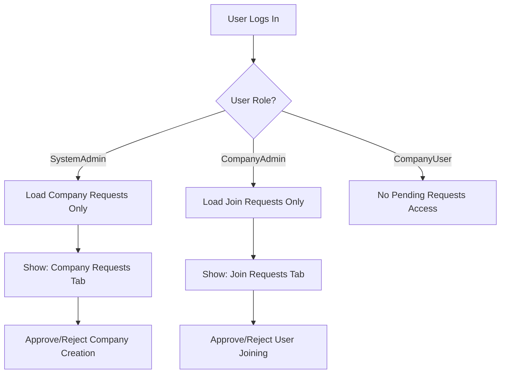

# Plan: Role-Based Filtering for Pending Requests

## Problem
Currently, the Super Admin sees both **Company Requests** and **Join Requests** in the pending requests page. According to the original design:
- **Super Admin** should only see **Company Requests** (new company creation approvals)
- **Company Admin** should only see **Join Requests** (users joining their company)

## Current Behavior
File: [`pending-requests.component.ts`](construction-cms/src/app/features/admin/pending-requests/pending-requests.component.ts:165)

```typescript
loadData() {
    this.service.getPendingCompanyRequests().subscribe(reqs => this.companyRequests.set(reqs));
    this.service.getPendingJoinRequests().subscribe(reqs => this.joinRequests.set(reqs)); // Should NOT load for Super Admin
}
```

## Required Changes

### 1. Update PendingRequestsComponent

**File:** `construction-cms/src/app/features/admin/pending-requests/pending-requests.component.ts`

#### Changes:
1. Import `AuthService` to get current user role
2. Add a computed signal or method to determine user role
3. Conditionally show/hide tabs based on role
4. Conditionally load data based on role

```typescript
// Add to imports
import { AuthService } from '../../../core/services/auth.service';

// Add computed property
isSystemAdmin = computed(() => this.authService.hasRole('SystemAdmin'));
isCompanyAdmin = computed(() => this.authService.hasRole('CompanyAdmin'));

// Update loadData to only load relevant requests
loadData() {
    // Super Admin only sees Company Requests
    if (this.isSystemAdmin()) {
        this.service.getPendingCompanyRequests().subscribe(reqs => this.companyRequests.set(reqs));
        this.activeTab = 'companies'; // Default to companies tab
    }
    
    // Company Admin only sees Join Requests
    if (this.isCompanyAdmin()) {
        this.service.getPendingJoinRequests().subscribe(reqs => this.joinRequests.set(reqs));
        this.activeTab = 'joins'; // Default to joins tab
    }
}
```

#### Template Changes:
```html
<!-- Only show Company Requests tab for Super Admin -->
@if (isSystemAdmin()) {
    <button (click)="activeTab = 'companies'"
            [class.bg-white]="activeTab === 'companies'"
            ...>
        {{ 'pending_requests.company_requests' | translate }}
    </button>
}

<!-- Only show Join Requests tab for Company Admin -->
@if (isCompanyAdmin()) {
    <button (click)="activeTab = 'joins'"
            [class.bg-white]="activeTab === 'joins'"
            ...>
        {{ 'pending_requests.join_requests' | translate }}
    </button>
}
```

### 2. Update PendingRequestsService

**File:** `construction-cms/src/app/core/services/pending-requests.service.ts`

The API endpoints should already be secured on the backend. However, we may need to:

1. Add a method to get only the relevant pending count for the current user role
2. Update `getPendingCounts()` to return role-specific counts

```typescript
// For Super Admin - only company requests count
getSystemAdminPendingCounts(): Observable<{ pendingCount: number }> {
    return this.http.get<{ pendingCount: number }>(`${this.apiUrl}/companyrequests/count`);
}

// For Company Admin - only join requests count
getCompanyAdminPendingCounts(): Observable<{ pendingCount: number }> {
    return this.http.get<{ pendingCount: number }>(`${this.apiUrl}/joinrequests/count`);
}
```

### 3. Update Sidebar Badge

**File:** `construction-cms/src/app/layout/sidebar/sidebar.component.ts`

The sidebar shows a badge for pending requests count. Update it to show only the relevant count:

```typescript
// Update refreshPendingCount to be role-aware
refreshPendingCount() {
    if (this.authService.hasRole('SystemAdmin')) {
        this.service.getPendingCompanyRequestsCount().subscribe({
            next: (counts) => {
                this.pendingRequests.set(counts.pendingCount);
            }
        });
    } else if (this.authService.hasRole('CompanyAdmin')) {
        this.service.getPendingJoinRequestsCount().subscribe({
            next: (counts) => {
                this.pendingRequests.set(counts.pendingCount);
            }
        });
    }
}
```

### 4. Backend Considerations

The backend API endpoints should also be secured:

**CompanyRequestController** - Super Admin only:
- `GET /api/companyrequests` - Super Admin
- `GET /api/companyrequests/pending` - Super Admin
- `POST /api/companyrequests/{id}/approve` - Super Admin
- `POST /api/companyrequests/{id}/reject` - Super Admin

**JoinRequestController** - Company Admin only:
- `GET /api/joinrequests` - Company Admin (their company only)
- `GET /api/joinrequests/pending` - Company Admin
- `POST /api/joinrequests/{id}/approve` - Company Admin
- `POST /api/joinrequests/{id}/reject` - Company Admin

## Workflow Diagram



## Implementation Order

1. Update `AuthService` - ensure role methods are working correctly
2. Update `PendingRequestsComponent` - add role detection and conditional loading
3. Update `PendingRequestsComponent` template - conditional tab visibility
4. Update `SidebarComponent` - role-aware badge count
5. Update backend API - ensure proper authorization
6. Test with both Super Admin and Company Admin users

## Files to Modify

1. `construction-cms/src/app/features/admin/pending-requests/pending-requests.component.ts`
2. `construction-cms/src/app/core/services/pending-requests.service.ts`
3. `construction-cms/src/app/layout/sidebar/sidebar.component.ts`

## Testing Checklist

- [ ] Super Admin only sees Company Requests
- [ ] Company Admin only sees Join Requests
- [ ] Sidebar badge shows correct count for each role
- [ ] Approve/Reject actions work correctly
- [ ] No unauthorized access to API endpoints
- [ ] Empty states display correctly for each role
