# Phases 4-9 Implementation Plan
## Construction CMS - Client Portal, Analytics, Equipment, Quality, Safety, Subcontractors, Companies & Settings

---

## Executive Summary

This plan outlines the implementation of Phases 4-9 of the Construction CMS project. All service layers are already defined with complete API endpoints. The primary work involves:

1. **Creating new client-facing components** for the Client Portal
2. **Creating new analytics components** for advanced reporting
3. **Updating existing components** to connect to real API endpoints
4. **Adding new routes** to the application routing configuration

---

## Architecture Overview

```mermaid
graph TB
    subgraph "Phase 4: Client Portal"
        CP[Client Portal Service]
        CD[Client Dashboard]
        CPay[Client Payments]
        CM[Client Messages]
        CCO[Client Change Orders]
        CS[Client Settings]
        CP --> CD
        CP --> CPay
        CP --> CM
        CP --> CCO
        CP --> CS
    end

    subgraph "Phase 5: Analytics & Reports"
        AS[Analytics Service]
        AC[Analytics Component]
        PD[Profitability Dashboard]
        RG[Reports Generation]
        AA[Advanced Analytics]
        AS --> AC
        AS --> PD
        AS --> RG
        AS --> AA
    end

    subgraph "Phase 6: Equipment & Inventory"
        ES[Equipment Service]
        CSrv[Catalog Service]
        EL[Equipment List]
        ED[Equipment Detail]
        EA[Equipment Assignments]
        IC[Inventory Component]
        IT[Inventory Transactions]
        ES --> EL
        ES --> ED
        ES --> EA
        CSrv --> IC
        CSrv --> IT
    end

    subgraph "Phase 7: Quality & Safety"
        QS[Quality Service]
        SS[Safety Service]
        QC[Quality Component]
        QI[Quality Inspections]
        QD[Quality Defects]
        QP[Quality Punchlist]
        SC[Safety Component]
        SI[Safety Inspections]
        SInc[Safety Incidents]
        ST[Safety Training]
        QS --> QC
        QS --> QI
        QS --> QD
        QS --> QP
        SS --> SC
        SS --> SI
        SS --> SInc
        SS --> ST
    end

    subgraph "Phase 8: Subcontractors & Vendors"
        SubS[Subcontractor Service]
        SubC[Subcontractor Component]
        SubD[Subcontractor Detail]
        SubCon[Subcontractor Contracts]
        SubP[Subcontractor Payments]
        SubR[Subcontractor Ratings]
        SubS --> SubC
        SubS --> SubD
        SubS --> SubCon
        SubS --> SubP
        SubS --> SubR
    end

    subgraph "Phase 9: Companies & Settings"
        CompS[Companies Service]
        SetS[Settings Service]
        CompC[Companies Component]
        CompD[Company Detail]
        CS[Company Settings]
        PS[Project Settings]
        CompS --> CompC
        CompS --> CompD
        SetS --> CS
        SetS --> PS
    end

    API[Backend API] --> CP
    API --> AS
    API --> ES
    API --> CSrv
    API --> QS
    API --> SS
    API --> SubS
    API --> CompS
    API --> SetS
```



---

## Phase 4: Client Portal (HIGH PRIORITY)

### Service Status
- ✅ **client-portal.service.ts** - Complete with all API endpoints defined

### Components to Create

#### 1. Client Payments Component
**File:** `construction-cms/src/app/features/client/client-payments/client-payments.component.ts`

**Features:**
- Display payment history with filters (date range, status, project)
- Show invoice details and payment status
- Download invoice PDFs
- View payment breakdown (paid, pending, overdue)
- Payment summary cards

**Key Methods:**
- `getClientPayments(projectId?: number)`
- `getClientPaymentSummary()`

---

#### 2. Client Messages Component
**File:** `construction-cms/src/app/features/client/client-messages/client-messages.component.ts`

**Features:**
- Message inbox with read/unread status
- Compose new messages
- Reply to messages
- View message threads
- Attach files to messages
- Filter by status and project

**Key Methods:**
- `getClientMessages(status?: string)`
- `createClientMessage(message: any)`
- `replyToMessage(messageId: number, content: string)`
- `getMessageReplies(messageId: number)`

---

#### 3. Client Change Orders Component
**File:** `construction-cms/src/app/features/client/client-change-orders/client-change-orders.component.ts`

**Features:**
- View change order requests
- Submit new change order requests
- Track request status (pending, approved, rejected)
- View approval history
- Estimated cost and timeline impact

**Key Methods:**
- `getChangeOrderRequests(projectId?: number)`
- `createChangeOrderRequest(request: any)`
- `updateChangeOrderRequest(id: number, request: any)`

---

#### 4. Client Settings Component
**File:** `construction-cms/src/app/features/client/client-settings/client-settings.component.ts`

**Features:**
- Update profile information
- Change password
- Notification preferences
- Theme settings
- Account security settings

**Key Methods:**
- `changeClientPassword(currentPassword: string, newPassword: string)`
- `updateClientUser(id: number, user: Partial<ClientUser>)`

---

### Components to Update

#### 1. Client Dashboard
**File:** `construction-cms/src/app/features/client/client-portal/client-dashboard.component.ts`

**Changes:**
- Connect `getClientDashboard()` to API
- Replace mock data with real API responses
- Add error handling and loading states

---

#### 2. Client Projects
**File:** `construction-cms/src/app/features/client/client-projects/client-projects.component.ts`

**Changes:**
- Connect to `ProjectService.getMyProjects()` for real data
- Add project progress API integration
- Connect site media to API

---

#### 3. Client Reports
**File:** `construction-cms/src/app/features/client/reports/client-reports.component.ts`

**Changes:**
- Connect to `AnalyticsService` for report data
- Implement real report generation
- Add export functionality

---

## Phase 5: Analytics & Reports (MEDIUM PRIORITY)

### Service Status
- ✅ **analytics.service.ts** - Complete with all API endpoints defined

### Components to Create

#### 1. Profitability Dashboard Component
**File:** `construction-cms/src/app/features/admin/analytics/profitability-dashboard.component.ts`

**Features:**
- Profit/loss analysis by project
- Gross and net profit margins
- ROI calculations
- Cost breakdown (labor, materials, equipment, subcontractors)
- Revenue vs. cost trends
- Project profitability comparison

**Key Methods:**
- `getFinancialAnalytics(startDate?: string, endDate?: string)`
- `getProjectFinancialSummaries(startDate?: string, endDate?: string)`
- `getFinancialTrends(period: string, periods: number)`

---

#### 2. Reports Generation Component
**File:** `construction-cms/src/app/features/admin/analytics/reports-generation.component.ts`

**Features:**
- Report builder with drag-and-drop fields
- Custom filters and parameters
- Schedule automated reports
- Export to PDF, Excel, CSV
- Save report templates
- Share reports with team

**Key Methods:**
- `getReportDefinitions()`
- `createReportDefinition(request: CreateReportDefinitionRequest)`
- `executeReport(request: ExecuteReportRequest)`
- `executeAndExportReport(request: ExecuteReportRequest)`
- `downloadReport(request: ExecuteReportRequest)`

---

#### 3. Advanced Analytics Component
**File:** `construction-cms/src/app/features/admin/analytics/advanced-analytics.component.ts`

**Features:**
- Custom query builder
- Data visualization with charts
- Drill-down capabilities
- Compare multiple metrics
- Time series analysis
- Custom KPI tracking

**Key Methods:**
- `getChartData(chartType: string, dataSource: string, startDate?: string, endDate?: string)`
- `getKPIDashboard()`
- `getKPIDefinitions()`
- `calculateKPIResults()`

---

### Components to Update

#### 1. Analytics Component
**File:** `construction-cms/src/app/features/admin/analytics/analytics.component.ts`

**Changes:**
- Connect `getDashboardSummary()` to API
- Connect `getFinancialAnalytics()` to API
- Connect `getResourceAnalytics()` to API
- Connect `getKPIDashboard()` to API
- Add real-time data refresh
- Implement error handling

---

## Phase 6: Equipment & Inventory (MEDIUM PRIORITY)

### Service Status
- ✅ **equipment.service.ts** - Complete with all API endpoints defined
- ⚠️ **catalog.service.ts** - Uses mock data, needs API connection

### Components to Create

#### 1. Equipment Detail Component
**File:** `construction-cms/src/app/features/admin/equipment/equipment-detail.component.ts`

**Features:**
- View equipment details and specifications
- Maintenance history timeline
- Assignment history
- Operating hours tracking
- GPS location (if enabled)
- Insurance and registration tracking

**Key Methods:**
- `getEquipmentById(id: number)`
- `getMaintenancesByEquipment(equipmentId: number)`
- `getAssignmentsByEquipment(equipmentId: number)`

---

#### 2. Equipment Assignments Component
**File:** `construction-cms/src/app/features/admin/equipment/equipment-assignments.component.ts`

**Features:**
- View all equipment assignments
- Create new assignments
- Return equipment from assignments
- Track assignment status
- View overdue assignments

**Key Methods:**
- `getAssignments(companyId?: number)`
- `getActiveAssignments(companyId?: number)`
- `createAssignment(request: CreateEquipmentAssignmentRequest)`
- `returnEquipment(id: number, request: ReturnEquipmentRequest)`
- `cancelAssignment(id: number)`

---

#### 3. Inventory Transactions Component
**File:** `construction-cms/src/app/features/admin/inventory/inventory-transactions.component.ts`

**Features:**
- Track all inventory movements
- Stock in/out transactions
- Transfer between warehouses
- Transaction history with filters
- Audit trail

**Key Methods:**
- `getInventoryTransactions()` (needs to be added to inventory.service.ts)
- `createInventoryTransaction()` (needs to be added to inventory.service.ts)

---

### Components to Update

#### 1. Equipment List Component
**File:** `construction-cms/src/app/features/admin/equipment/equipment-list.component.ts`

**Changes:**
- Connect `getEquipment()` to API
- Connect `getEquipmentTypes()` to API
- Connect `getDashboard()` to API
- Add search and filter functionality
- Implement pagination

---

#### 2. Inventory Component
**File:** `construction-cms/src/app/features/admin/inventory/inventory.component.ts`

**Changes:**
- Connect to API for inventory data
- Add stock level tracking
- Implement low stock alerts
- Add warehouse filtering

---

#### 3. Catalog Service
**File:** `construction-cms/src/app/core/services/catalog.service.ts`

**Changes:**
- Replace mock data with API calls
- Add HTTP client injection
- Implement CRUD operations via API

---

## Phase 7: Quality & Safety (MEDIUM PRIORITY)

### Service Status
- ✅ **quality.service.ts** - Complete with all API endpoints defined
- ✅ **safety.service.ts** - Complete with all API endpoints defined

### Components to Create

#### 1. Quality Inspections Component
**File:** `construction-cms/src/app/features/admin/quality/quality-inspections.component.ts`

**Features:**
- Schedule inspections
- Start and complete inspections
- Record inspection results
- Attach photos and documents
- View inspection history

**Key Methods:**
- `getInspections(companyId?: number, projectId?: number, phaseId?: number, status?: string)`
- `createInspection(request: CreateQualityInspectionRequest, companyId?: number)`
- `startInspection(id: number, companyId?: number)`
- `completeInspection(id: number, request: CompleteInspectionRequest, companyId?: number)`

---

#### 2. Quality Defects Component
**File:** `construction-cms/src/app/features/admin/quality/quality-defects.component.ts`

**Features:**
- Report defects
- Assign defects to team members
- Track defect resolution
- View defect history
- Generate defect reports

**Key Methods:**
- `getDefects(companyId?: number, projectId?: number, phaseId?: number, status?: string, severity?: string)`
- `createDefect(request: CreateDefectRequest, companyId?: number)`
- `assignDefect(id: number, request: AssignDefectRequest, companyId?: number)`
- `resolveDefect(id: number, request: ResolveDefectRequest, companyId?: number)`

---

#### 3. Quality Punchlist Component
**File:** `construction-cms/src/app/features/admin/quality/quality-punchlist.component.ts`

**Features:**
- Create punch list items
- Assign items to team members
- Track completion status
- Mark items as complete
- Generate punch list reports

**Key Methods:**
- `getPunchListItems(companyId?: number)`
- `createPunchListItem()` (needs to be added to quality.service.ts)
- `updatePunchListItem()` (needs to be added to quality.service.ts)

---

#### 4. Safety Inspections Component
**File:** `construction-cms/src/app/features/admin/safety/safety-inspections.component.ts`

**Features:**
- Schedule safety inspections
- Use safety checklists
- Record inspection results
- Track pass/fail rates
- View inspection history

**Key Methods:**
- `getInspections(queryParams?: any)`
- `createInspection(request: CreateSafetyInspectionRequest)`
- `getChecklists()`
- `getChecklistItems(id: number)`

---

#### 5. Safety Incidents Component
**File:** `construction-cms/src/app/features/admin/safety/safety-incidents.component.ts`

**Features:**
- Report safety incidents
- Investigate incidents
- Track root cause analysis
- Document corrective actions
- Generate incident reports

**Key Methods:**
- `getIncidents(queryParams?: any)`
- `createIncident(request: CreateSafetyIncidentRequest)`
- `updateInvestigation(id: number, request: InvestigationUpdateRequest)`
- `getCriticalIncidents()`

---

#### 6. Safety Training Component
**File:** `construction-cms/src/app/features/admin/safety/safety-training.component.ts`

**Features:**
- Schedule training sessions
- Track attendance
- Manage certifications
- Track certification expiry
- Generate training reports

**Key Methods:**
- `getTrainings(queryParams?: any)`
- `createTraining(request: CreateSafetyTrainingRequest)`
- `completeTraining(id: number, request: CompleteTrainingRequest)`
- `addParticipant(id: number, userId: number)`
- `getExpiringCertifications(daysAhead: number)`

---

### Components to Update

#### 1. Quality Component
**File:** `construction-cms/src/app/features/admin/quality/quality.component.ts`

**Changes:**
- Connect `getStatistics()` to API
- Connect `getInspections()` to API
- Connect `getDefects()` to API
- Add dashboard summary cards

---

#### 2. Safety Component
**File:** `construction-cms/src/app/features/admin/safety/safety.component.ts`

**Changes:**
- Connect `getDashboardStats()` to API
- Connect `getIncidents()` to API
- Connect `getInspections()` to API
- Connect `getTrainings()` to API
- Add dashboard summary cards

---

## Phase 8: Subcontractors & Vendors (MEDIUM PRIORITY)

### Service Status
- ✅ **subcontractor.service.ts** - Complete with all API endpoints defined

### Components to Create

#### 1. Subcontractor Detail Component
**File:** `construction-cms/src/app/features/admin/subcontractor/subcontractor-detail.component.ts`

**Features:**
- View subcontractor profile
- Contact information
- License and insurance details
- Performance history
- Rating summary

**Key Methods:**
- `getSubcontractor(id: number)`
- `getContracts(subcontractorId: number)`
- `getPayments(subcontractorId: number)`
- `getRatings(subcontractorId: number)`
- `getRatingSummary(subcontractorId: number)`

---

#### 2. Subcontractor Contracts Component
**File:** `construction-cms/src/app/features/admin/subcontractor/subcontractor-contracts.component.ts`

**Features:**
- Create and manage contracts
- Track contract status
- Monitor completion percentage
- View contract details
- Contract history

**Key Methods:**
- `getActiveContracts()`
- `getAllContracts()`
- `createContract(request: CreateContractRequest)`
- `updateContract(id: number, request: UpdateContractRequest)`
- `updateContractStatus(id: number, request: ContractStatusUpdateRequest)`

---

#### 3. Subcontractor Payments Component
**File:** `construction-cms/src/app/features/admin/subcontractor/subcontractor-payments.component.ts`

**Features:**
- Track subcontractor payments
- Create payment records
- Update payment status
- View payment history
- Generate payment reports

**Key Methods:**
- `getPendingPayments()`
- `getAllPayments()`
- `createPayment(request: CreatePaymentRequest)`
- `updatePaymentStatus(id: number, request: UpdatePaymentStatusRequest)`

---

#### 4. Subcontractor Ratings Component
**File:** `construction-cms/src/app/features/admin/subcontractor/subcontractor-ratings.component.ts`

**Features:**
- Rate subcontractors
- View rating history
- Compare subcontractor performance
- Generate rating reports
- Finalize ratings

**Key Methods:**
- `getAllRatings()`
- `getRatings(subcontractorId: number)`
- `createRating(request: CreateRatingRequest)`
- `finalizeRating(id: number)`

---

### Components to Update

#### 1. Subcontractor Component
**File:** `construction-cms/src/app/features/admin/subcontractor/subcontractor.component.ts`

**Changes:**
- Connect `getSubcontractors()` to API
- Connect `getSummary()` to API
- Connect `getTopRated()` to API
- Add search and filter functionality

---

## Phase 9: Companies & Settings (MEDIUM PRIORITY)

### Service Status
- ✅ **companies.service.ts** - Complete with all API endpoints defined
- ✅ **settings.service.ts** - Complete with all API endpoints defined

### Components to Create

#### 1. Project Settings Component
**File:** `construction-cms/src/app/features/admin/projects/project-settings/project-settings.component.ts`

**Features:**
- Configure project-specific settings
- Override company settings
- Set notification preferences
- Configure approval workflows
- Manage project permissions

**Key Methods:**
- `getProjectSettings(projectId: number)`
- `updateProjectSettings(projectId: number, request: UpdateProjectSettingsRequest)`

---

### Components to Update

#### 1. Companies Component
**File:** `construction-cms/src/app/features/admin/companies/companies.component.ts`

**Changes:**
- Connect `getCompanies()` to API
- Connect `createCompany()` to API
- Connect `updateCompany()` to API
- Connect `deleteCompany()` to API
- Add company package selection

---

#### 2. Company Detail Component
**File:** `construction-cms/src/app/features/admin/companies/company-detail/company-detail.component.ts`

**Changes:**
- Connect `getCompany(id: number)` to API
- Add company settings view
- Add company users management
- Add company statistics

---

#### 3. Company Settings Component
**File:** `construction-cms/src/app/features/admin/company-settings/company-settings.component.ts`

**Changes:**
- Connect `getCompanySettings()` to API
- Connect `updateCompanySettings()` to API
- Add settings categories
- Implement save functionality
- Add validation

---

## Cross-Phase Tasks

### 1. Update App Routes
**File:** `construction-cms/src/app/app.routes.ts`

**New Routes to Add:**

```typescript
// Client Portal Routes
{
    path: 'client-portal/payments',
    loadComponent: () => import('./features/client/client-payments/client-payments.component').then(m => m.ClientPaymentsComponent)
},
{
    path: 'client-portal/messages',
    loadComponent: () => import('./features/client/client-messages/client-messages.component').then(m => m.ClientMessagesComponent)
},
{
    path: 'client-portal/change-orders',
    loadComponent: () => import('./features/client/client-change-orders/client-change-orders.component').then(m => m.ClientChangeOrdersComponent)
},
{
    path: 'client-portal/settings',
    loadComponent: () => import('./features/client/client-settings/client-settings.component').then(m => m.ClientSettingsComponent)
},

// Analytics Routes
{
    path: 'admin/profitability',
    loadComponent: () => import('./features/admin/analytics/profitability-dashboard.component').then(m => m.ProfitabilityDashboardComponent),
    canActivate: [roleGuard],
    data: { roles: ['SuperAdmin', 'CompanyAdmin'] }
},
{
    path: 'admin/reports-generation',
    loadComponent: () => import('./features/admin/analytics/reports-generation.component').then(m => m.ReportsGenerationComponent),
    canActivate: [roleGuard],
    data: { roles: ['SuperAdmin', 'CompanyAdmin'] }
},
{
    path: 'admin/advanced-analytics',
    loadComponent: () => import('./features/admin/analytics/advanced-analytics.component').then(m => m.AdvancedAnalyticsComponent),
    canActivate: [roleGuard],
    data: { roles: ['SuperAdmin', 'CompanyAdmin'] }
},

// Equipment Routes
{
    path: 'admin/equipment/:id',
    loadComponent: () => import('./features/admin/equipment/equipment-detail.component').then(m => m.EquipmentDetailComponent),
    canActivate: [roleGuard],
    data: { roles: ['SuperAdmin', 'CompanyAdmin'] }
},
{
    path: 'admin/equipment/assignments',
    loadComponent: () => import('./features/admin/equipment/equipment-assignments.component').then(m => m.EquipmentAssignmentsComponent),
    canActivate: [roleGuard],
    data: { roles: ['SuperAdmin', 'CompanyAdmin'] }
},

// Inventory Routes
{
    path: 'admin/inventory/transactions',
    loadComponent: () => import('./features/admin/inventory/inventory-transactions.component').then(m => m.InventoryTransactionsComponent),
    canActivate: [roleGuard],
    data: { roles: ['SuperAdmin', 'CompanyAdmin'] }
},

// Quality Routes
{
    path: 'admin/quality/inspections',
    loadComponent: () => import('./features/admin/quality/quality-inspections.component').then(m => m.QualityInspectionsComponent),
    canActivate: [roleGuard],
    data: { roles: ['SuperAdmin', 'CompanyAdmin'] }
},
{
    path: 'admin/quality/defects',
    loadComponent: () => import('./features/admin/quality/quality-defects.component').then(m => m.QualityDefectsComponent),
    canActivate: [roleGuard],
    data: { roles: ['SuperAdmin', 'CompanyAdmin'] }
},
{
    path: 'admin/quality/punchlist',
    loadComponent: () => import('./features/admin/quality/quality-punchlist.component').then(m => m.QualityPunchlistComponent),
    canActivate: [roleGuard],
    data: { roles: ['SuperAdmin', 'CompanyAdmin'] }
},

// Safety Routes
{
    path: 'admin/safety/inspections',
    loadComponent: () => import('./features/admin/safety/safety-inspections.component').then(m => m.SafetyInspectionsComponent),
    canActivate: [roleGuard],
    data: { roles: ['SuperAdmin', 'CompanyAdmin'] }
},
{
    path: 'admin/safety/incidents',
    loadComponent: () => import('./features/admin/safety/safety-incidents.component').then(m => m.SafetyIncidentsComponent),
    canActivate: [roleGuard],
    data: { roles: ['SuperAdmin', 'CompanyAdmin'] }
},
{
    path: 'admin/safety/training',
    loadComponent: () => import('./features/admin/safety/safety-training.component').then(m => m.SafetyTrainingComponent),
    canActivate: [roleGuard],
    data: { roles: ['SuperAdmin', 'CompanyAdmin'] }
},

// Subcontractor Routes
{
    path: 'admin/subcontractors/:id',
    loadComponent: () => import('./features/admin/subcontractor/subcontractor-detail.component').then(m => m.SubcontractorDetailComponent),
    canActivate: [roleGuard],
    data: { roles: ['SuperAdmin', 'CompanyAdmin'] }
},
{
    path: 'admin/subcontractors/contracts',
    loadComponent: () => import('./features/admin/subcontractor/subcontractor-contracts.component').then(m => m.SubcontractorContractsComponent),
    canActivate: [roleGuard],
    data: { roles: ['SuperAdmin', 'CompanyAdmin'] }
},
{
    path: 'admin/subcontractors/payments',
    loadComponent: () => import('./features/admin/subcontractor/subcontractor-payments.component').then(m => m.SubcontractorPaymentsComponent),
    canActivate: [roleGuard],
    data: { roles: ['SuperAdmin', 'CompanyAdmin'] }
},
{
    path: 'admin/subcontractors/ratings',
    loadComponent: () => import('./features/admin/subcontractor/subcontractor-ratings.component').then(m => m.SubcontractorRatingsComponent),
    canActivate: [roleGuard],
    data: { roles: ['SuperAdmin', 'CompanyAdmin'] }
}
```

---

### 2. Update Shared Interfaces
**File:** `construction-cms/src/app/shared/interfaces.ts`

**Potential Additions:**
- Add any missing interfaces for new components
- Ensure all service interfaces are exported

---

### 3. Error Handling & Loading States

All components should implement:
- Loading spinners during API calls
- Error messages with user-friendly text
- Retry functionality for failed requests
- Empty state displays when no data is available

---

## Implementation Priority

### Phase 4: Client Portal (HIGH)
1. Update existing client components to connect to API
2. Create client-payments component
3. Create client-messages component
4. Create client-change-orders component
5. Create client-settings component

### Phase 5: Analytics & Reports (MEDIUM)
1. Update analytics component to connect to API
2. Create profitability-dashboard component
3. Create reports-generation component
4. Create advanced-analytics component

### Phase 6: Equipment & Inventory (MEDIUM)
1. Update catalog service to use API
2. Update equipment-list component
3. Create equipment-detail component
4. Create equipment-assignments component
5. Update inventory component
6. Create inventory-transactions component

### Phase 7: Quality & Safety (MEDIUM)
1. Update quality component
2. Create quality-inspections component
3. Create quality-defects component
4. Create quality-punchlist component
5. Update safety component
6. Create safety-inspections component
7. Create safety-incidents component
8. Create safety-training component

### Phase 8: Subcontractors & Vendors (MEDIUM)
1. Update subcontractor component
2. Create subcontractor-detail component
3. Create subcontractor-contracts component
4. Create subcontractor-payments component
5. Create subcontractor-ratings component

### Phase 9: Companies & Settings (MEDIUM)
1. Update companies component
2. Update company-detail component
3. Update company-settings component
4. Create project-settings component

---

## Testing Checklist

- [ ] All API connections work correctly
- [ ] Error handling displays user-friendly messages
- [ ] Loading states appear during API calls
- [ ] Empty states display when no data is available
- [ ] All routes navigate correctly
- [ ] Role guards protect appropriate routes
- [ ] Forms validate correctly
- [ ] Data persists after page refresh
- [ ] Responsive design works on mobile devices
- [ ] Dark mode compatibility

---

## Notes

1. **Service Layer**: All services are already complete with API endpoints. No changes needed to service files except for `catalog.service.ts` which needs to replace mock data with API calls.

2. **Component Structure**: Follow the existing component structure and patterns used in the codebase.

3. **Styling**: Use Tailwind CSS classes for styling, consistent with existing components.

4. **Internationalization**: Use `TranslateModule` for all user-facing text.

5. **Error Handling**: Implement consistent error handling across all components.

6. **Loading States**: Use loading spinners or skeleton screens during API calls.

7. **Role Guards**: Ensure all admin routes have appropriate role guards.

---

## Next Steps

Once you approve this plan, switch to **Code mode** to begin implementation. The implementation will proceed phase by phase, starting with Phase 4 (Client Portal) as it has the highest priority.
