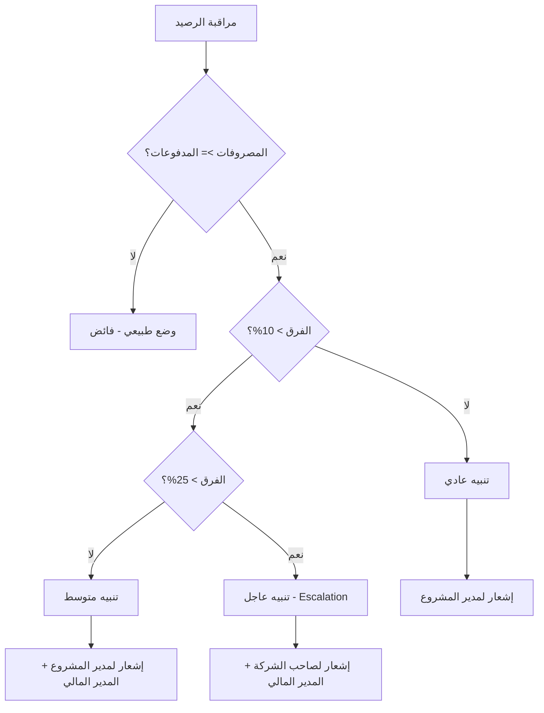

# خطة نظام المالية المتكامل للمشروع

## نظرة عامة

نظام مالي شامل لمشاريع الإنشاءات يتضمن:
1. **المصروفات** - ما صرفته الشركة
2. **مدفوعات العميل** - ما دفعه العميل
3. **المقارنة والتنبيهات** - مراقبة الرصيد

---

## هيكل النظام

### 1. تبويبات تفاصيل المشروع

```
┌─────────────────────────────────────────────────────────────┐
│  تفاصيل المشروع                                              │
├─────────────────────────────────────────────────────────────┤
│  [نظرة عامة] [البنود] [المصروفات] [مدفوعات العميل] [التقارير] │
└─────────────────────────────────────────────────────────────┘
```

### 2. تبويب المصروفات (Expenses)

**المحتوى:**
- فواتير الموردين (الموجودة حالياً)
- أذونات الصرف (الموجودة حالياً)
- مصروفات نقدية (جديد)
- مصروفات بدون صور (مسودات)

**العرض:**
```
┌─────────────────────────────────────────────────────────────┐
│  المصروفات                                                   │
├─────────────────────────────────────────────────────────────┤
│  إجمالي المصروفات: 2,500,000 جنيه                           │
│  ├── فواتير معتمدة: 2,000,000                               │
│  ├── فواتير معلقة: 300,000                                  │
│  └── مسودات (بدون صور): 200,000                             │
├─────────────────────────────────────────────────────────────┤
│  [فاتورة جديدة]  [تصفية]                                     │
├─────────────────────────────────────────────────────────────┤
│  قائمة الفواتير...                                           │
└─────────────────────────────────────────────────────────────┘
```

### 3. تبويب مدفوعات العميل (Client Payments)

**أنواع الدفعات:**
| النوع | الوصف |
|-------|-------|
| دفعة مقدمة | قبل البدء (Advance Payment) |
| دفعة على الحساب | بدون مستخلص (On Account) |
| دفعة مستخلص | مقابل عمل منجز (Progress Payment) |
| دفعة نهائية | عند التسليم (Final Payment) |

**العرض:**
```
┌─────────────────────────────────────────────────────────────┐
│  مدفوعات العميل                                              │
├─────────────────────────────────────────────────────────────┤
│  إجمالي المدفوعات: 3,000,000 جنيه                           │
│  ├── دفعات مقدمة: 500,000                                   │
│  ├── دفعات مستخلصات: 2,000,000                              │
│  └── دفعات على الحساب: 500,000                              │
├─────────────────────────────────────────────────────────────┤
│  [دفعة جديدة]  [إصدار مستخلص]                                │
├─────────────────────────────────────────────────────────────┤
│  قائمة الدفعات...                                            │
└─────────────────────────────────────────────────────────────┘
```

---

## بطاقة المشروع (Project Card)

### مؤشر الرصيد المالي

```
┌─────────────────────────────────────────────────────────────┐
│  مشروع فيلا الزهراء                                          │
├─────────────────────────────────────────────────────────────┤
│                                                              │
│  ┌─────────────────────────────────────────────────────┐    │
│  │  الرصيد المالي                                       │    │
│  │                                                      │    │
│  │  مدفوعات العميل: 3,000,000 ████████████████ 100%    │    │
│  │  المصروفات:      2,500,000 █████████████    83%     │    │
│  │                                                      │    │
│  │  ┌──────────────────────────────────────────────┐   │    │
│  │  │  الفائض: +500,000 جنيه ✓                     │   │    │
│  │  │  العميل دفع أكثر مما صُرف                    │   │    │
│  │  └──────────────────────────────────────────────┘   │    │
│  └─────────────────────────────────────────────────────┘    │
│                                                              │
└─────────────────────────────────────────────────────────────┘
```

### ألوان المؤشر

| الحالة | اللون | الوصف |
|--------|-------|-------|
| فائض كبير | 🟢 أخضر | المدفوعات > المصروفات بفارق كبير |
| فائض قليل | 🟡 أصفر | المدفوعات > المصروفات بفارق قليل |
| متوازن | 🔵 أزرق | المدفوعات ≈ المصروفات |
| عجز | 🔴 أحمر | المصروفات > المدفوعات |

---

## نظام التنبيهات (Escalation)

### قواعد التنبيه



### أنواع التنبيهات

| المستوى | الشرط | المستلمين |
|---------|-------|-----------|
| عادي | المصروفات = المدفوعات | مدير المشروع |
| متوسط | المصروفات > المدفوعات بـ 10% | مدير المشروع + المدير المالي |
| عاجل | المصروفات > المدفوعات بـ 25% | صاحب الشركة + المدير المالي |
| حرج | المصروفات > المدفوعات بـ 50% | جميع المدراء + تجميد الصرف |

---

## قاعدة البيانات

### جدول مدفوعات العميل (ClientPayments)

```sql
CREATE TABLE ClientPayments (
    Id INT PRIMARY KEY,
    ProjectId INT NOT NULL,
    PaymentType NVARCHAR(50), -- Advance, OnAccount, Progress, Final
    Amount DECIMAL(18,2) NOT NULL,
    PaymentDate DATETIME NOT NULL,
    ReceiptNumber NVARCHAR(50),
    PaymentMethod NVARCHAR(50), -- Cash, BankTransfer, Check
    BankName NVARCHAR(100),
    CheckNumber NVARCHAR(50),
    Notes NVARCHAR(500),
    AttachmentPath NVARCHAR(500),
    Status NVARCHAR(50), -- Pending, Confirmed, Cancelled
    CreatedByUserId INT,
    CreatedAt DATETIME,
    CompanyId INT
);
```

### جدول المستخلصات (ProgressInvoices)

```sql
CREATE TABLE ProgressInvoices (
    Id INT PRIMARY KEY,
    ProjectId INT NOT NULL,
    InvoiceNumber NVARCHAR(50),
    InvoiceDate DATETIME NOT NULL,
    PeriodFrom DATETIME,
    PeriodTo DATETIME,
    TotalWorkValue DECIMAL(18,2), -- قيمة العمل المنجز
    PreviousPayments DECIMAL(18,2), -- الدفعات السابقة
    CurrentPayment DECIMAL(18,2), -- الدفعة الحالية
    RetentionAmount DECIMAL(18,2), -- الاستقطاع
    NetAmount DECIMAL(18,2), -- صافي الدفعة
    Status NVARCHAR(50), -- Draft, Submitted, Approved, Paid
    Notes NVARCHAR(500),
    CreatedByUserId INT,
    CreatedAt DATETIME,
    CompanyId INT
);
```

---

## API Endpoints

### مدفوعات العميل

```
GET    /api/projects/{projectId}/client-payments
POST   /api/projects/{projectId}/client-payments
GET    /api/projects/{projectId}/client-payments/{id}
PUT    /api/projects/{projectId}/client-payments/{id}
DELETE /api/projects/{projectId}/client-payments/{id}
```

### المستخلصات

```
GET    /api/projects/{projectId}/progress-invoices
POST   /api/projects/{projectId}/progress-invoices
GET    /api/projects/{projectId}/progress-invoices/{id}
PUT    /api/projects/{projectId}/progress-invoices/{id}
POST   /api/projects/{projectId}/progress-invoices/{id}/submit
POST   /api/projects/{projectId}/progress-invoices/{id}/approve
```

### الملخص المالي

```
GET    /api/projects/{projectId}/financial-summary
```

**الاستجابة:**
```json
{
  "totalExpenses": 2500000,
  "confirmedExpenses": 2000000,
  "pendingExpenses": 300000,
  "draftExpenses": 200000,
  
  "totalClientPayments": 3000000,
  "advancePayments": 500000,
  "progressPayments": 2000000,
  "onAccountPayments": 500000,
  
  "balance": 500000,
  "balanceStatus": "Surplus",
  "balancePercentage": 16.67,
  
  "alertLevel": "None",
  "alertMessage": null
}
```

---

## ترتيب التنفيذ

### المرحلة 1: قاعدة البيانات والـ Backend
1. [ ] إنشاء جداول ClientPayments و ProgressInvoices
2. [ ] إنشاء DTOs للمدفوعات والمستخلصات
3. [ ] إنشاء Services للمدفوعات والمستخلصات
4. [ ] إنشاء Controllers للـ API

### المرحلة 2: Frontend - مدفوعات العميل
1. [ ] إنشاء تبويب مدفوعات العميل
2. [ ] نموذج إضافة دفعة جديدة
3. [ ] قائمة الدفعات
4. [ ] تفاصيل الدفعة

### المرحلة 3: Frontend - المستخلصات
1. [ ] نموذج إصدار مستخلص
2. [ ] قائمة المستخلصات
3. [ ] ربط المستخلص بالدفعات

### المرحلة 4: المؤشرات والتنبيهات
1. [ ] مؤشر الرصيد على بطاقة المشروع
2. [ ] ملخص مالي في تفاصيل المشروع
3. [ ] نظام التنبيهات والـ Escalation
4. [ ] إشعارات للمستخدمين

### المرحلة 5: التقارير
1. [ ] تقرير المصروفات
2. [ ] تقرير مدفوعات العميل
3. [ ] تقرير المقارنة المالية
4. [ ] تصدير Excel/PDF

---

## ملاحظات

- يجب مراعاة تعدد العملات
- يجب دعم الضرائب والاستقطاعات
- يجب ربط النظام بنظام الموافقات الموجود
- يجب دعم أرشفة المستندات
