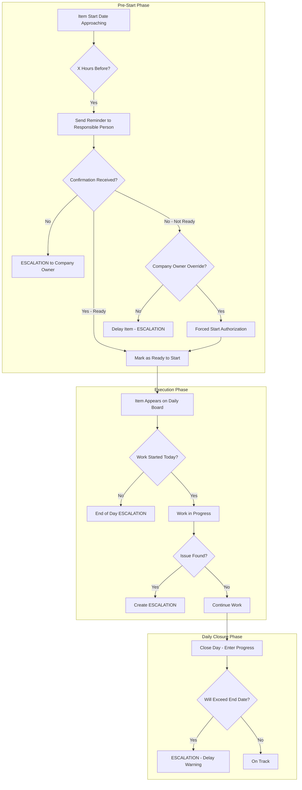

# Project Item Workflow & Escalation System
## (Mini Jira for Construction Project Operations)

## Overview

This document outlines the implementation plan for a comprehensive Project Item Workflow and Escalation System that ensures project items are properly prepared, started, tracked, and completed with automatic escalations when issues arise.

**This is essentially a mini Jira system tailored for construction project operations**, featuring:
- Kanban boards for task visualization
- Task states and workflows
- Photo/video attachments for proof of work
- Review and approval process
- Escalations and notifications
- Activity history and audit trail

---

## Business Requirements

### 1. Pre-Start Confirmation Workflow
- Each project item has a start date and end date
- Before the item starts (X hours before - configurable), a responsible person must confirm:
  - All materials needed are available
  - Equipment is ready
  - Workers are assigned
  - Everything is ready to start
- If confirmation is NOT done before the deadline → **ESCALATION to Company Owner**

### 2. Forced Start
- If materials are NOT ready, but company owner gives special permission
- Item can start with "Forced Start" status
- Visible indication that this item started under special circumstances
- Marked as "Forced Start" not "Normal Start"

### 3. During Execution - Issue Escalation
- If engineer/worker on site finds something missing during work
- They can create an ESCALATION to their manager AND company owner
- Escalation includes: What is missing, Impact on timeline, Urgency level

### 4. Daily Task Board & Task Management System
- Items that are ready to start appear on a board for engineers/workers
- Shows "This item must start today"
- Shows item details, assigned workers, materials confirmed
- **Each Project Item contains multiple Tasks**
- **Task Workflow States:**
  - `Pending` - Task created, waiting to start
  - `InProgress` - Worker started working on task
  - `ReadyForReview` - Worker completed, uploaded photos/videos for review
  - `RevisionRequested` - Manager requested changes/re-upload
  - `Approved` - Manager approved, task completed
  - `Rejected` - Manager rejected work, needs rework
- **Review Process:**
  - Worker attaches photos/videos to task
  - Worker submits task for review
  - Manager views attachments
  - Manager can: Approve, Request Revision (unclear media), or Reject with description
  - Worker gets notified of manager's decision

### 5. No-Start Escalation
- If the day passes and no one started the item
- **ESCALATION to Manager and Company Owner** at end of day

### 6. Daily Closure & Progress Tracking
- At end of day, responsible person closes the day and enters:
  - Work completed
  - Remaining percentage to complete
- If remaining percentage will require extra days beyond the item's end date
- **ESCALATION to Company Owner** about potential delay

---

## System Architecture



---

## Database Schema Changes

### 1. Update ProjectItem Entity

```sql
-- Add workflow fields to ProjectItems table
ALTER TABLE ProjectItems ADD 
    -- Workflow Status
    WorkflowStatus NVARCHAR(50) DEFAULT 'Pending',
    -- Pending, Preparing, ReadyToStart, InProgress, Paused, Completed, Delayed
    
    -- Pre-Start Confirmation
    RequiresPreStartConfirmation BIT DEFAULT 1,
    PreStartConfirmationDeadline DATETIME2 NULL,
    PreStartConfirmedAt DATETIME2 NULL,
    PreStartConfirmedByUserId INT NULL,
    PreStartConfirmationNotes NVARCHAR(MAX) NULL,
    
    -- Forced Start
    IsForcedStart BIT DEFAULT 0,
    ForcedStartAuthorizedByUserId INT NULL,
    ForcedStartAuthorizedAt DATETIME2 NULL,
    ForcedStartReason NVARCHAR(MAX) NULL,
    
    -- Assignment
    ResponsibleUserId INT NULL,
    
    -- Progress Tracking
    EstimatedRemainingDays DECIMAL(5,1) NULL,
    ActualStartDate DATETIME2 NULL,
    ActualEndDate DATETIME2 NULL,
    
    -- Last Daily Log
    LastDailyLogDate DATETIME2 NULL,
    LastProgressPercentage DECIMAL(5,2) NULL;
```

### 2. Create ProjectItemWorkflowConfiguration Entity

```sql
CREATE TABLE ProjectItemWorkflowConfigurations (
    Id INT PRIMARY KEY IDENTITY,
    CompanyId INT NOT NULL,
    ProjectId INT NULL,  -- NULL means company default
    
    -- Pre-Start Settings
    PreStartConfirmationEnabled BIT DEFAULT 1,
    PreStartConfirmationHours INT DEFAULT 24,  -- Hours before start date
    PreStartReminderHours INT DEFAULT 48,  -- First reminder
    
    -- Escalation Settings
    EscalationToCompanyOwner BIT DEFAULT 1,
    EscalationToProjectManager BIT DEFAULT 1,
    
    -- Daily Closure Settings
    RequireDailyClosure BIT DEFAULT 1,
    AutoCloseTime TIME DEFAULT '18:00',
    
    -- Delay Prediction
    DelayPredictionEnabled BIT DEFAULT 1,
    DelayWarningThreshold DECIMAL(5,2) DEFAULT 80,  -- % of end date passed
    
    CreatedAt DATETIME2 DEFAULT GETUTCDATE(),
    UpdatedAt DATETIME2 DEFAULT GETUTCDATE(),
    
    FOREIGN KEY (CompanyId) REFERENCES Companies(Id),
    FOREIGN KEY (ProjectId) REFERENCES Projects(Id)
);
```

### 3. Create ProjectItemEscalation Entity

```sql
CREATE TABLE ProjectItemEscalations (
    Id INT PRIMARY KEY IDENTITY,
    CompanyId INT NOT NULL,
    ProjectId INT NOT NULL,
    ProjectItemId INT NOT NULL,
    
    -- Escalation Details
    EscalationType NVARCHAR(50) NOT NULL,
    -- PreStartNotConfirmed, MaterialsNotReady, ForcedStartRequired,
    -- IssueDuringExecution, NoStartToday, DelayPredicted, Other
    
    Severity NVARCHAR(20) DEFAULT 'Medium',
    -- Low, Medium, High, Critical
    
    Title NVARCHAR(200) NOT NULL,
    Description NVARCHAR(MAX) NOT NULL,
    
    -- Who caused the escalation
    TriggeredByUserId INT NULL,
    TriggeredAt DATETIME2 DEFAULT GETUTCDATE(),
    
    -- Status
    Status NVARCHAR(20) DEFAULT 'Open',
    -- Open, Acknowledged, InProgress, Resolved, Closed
    
    -- Resolution
    ResolvedByUserId INT NULL,
    ResolvedAt DATETIME2 NULL,
    Resolution NVARCHAR(MAX) NULL,
    
    -- Notifications
    NotifiedUserIds NVARCHAR(MAX) NULL,  -- JSON array of user IDs
    
    CreatedAt DATETIME2 DEFAULT GETUTCDATE(),
    UpdatedAt DATETIME2 DEFAULT GETUTCDATE(),
    
    FOREIGN KEY (CompanyId) REFERENCES Companies(Id),
    FOREIGN KEY (ProjectId) REFERENCES Projects(Id),
    FOREIGN KEY (ProjectItemId) REFERENCES ProjectItems(Id)
);
```

### 4. Create DailyTaskBoardItem Entity

```sql
CREATE TABLE DailyTaskBoardItems (
    Id INT PRIMARY KEY IDENTITY,
    CompanyId INT NOT NULL,
    ProjectId INT NOT NULL,
    ProjectItemId INT NOT NULL,
    
    BoardDate DATE NOT NULL,
    
    -- Status
    Status NVARCHAR(20) DEFAULT 'Scheduled',
    -- Scheduled, Started, Completed, Delayed, Cancelled
    
    -- Assignment
    AssignedUserIds NVARCHAR(MAX) NULL,  -- JSON array
    
    -- Start/End
    StartedAt DATETIME2 NULL,
    StartedByUserId INT NULL,
    CompletedAt DATETIME2 NULL,
    
    -- Notes
    Notes NVARCHAR(MAX) NULL,
    
    CreatedAt DATETIME2 DEFAULT GETUTCDATE(),
    
    FOREIGN KEY (CompanyId) REFERENCES Companies(Id),
    FOREIGN KEY (ProjectId) REFERENCES Projects(Id),
    FOREIGN KEY (ProjectItemId) REFERENCES ProjectItems(Id)
);
```

### 5. Create ProjectItemTask Entity (Tasks inside Project Items)

```sql
CREATE TABLE ProjectItemTasks (
    Id INT PRIMARY KEY IDENTITY,
    CompanyId INT NOT NULL,
    ProjectId INT NOT NULL,
    ProjectItemId INT NOT NULL,
    
    -- Task Details
    TaskNumber NVARCHAR(50) NOT NULL,  -- Auto-generated: T-001, T-002
    Title NVARCHAR(200) NOT NULL,
    Description NVARCHAR(MAX) NULL,
    
    -- Assignment
    AssignedToUserId INT NULL,
    AssignedAt DATETIME2 NULL,
    
    -- Status
    Status NVARCHAR(20) DEFAULT 'Pending',
    -- Pending, InProgress, ReadyForReview, RevisionRequested, Approved, Rejected
    
    -- Dates
    DueDate DATE NULL,
    StartedAt DATETIME2 NULL,
    SubmittedAt DATETIME2 NULL,  -- When submitted for review
    ReviewedAt DATETIME2 NULL,
    CompletedAt DATETIME2 NULL,
    
    -- Progress
    ProgressPercentage INT DEFAULT 0,
    
    -- Order
    SortOrder INT DEFAULT 0,
    
    -- Audit
    CreatedByUserId INT NOT NULL,
    CreatedAt DATETIME2 DEFAULT GETUTCDATE(),
    UpdatedAt DATETIME2 DEFAULT GETUTCDATE(),
    
    FOREIGN KEY (CompanyId) REFERENCES Companies(Id),
    FOREIGN KEY (ProjectId) REFERENCES Projects(Id),
    FOREIGN KEY (ProjectItemId) REFERENCES ProjectItems(Id),
    FOREIGN KEY (AssignedToUserId) REFERENCES Users(Id),
    FOREIGN KEY (CreatedByUserId) REFERENCES Users(Id)
);

CREATE INDEX IX_ProjectItemTasks_ProjectItem ON ProjectItemTasks(ProjectItemId);
CREATE INDEX IX_ProjectItemTasks_Status ON ProjectItemTasks(Status);
CREATE INDEX IX_ProjectItemTasks_AssignedTo ON ProjectItemTasks(AssignedToUserId);
```

### 6. Create ProjectItemTaskAttachment Entity (Photos/Videos)

```sql
CREATE TABLE ProjectItemTaskAttachments (
    Id INT PRIMARY KEY IDENTITY,
    TaskId INT NOT NULL,
    
    -- File Details
    FileName NVARCHAR(255) NOT NULL,
    OriginalFileName NVARCHAR(255) NOT NULL,
    FilePath NVARCHAR(500) NOT NULL,
    FileUrl NVARCHAR(500) NOT NULL,
    FileSizeBytes BIGINT NOT NULL,
    
    -- Type
    MediaType NVARCHAR(20) NOT NULL,
    -- Photo, Video
    
    -- Thumbnail for videos
    ThumbnailUrl NVARCHAR(500) NULL,
    
    -- Metadata
    Caption NVARCHAR(500) NULL,
    TakenAt DATETIME2 NULL,  -- When photo/video was taken (from EXIF)
    Latitude DECIMAL(10, 7) NULL,
    Longitude DECIMAL(10, 7) NULL,
    
    -- Upload Info
    UploadedByUserId INT NOT NULL,
    UploadedAt DATETIME2 DEFAULT GETUTCDATE(),
    
    -- Review Status
    ReviewStatus NVARCHAR(20) DEFAULT 'Pending',
    -- Pending, Approved, Rejected, NeedsResubmission
    ReviewNotes NVARCHAR(MAX) NULL,
    
    FOREIGN KEY (TaskId) REFERENCES ProjectItemTasks(Id) ON DELETE CASCADE,
    FOREIGN KEY (UploadedByUserId) REFERENCES Users(Id)
);

CREATE INDEX IX_TaskAttachments_Task ON ProjectItemTaskAttachments(TaskId);
```

### 7. Create ProjectItemTaskReview Entity (Review History)

```sql
CREATE TABLE ProjectItemTaskReviews (
    Id INT PRIMARY KEY IDENTITY,
    TaskId INT NOT NULL,
    
    -- Review Details
    ReviewType NVARCHAR(20) NOT NULL,
    -- Approval, Rejection, RevisionRequest
    
    ReviewerUserId INT NOT NULL,
    ReviewedAt DATETIME2 DEFAULT GETUTCDATE(),
    
    -- Feedback
    Comments NVARCHAR(MAX) NULL,
    
    -- For revision requests
    RevisionInstructions NVARCHAR(MAX) NULL,
    NeedsNewPhotos BIT DEFAULT 0,
    NeedsNewVideos BIT DEFAULT 0,
    
    -- Attachments that were reviewed (JSON array of attachment IDs)
    ReviewedAttachmentIds NVARCHAR(MAX) NULL,
    
    FOREIGN KEY (TaskId) REFERENCES ProjectItemTasks(Id),
    FOREIGN KEY (ReviewerUserId) REFERENCES Users(Id)
);

CREATE INDEX IX_TaskReviews_Task ON ProjectItemTaskReviews(TaskId);
```

---

## Entity Classes

### ProjectItemWorkflowStatus Enum

```csharp
public enum ProjectItemWorkflowStatus
{
    Pending = 0,           // Not yet ready
    Preparing = 1,         // Being prepared
    ReadyToStart = 2,      // Confirmed ready
    InProgress = 3,        // Work started
    Paused = 4,            // Temporarily stopped
    Completed = 5,         // Finished
    Delayed = 6,           // Behind schedule
    ForcedStart = 7        // Started with override
}
```

### EscalationType Enum

```csharp
public enum EscalationType
{
    PreStartNotConfirmed = 1,
    MaterialsNotReady = 2,
    ForcedStartRequired = 3,
    IssueDuringExecution = 4,
    NoStartToday = 5,
    DelayPredicted = 6,
    DailyLogNotClosed = 7,
    Other = 99
}
```

### EscalationSeverity Enum

```csharp
public enum EscalationSeverity
{
    Low = 1,
    Medium = 2,
    High = 3,
    Critical = 4
}
```

---

## API Endpoints

### Pre-Start Confirmation

| Method | Endpoint | Description |
|--------|----------|-------------|
| POST | `/api/projects/{projectId}/items/{itemId}/confirm-ready` | Confirm item is ready to start |
| POST | `/api/projects/{projectId}/items/{itemId}/report-not-ready` | Report item is not ready |
| POST | `/api/projects/{projectId}/items/{itemId}/force-start` | Company owner authorizes forced start |

### Daily Task Board

| Method | Endpoint | Description |
|--------|----------|-------------|
| GET | `/api/projects/{projectId}/daily-board` | Get today's task board |
| GET | `/api/projects/{projectId}/daily-board/{date}` | Get task board for specific date |
| POST | `/api/projects/{projectId}/items/{itemId}/start-work` | Mark item as started |
| POST | `/api/projects/{projectId}/items/{itemId}/report-issue` | Report issue during execution |

### Escalations

| Method | Endpoint | Description |
|--------|----------|-------------|
| GET | `/api/escalations` | Get all escalations |
| GET | `/api/escalations/{id}` | Get escalation details |
| POST | `/api/escalations/{id}/acknowledge` | Acknowledge escalation |
| POST | `/api/escalations/{id}/resolve` | Resolve escalation |
| GET | `/api/projects/{projectId}/escalations` | Get project escalations |

### Workflow Configuration

| Method | Endpoint | Description |
|--------|----------|-------------|
| GET | `/api/companies/{companyId}/workflow-config` | Get company workflow config |
| PUT | `/api/companies/{companyId}/workflow-config` | Update company workflow config |
| GET | `/api/projects/{projectId}/workflow-config` | Get project workflow config |
| PUT | `/api/projects/{projectId}/workflow-config` | Update project workflow config |

---

## Background Jobs

### 1. Pre-Start Confirmation Check Job
Runs every hour to check for items needing confirmation.

```csharp
public class PreStartConfirmationJob : IJob
{
    public async Task Execute()
    {
        // Find items starting within X hours that need confirmation
        var itemsNeedingConfirmation = await GetItemsNeedingConfirmation();
        
        foreach (var item in itemsNeedingConfirmation)
        {
            if (item.ConfirmationDeadlinePassed)
            {
                // Create escalation
                await CreateEscalation(item, EscalationType.PreStartNotConfirmed);
            }
            else
            {
                // Send reminder
                await SendConfirmationReminder(item);
            }
        }
    }
}
```

### 2. Daily Board Generation Job
Runs at midnight to generate daily task boards.

```csharp
public class DailyBoardGenerationJob : IJob
{
    public async Task Execute()
    {
        var today = DateTime.Today;
        var projects = await GetActiveProjects();
        
        foreach (var project in projects)
        {
            var itemsToStart = await GetItemsStartingToday(project.Id);
            
            foreach (var item in itemsToStart.Where(i => i.IsReadyToStart))
            {
                await CreateDailyBoardItem(item, today);
            }
        }
    }
}
```

### 3. No-Start Check Job
Runs at end of work day to check for items not started.

```csharp
public class NoStartCheckJob : IJob
{
    public async Task Execute()
    {
        var today = DateTime.Today;
        var boardItems = await GetTodaysBoardItemsNotStarted();
        
        foreach (var item in boardItems)
        {
            await CreateEscalation(item, EscalationType.NoStartToday);
        }
    }
}
```

### 4. Delay Prediction Job
Runs after daily log closure to predict delays.

```csharp
public class DelayPredictionJob : IJob
{
    public async Task Execute()
    {
        var itemsInProgress = await GetItemsInProgress();
        
        foreach (var item in itemsInProgress)
        {
            var predictedEndDate = CalculatePredictedEndDate(item);
            
            if (predictedEndDate > item.EndDate)
            {
                await CreateEscalation(item, EscalationType.DelayPredicted, new {
                    OriginalEndDate = item.EndDate,
                    PredictedEndDate = predictedEndDate,
                    RemainingWork = item.RemainingPercentage
                });
            }
        }
    }
}
```

---

## Frontend Components

### 1. Pre-Start Confirmation Modal
- Shows item details
- Checklist for materials, equipment, workers
- Confirm Ready / Report Issue buttons
- Notes field

### 2. Daily Task Board Component (Kanban-style)
- Columns: Scheduled, In Progress, Ready for Review, Completed
- Drag and drop support
- Quick actions: Start, Report Issue, Complete

### 3. Task Detail View
- Task information and description
- Assigned worker
- Photo/video gallery
- Review history timeline
- Action buttons: Submit for Review, Add Photos/Videos

### 4. Task Review Modal (For Managers)
- View all submitted photos/videos
- Approve / Reject / Request Revision buttons
- Comment field for feedback
- Option to mark media as unclear

### 5. Project Item Tasks Tab
- List of tasks within a project item
- Task status indicators
- Progress bar
- Quick actions: Create Task, Assign, View Details

### 6. Escalation Dashboard
- List of open escalations
- Filter by type, severity, project
- Quick actions: Acknowledge, Resolve
- Detail view with resolution form

### 7. Workflow Configuration Page
- Company-level settings
- Project-level overrides
- Toggle switches for each feature
- Time thresholds configuration

### 8. My Tasks Widget (For Workers)
- Tasks assigned to me
- Tasks pending my review
- Tasks I need to resubmit
- Quick status overview

---

## Task State Transition Notifications

Every time a task moves from one state to another, notifications are sent to relevant users:

| From State | To State | Notify Who | Notification Message |
|------------|----------|------------|---------------------|
| Pending | InProgress | Manager, Company Owner | Task {taskName} has been started by {workerName} |
| InProgress | ReadyForReview | Manager | Task {taskName} is ready for your review |
| ReadyForReview | Approved | Worker | Your task {taskName} has been approved! |
| ReadyForReview | Rejected | Worker | Task {taskName} needs rework. Reason: {reason} |
| ReadyForReview | RevisionRequested | Worker | Task {taskName} needs revision. Please upload clearer photos/videos. |
| RevisionRequested | ReadyForReview | Manager | Task {taskName} has been resubmitted for review |
| Any | Delayed | Manager, Company Owner | Task {taskName} is delayed. Current status: {status} |

### Notification Channels
- **In-App**: Real-time notification bell
- **Push**: Browser/mobile push notification
- **Email**: Email notification (configurable)
- **SMS**: SMS notification (for critical escalations only)

### TaskNotification Entity

```sql
CREATE TABLE TaskNotifications (
    Id INT PRIMARY KEY IDENTITY,
    TaskId INT NOT NULL,
    
    -- Notification Details
    Type NVARCHAR(50) NOT NULL,
    -- TaskStarted, TaskCompleted, TaskReadyForReview, TaskApproved, 
    -- TaskRejected, TaskRevisionRequested, TaskResubmitted, TaskDelayed
    
    Title NVARCHAR(200) NOT NULL,
    Message NVARCHAR(MAX) NOT NULL,
    
    -- Recipients
    RecipientUserIds NVARCHAR(MAX) NOT NULL,  -- JSON array
    
    -- Channels
    SendInApp BIT DEFAULT 1,
    SendPush BIT DEFAULT 1,
    SendEmail BIT DEFAULT 0,
    SendSms BIT DEFAULT 0,
    
    -- Status
    SentAt DATETIME2 NULL,
    ReadAt DATETIME2 NULL,
    
    -- Related Data
    RelatedData NVARCHAR(MAX) NULL,  -- JSON with task details
    
    CreatedAt DATETIME2 DEFAULT GETUTCDATE(),
    
    FOREIGN KEY (TaskId) REFERENCES ProjectItemTasks(Id)
);
```

---

## Task Management API Endpoints

### Tasks CRUD
| Method | Endpoint | Description |
|--------|----------|-------------|
| GET | `/api/projects/{projectId}/items/{itemId}/tasks` | Get all tasks for a project item |
| POST | `/api/projects/{projectId}/items/{itemId}/tasks` | Create a new task |
| GET | `/api/projects/{projectId}/items/{itemId}/tasks/{taskId}` | Get task details |
| PUT | `/api/projects/{projectId}/items/{itemId}/tasks/{taskId}` | Update task |
| DELETE | `/api/projects/{projectId}/items/{itemId}/tasks/{taskId}` | Delete task |

### Task Workflow
| Method | Endpoint | Description |
|--------|----------|-------------|
| POST | `/api/projects/{projectId}/items/{itemId}/tasks/{taskId}/start` | Start working on a task |
| POST | `/api/projects/{projectId}/items/{itemId}/tasks/{taskId}/submit-review` | Submit task for review with attachments |
| POST | `/api/projects/{projectId}/items/{itemId}/tasks/{taskId}/approve` | Approve task (manager) |
| POST | `/api/projects/{projectId}/items/{itemId}/tasks/{taskId}/reject` | Reject task with reason (manager) |
| POST | `/api/projects/{projectId}/items/{itemId}/tasks/{taskId}/request-revision` | Request revision with instructions (manager) |

| POST | `/api/projects/{projectId}/items/{itemId}/tasks/{taskId}/resubmit` | Resubmit after revision (worker) |

### Task Attachments
| Method | Endpoint | Description |
| --------|----------|-------------|
| POST | `/api/tasks/{taskId}/attachments` | Upload attachment (photo/video) |
| GET | `/api/tasks/{taskId}/attachments` | Get all attachments for a task |
| DELETE | `/api/tasks/attachments/{attachmentId}` | Delete attachment |

### My Tasks (Worker View)
| Method | Endpoint | Description |
| --------|----------|-------------|
| GET | `/api/users/me/tasks` | Get tasks assigned to current user |
| GET | `/api/users/me/tasks/pending` | Get pending tasks |
| GET | `/api/users/me/tasks/in-progress` | Get in-progress tasks |
| GET | `/api/users/me/tasks/completed` | Get completed tasks |

### Tasks Pending Review (Manager View)
| Method | Endpoint | Description |
| --------|----------|-------------|
| GET | `/api/projects/{projectId}/tasks/pending-review` | Get tasks pending review |
| GET | `/api/projects/{projectId}/tasks/review-history` | Get review history |

---

## Implementation Order
### Phase 1: Database & Entities
1. Create new entities
2. Update ProjectItem entity
3. Add migrations
4. Update DbContext

### Phase 2: Backend Services
1. Create WorkflowConfigurationService
2. Create EscalationService
3. Create DailyTaskBoardService
4. Update ProjectItemService with workflow methods

### Phase 3: Background Jobs
1. Implement PreStartConfirmationJob
2. Implement DailyBoardGenerationJob
3. Implement NoStartCheckJob
4. Implement DelayPredictionJob
5. Register jobs in Hangfire

### Phase 4: API Endpoints
1. Pre-start confirmation endpoints
2. Daily board endpoints
3. Escalation endpoints
4. Configuration endpoints

### Phase 5: Frontend
1. Pre-start confirmation modal
2. Daily task board component
3. Escalation dashboard
4. Workflow configuration page

### Phase 6: Notifications
1. Email notifications for escalations
2. Push notifications
3. In-app notifications

---

## Configuration Example

```json
{
  "ProjectItemWorkflow": {
    "DefaultPreStartConfirmationHours": 24,
    "DefaultPreStartReminderHours": 48,
    "DefaultAutoCloseTime": "18:00",
    "DefaultDelayWarningThreshold": 80,
    "EnableAutomaticEscalations": true,
    "EscalationNotificationMethods": ["Email", "Push", "InApp"]
  }
}
```

---

## User Roles & Permissions

| Role | Permissions |
|------|-------------|
| Company Owner | Configure workflow, Authorize forced start, View all escalations, Resolve escalations |
| Project Manager | Confirm ready, View project escalations, Resolve escalations |
| Responsible Person | Confirm ready, Report issues, Close daily logs |
| Engineer/Worker | Start work, Report issues, View daily board |

---

## Testing Checklist

- [ ] Pre-start confirmation reminder sent X hours before
- [ ] Escalation created if confirmation not received
- [ ] Forced start authorization works correctly
- [ ] Daily board generated at midnight
- [ ] No-start escalation created at end of day
- [ ] Issue escalation during execution works
- [ ] Delay prediction calculates correctly
- [ ] Notifications sent to correct users
- [ ] Workflow configuration overrides work per project
