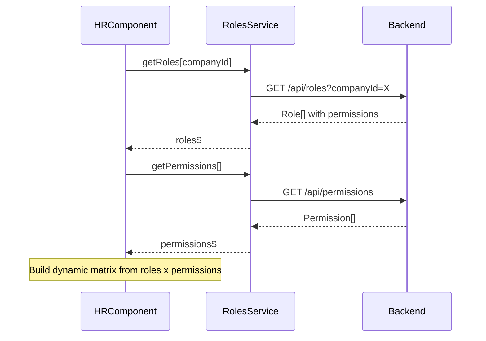

# Role Permission Matrix Fix Plan

## Issues Identified

### 1. Translation Key Bug
**Location**: `construction-cms/src/app/features/admin/hr/hr.component.ts` line 199

**Current Code**:
```typescript
{{ 'hr.permission_' + permission.name.toLowerCase().replace(' ', '_') | translate }}
```

**Problem**: `replace(' ', '_')` only replaces the **first** space. For "View All Projects":
- Current: `permission_view all_projects` (broken - space remains)
- Expected: `permission_view_all_projects`

**Fix**: Use `replaceAll(' ', '_')` or regex `replace(/ /g, '_')`

### 2. Hardcoded Roles
**Location**: `construction-cms/src/app/features/admin/hr/hr.component.ts` lines 190-194

**Current Code**:
```html
<th>{{ 'sidebar.role_super' | translate }}</th>
<th>{{ 'sidebar.role_admin' | translate }}</th>
<th>{{ 'sidebar.role_worker' | translate }}</th>
<th>{{ 'sidebar.role_client' | translate }}</th>
```

**Problem**: Shows only hardcoded system roles (SuperAdmin, Admin, Worker, Client). User wants to see **company-specific roles created by the admin**.

### 3. Hardcoded Permission Matrix
**Location**: `construction-cms/src/app/features/admin/hr/hr.component.ts` lines 352-361

**Current Code**:
```typescript
permissions = [
  { name: 'Manage Users', superAdmin: true, companyAdmin: true, companyUser: false, normalUser: false },
  { name: 'View All Projects', superAdmin: true, companyAdmin: true, companyUser: true, normalUser: false },
  // ... hardcoded data
];
```

**Problem**: Permission matrix is hardcoded instead of being loaded from backend.

## Solution Architecture

### Backend APIs Available
1. `GET /api/roles?companyId=X` - Returns roles for a company
2. `GET /api/permissions` - Returns all permissions
3. `POST /api/roles/permissions` - Update role permissions

### Data Flow


## Implementation Steps

### Step 1: Fix Translation Key Generation
Change line 199 from:
```typescript
{{ 'hr.permission_' + permission.name.toLowerCase().replace(' ', '_') | translate }}
```
To:
```typescript
{{ 'hr.permission_' + permission.name.toLowerCase().replace(/ /g, '_') | translate }}
```

### Step 2: Load Roles from Backend
Add to HrComponent:
```typescript
roles: Role[] = [];
permissions: Permission[] = [];
rolePermissionMatrix: Map<number, Set<number>> = new Map();

ngOnInit() {
  this.loadRoles();
  this.loadPermissions();
}

loadRoles() {
  this.rolesService.getRoles(this.companyId).subscribe(roles => {
    this.roles = roles;
    this.buildPermissionMatrix();
  });
}

loadPermissions() {
  this.rolesService.getPermissions().subscribe(permissions => {
    this.permissions = permissions;
  });
}
```

### Step 3: Dynamic Template for Role Columns
Replace hardcoded role columns with dynamic ones:
```html
<thead>
  <tr>
    <th>{{ 'hr.permission' | translate }}</th>
    @for (role of roles; track role.id) {
      <th class="text-center">{{ role.name }}</th>
    }
  </tr>
</thead>
```

### Step 4: Dynamic Permission Check
```html
<tbody>
  @for (permission of permissions; track permission.id) {
    <tr>
      <td>{{ 'hr.permission_' + permission.name.toLowerCase().replace(/ /g, '_') | translate }}</td>
      @for (role of roles; track role.id) {
        <td class="text-center">
          @if (hasPermission(role.id, permission.id)) {
            <span class="check-icon">✓</span>
          } @else {
            <span class="x-icon">✗</span>
          }
        </td>
      }
    </tr>
  }
</tbody>
```

### Step 5: Add Permission Matrix Helper
```typescript
hasPermission(roleId: number, permissionId: number): boolean {
  const role = this.roles.find(r => r.id === roleId);
  if (!role || !role.permissions) return false;
  return role.permissions.some(p => p.id === permissionId);
}
```

## Files to Modify

1. **`construction-cms/src/app/features/admin/hr/hr.component.ts`**
   - Fix translation key generation
   - Add role/permission loading from backend
   - Replace hardcoded matrix with dynamic one

2. **`construction-cms/src/assets/i18n/en.json`** (if needed)
   - Add any missing permission translation keys

3. **`construction-cms/src/assets/i18n/ar.json`** (if needed)
   - Add any missing permission translation keys

## Testing Checklist

- [ ] Translation keys display correctly for all permissions
- [ ] Roles load from backend for the current company
- [ ] Permissions load from backend
- [ ] Matrix shows correct check/cross for each role-permission combination
- [ ] Language switching updates permission names correctly
