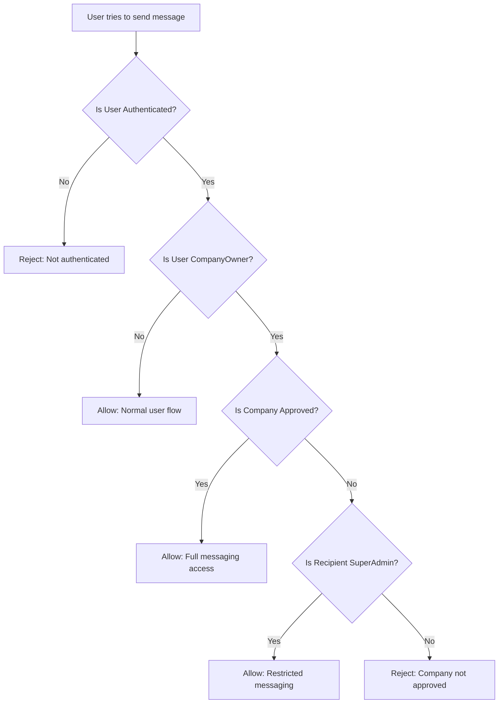

# Unverified Company Owner Messaging Restrictions

## Overview

This plan outlines the implementation of messaging restrictions for unverified company owners. These are users who have registered as company owners but their company has not yet been approved by a SuperAdmin.

## Current Behavior

- The `/messages` route uses only `roleGuard` (not `companyApprovalGuard`)
- Unverified company owners can access the Messages page
- They can currently start conversations with ANY company
- No restrictions on who they can message

## Desired Behavior

Unverified company owners should:
- ✅ Be able to access the Messages page
- ✅ Be able to send and receive messages **ONLY from SuperAdmin**
- ❌ NOT be able to message any other companies until their company is approved

## Architecture

### User Verification Status Detection

A user is considered an "unverified company owner" when:
1. Their `UserType` is `CompanyOwner` (value 2)
2. They have a `CompanyId` set
3. Their company request has status `Pending` (not yet approved)



## Implementation Plan

### 1. Backend Changes

#### 1.1 Add Helper Method to Check User Verification Status

**File:** `src/ConstructionManagement.Infrastructure/Services/MessagingService.cs`

Add a method to check if a user is an unverified company owner:

```csharp
private async Task<bool> IsUnverifiedCompanyOwnerAsync(int userId)
{
    var user = await _context.Users
        .Include(u => u.Company)
        .FirstOrDefaultAsync(u => u.Id == userId);
    
    if (user == null || user.UserType != UserType.CompanyOwner)
        return false;
    
    if (!user.CompanyId.HasValue)
        return false;
    
    // Check if company request is approved
    var companyRequest = await _context.CompanyRequests
        .FirstOrDefaultAsync(cr => cr.UserId == userId && cr.Status == "Approved");
    
    // If no approved request exists, user is unverified
    return companyRequest == null;
}

private async Task<bool> CanMessageRecipientAsync(int senderId, int recipientCompanyId)
{
    // If sender is not an unverified owner, allow
    if (!await IsUnverifiedCompanyOwnerAsync(senderId))
        return true;
    
    // Unverified owners can ONLY message SuperAdmin
    // Check if any SuperAdmin is associated with this company
    var hasSuperAdmin = await _context.Users
        .AnyAsync(u => u.CompanyId == recipientCompanyId && 
                       u.UserRoles.Any(ur => ur.Role.Name == "SuperAdmin"));
    
    return hasSuperAdmin;
}
```

#### 1.2 Modify StartConversationAsync

Update the `StartConversationAsync` method to check recipient eligibility:

```csharp
public async Task<ConversationDto> StartConversationAsync(int userId, StartConversationRequest request, List<IFormFile>? attachments = null)
{
    // Check if user can message this company
    if (!await CanMessageRecipientAsync(userId, request.CompanyId))
    {
        throw new InvalidOperationException(
            "Your company is pending approval. You can only message SuperAdmin until your company is approved.");
    }
    
    // ... rest of existing implementation
}
```

#### 1.3 Modify SendMessageAsync

Add similar validation to `SendMessageAsync`:

```csharp
public async Task<CompanyMessageDto> SendMessageAsync(int conversationId, int userId, SendMessageRequest request, List<IFormFile>? attachments = null)
{
    var conversation = await _context.CompanyConversations.FindAsync(conversationId);
    if (conversation == null)
        throw new InvalidOperationException("Conversation not found.");
    
    // Check if user can message this company
    if (!await CanMessageRecipientAsync(userId, conversation.CompanyId))
    {
        throw new InvalidOperationException(
            "Your company is pending approval. You can only message SuperAdmin until your company is approved.");
    }
    
    // ... rest of existing implementation
}
```

#### 1.4 Add API Endpoint for Messaging Status

**File:** `src/ConstructionManagement.WebApi/Controllers/MessagingController.cs`

Add endpoint to get messaging restriction status:

```csharp
/// <summary>
/// Get messaging restriction status for the current user
/// </summary>
[HttpGet("messaging-status")]
public async Task<ActionResult<MessagingStatusDto>> GetMessagingStatus()
{
    try
    {
        var userId = GetCurrentUserId();
        var result = await _messagingService.GetMessagingStatusAsync(userId);
        return Ok(result);
    }
    catch (Exception ex)
    {
        _logger.LogError(ex, "Error getting messaging status");
        return StatusCode(500, new { message = "An error occurred." });
    }
}
```

#### 1.5 Create DTOs for Messaging Status

**File:** `src/ConstructionManagement.Application/DTOs/Messaging/MessagingDTOs.cs`

```csharp
public class MessagingStatusDto
{
    /// <summary>
    /// Whether the user has restricted messaging
    /// </summary>
    public bool IsRestricted { get; set; }
    
    /// <summary>
    /// Reason for restriction if applicable
    /// </summary>
    public string? RestrictionReason { get; set; }
    
    /// <summary>
    /// Company ID of SuperAdmin if restricted (the only allowed recipient)
    /// </summary>
    public int? SuperAdminCompanyId { get; set; }
    
    /// <summary>
    /// Whether the user is an unverified company owner
    /// </summary>
    public bool IsUnverifiedCompanyOwner { get; set; }
}
```

#### 1.6 Update IMessagingService Interface

**File:** `src/ConstructionManagement.Application/Interfaces/IMessagingService.cs`

Add the new methods to the interface:

```csharp
Task<MessagingStatusDto> GetMessagingStatusAsync(int userId);
```

### 2. Frontend Changes

#### 2.1 Update MessagingService

**File:** `construction-cms/src/app/core/services/messaging.service.ts`

Add method to get messaging status:

```typescript
getMessagingStatus(): Observable<MessagingStatusDto> {
    return this.http.get<MessagingStatusDto>(`${this.baseUrl}/messaging/messaging-status`);
}

export interface MessagingStatusDto {
    isRestricted: boolean;
    restrictionReason?: string;
    superAdminCompanyId?: number;
    isUnverifiedCompanyOwner: boolean;
}
```

#### 2.2 Update MessagesComponent

**File:** `construction-cms/src/app/features/common/messages/messages.component.ts`

Add restriction notice in the template:

```typescript
// Add to the component class
messagingStatus: MessagingStatusDto | null = null;
isRestricted = false;

ngOnInit() {
    this.loadMessagingStatus();
    this.loadConversations();
    this.loadUnreadCount();
    // ... rest of existing code
}

loadMessagingStatus() {
    this.messagingService.getMessagingStatus().subscribe({
        next: (status) => {
            this.messagingStatus = status;
            this.isRestricted = status.isRestricted;
        },
        error: (error) => {
            console.error('Error loading messaging status:', error);
        }
    });
}
```

Add to template:

```html
<!-- Restriction Notice for Unverified Owners -->
@if (isRestricted) {
  <div class="mb-6 p-4 rounded-2xl bg-amber-50 dark:bg-amber-900/20 border border-amber-200 dark:border-amber-500/30">
    <div class="flex items-start gap-3">
      <svg class="w-5 h-5 text-amber-500 mt-0.5" fill="none" stroke="currentColor" viewBox="0 0 24 24">
        <path stroke-linecap="round" stroke-linejoin="round" stroke-width="2" d="M12 9v2m0 4h.01m-6.938 4h13.856c1.54 0 2.502-1.667 1.732-3L13.732 4c-.77-1.333-2.694-1.333-3.464 0L3.34 16c-.77 1.333.192 3 1.732 3z"></path>
      </svg>
      <div>
        <h4 class="font-bold text-amber-700 dark:text-amber-400">{{ 'messages.restricted_title' | translate }}</h4>
        <p class="text-sm text-amber-600 dark:text-amber-300">{{ 'messages.restricted_desc' | translate }}</p>
      </div>
    </div>
  </div>
}
```

#### 2.3 Update Companies Browse Component

**File:** `construction-cms/src/app/features/common/companies/companies-browse.component.ts`

Add visual indicator for messaging restrictions:

```typescript
// Add to component
messagingStatus: MessagingStatusDto | null = null;

canMessageCompany(company: any): boolean {
    // If not restricted, can message anyone
    if (!this.messagingStatus?.isRestricted) return true;
    
    // If restricted, can only message SuperAdmin company
    return this.messagingStatus.superAdminCompanyId === company.id;
}
```

Update template:

```html
@if (canMessageCompany(company)) {
  <button (click)="startConversation(company)" 
          class="...">
    {{ 'messages.message_company' | translate }}
  </button>
} @else {
  <button disabled 
          class="opacity-50 cursor-not-allowed ..."
          [title]="'messages.approval_required_tooltip' | translate">
    <span class="flex items-center gap-2">
      <svg class="w-4 h-4" fill="none" stroke="currentColor" viewBox="0 0 24 24">
        <path stroke-linecap="round" stroke-linejoin="round" stroke-width="2" d="M12 15v2m-6 4h12a2 2 0 002-2v-6a2 2 0 00-2-2H6a2 2 0 00-2 2v6a2 2 0 002 2zm10-10V7a4 4 0 00-8 0v4h8z"></path>
      </svg>
      {{ 'messages.approval_required' | translate }}
    </span>
  </button>
}
```

#### 2.4 Add Translation Keys

**Files:** 
- `construction-cms/src/assets/i18n/en.json`
- `construction-cms/src/assets/i18n/ar.json`

```json
{
  "messages": {
    "restricted_title": "Messaging Restricted",
    "restricted_desc": "Your company is pending approval. You can only message SuperAdmin until your company is approved.",
    "approval_required": "Approval Required",
    "approval_required_tooltip": "Your company must be approved before you can message this company",
    "message_company": "Message Company"
  }
}
```

Arabic translations:

```json
{
  "messages": {
    "restricted_title": "المراسلة مقيدة",
    "restricted_desc": "شركتك في انتظار الموافقة. يمكنك فقط مراسلة المدير العام حتى يتم الموافقة على شركتك.",
    "approval_required": "موافقة مطلوبة",
    "approval_required_tooltip": "يجب الموافقة على شركتك قبل أن تتمكن من مراسلة هذه الشركة",
    "message_company": "مراسلة الشركة"
  }
}
```

## Database Considerations

No database schema changes required. The implementation uses existing entities:
- `User` - to check UserType and CompanyId
- `Company` - to check company details
- `CompanyRequest` - to check approval status
- `UserRole` - to check for SuperAdmin role

## Security Considerations

1. **Backend Validation**: All validation MUST happen on the backend. Frontend restrictions are for UX only.
2. **Authorization**: Ensure the user is authenticated before any messaging operation.
3. **Error Messages**: Provide clear but not overly informative error messages.
4. **SuperAdmin Check**: Verify SuperAdmin role through the UserRole table, not just UserType.

## Testing Checklist

- [ ] Unverified company owner cannot start conversation with regular company
- [ ] Unverified company owner CAN start conversation with SuperAdmin
- [ ] Unverified company owner CAN reply to SuperAdmin messages
- [ ] Verified company owner has full messaging access
- [ ] Regular users are not affected by restrictions
- [ ] Frontend shows appropriate restriction notice
- [ ] Frontend disables message buttons for restricted recipients
- [ ] Error messages are displayed correctly
- [ ] Arabic translations are correct

## Files to Modify

### Backend
1. `src/ConstructionManagement.Infrastructure/Services/MessagingService.cs` - Add restriction logic
2. `src/ConstructionManagement.WebApi/Controllers/MessagingController.cs` - Add status endpoint
3. `src/ConstructionManagement.Application/DTOs/Messaging/MessagingDTOs.cs` - Add DTOs
4. `src/ConstructionManagement.Application/Interfaces/IMessagingService.cs` - Add interface methods

### Frontend
1. `construction-cms/src/app/core/services/messaging.service.ts` - Add status method
2. `construction-cms/src/app/features/common/messages/messages.component.ts` - Add restriction notice
3. `construction-cms/src/app/features/common/companies/companies-browse.component.ts` - Add restriction indicators
4. `construction-cms/src/assets/i18n/en.json` - Add translations
5. `construction-cms/src/assets/i18n/ar.json` - Add translations
