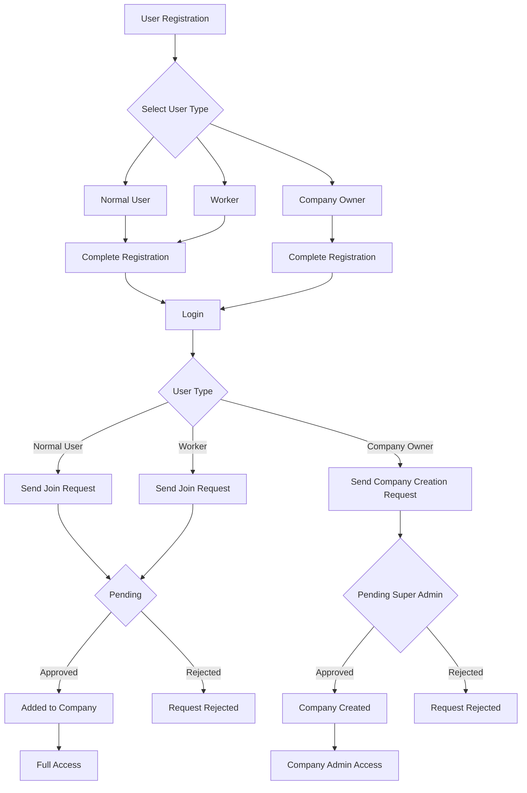

# User Registration and Pending Requests Plan

## Overview
This plan outlines the implementation of enhanced user registration with role selection and pending request management for Super Admins and Company Admins.

## User Registration Flow

### Registration Options
1. **Normal User** - Can send request to join a company (Company Admin must approve)
2. **Worker** - Same as Normal User (can request to join company)
3. **Company Owner** - Can send request to Super Admin to create a new company

### Registration Process
```
User selects registration type
    |
    ├── Normal User / Worker
    │   └── Complete registration
    │       └── Login
    │           └── Send join request to Company Admin
    │               └── Wait for approval
    │                   └── If approved -> Added to company
    │
    └── Company Owner
        └── Complete registration
            └── Login
                └── Send company creation request to Super Admin
                    └── Wait for approval
                        └── If approved -> Company created, user becomes Company Admin
```

## Backend Implementation

### 1. UserType Enum
**File:** `src/ConstructionManagement.Domain/Enums/UserType.cs`
```csharp
public enum UserType
{
    NormalUser = 0,
    Worker = 1,
    CompanyOwner = 2
}
```

### 2. Update RegisterRequest DTO
**File:** `src/ConstructionManagement.Application/DTOs/RegisterRequest.cs`
```csharp
public record RegisterRequest(
    string FullName,
    string Email,
    string Password,
    string? Phone,
    UserType UserType  // NEW FIELD
);
```

### 3. CompanyRequest Entity
**File:** `src/ConstructionManagement.Domain/Entities/CompanyRequest.cs`
```csharp
public class CompanyRequest : BaseEntity
{
    public int UserId { get; set; }
    public virtual User User { get; set; }
    
    public string CompanyName { get; set; }
    public string? BusinessId { get; set; }
    public string? ContactEmail { get; set; }
    public string? ContactPhone { get; set; }
    public string? Address { get; set; }
    
    public string Status { get; set; } = "Pending"; // Pending, Approved, Rejected
    public string? RejectionReason { get; set; }
    public int? ReviewedByUserId { get; set; }
    public virtual User? ReviewedBy { get; set; }
    public DateTime? ReviewedAt { get; set; }
}
```

### 4. JoinRequest Entity
**File:** `src/ConstructionManagement.Domain/Entities/JoinRequest.cs`
```csharp
public class JoinRequest : BaseEntity
{
    public int UserId { get; set; }
    public virtual User User { get; set; }
    
    public int CompanyId { get; set; }
    public virtual Company Company { get; set; }
    
    public string Status { get; set; } = "Pending"; // Pending, Approved, Rejected
    public string? RejectionReason { get; set; }
    public int? ReviewedByUserId { get; set; }
    public virtual User? ReviewedBy { get; set; }
    public DateTime? ReviewedAt { get; set; }
}
```

### 5. API Endpoints

**CompanyRequestController**
- `POST /api/company-requests` - Create company creation request
- `GET /api/company-requests` - Get all company requests (Super Admin only)
- `GET /api/company-requests/{id}` - Get single request
- `PUT /api/company-requests/{id}/approve` - Approve request
- `PUT /api/company-requests/{id}/reject` - Reject request

**JoinRequestController**
- `POST /api/join-requests` - Create join company request
- `GET /api/join-requests` - Get join requests (Company Admin only)
- `GET /api/join-requests/pending` - Get pending requests for current user
- `PUT /api/join-requests/{id}/approve` - Approve request
- `PUT /api/join-requests/{id}/reject` - Reject request

### 6. AuthService Updates
- Update `RegisterAsync` to handle different user types
- Assign default role based on UserType
- Normal User/Worker -> CompanyUser role
- CompanyOwner -> No company yet (pending)

## Frontend Implementation

### 1. Updated Register Component
**File:** `construction-cms/src/app/features/auth/register/register.component.ts`
- Add user type selection dropdown (Normal User, Worker, Company Owner)
- Update form validation based on selection
- Update i18n translations

### 2. New Services
- `CompanyRequestService` - API calls for company requests
- `JoinRequestService` - API calls for join requests

### 3. New Components
- `company-request.component.ts` - Form to send company creation request
- `join-request.component.ts` - Form to send join company request
- `pending-requests.component.ts` - List and manage pending requests

### 4. Sidebar Updates
**File:** `construction-cms/src/app/layout/sidebar/sidebar.component.ts`
- Add pending requests badge icon for Super Admin
- Add pending requests badge icon for Company Admin
- Show pending count in badge

### 5. Routes
- `/admin/pending-requests` - View pending requests (Super Admin)
- `/admin/company-requests` - View company creation requests (Super Admin)
- `/admin/join-requests` - View join requests (Company Admin)

## Database Migrations
1. Add `UserType` column to Users table
2. Create `CompanyRequests` table
3. Create `JoinRequests` table

## Email Notifications
When requests are approved or rejected, email notifications should be sent:

### Notification Types
1. **CompanyRequest Approved** - Email to Company Owner with company credentials
2. **CompanyRequest Rejected** - Email to Company Owner with rejection reason
3. **JoinRequest Approved** - Email to Normal User with welcome message
4. **JoinRequest Rejected** - Email to Normal User with rejection reason

### Email Service Updates
**File:** `src/ConstructionManagement.Infrastructure/Services/EmailService.cs`
```csharp
public async Task SendCompanyRequestApprovedAsync(string email, string companyName)
{
    // Send approval email with company details
}

public async Task SendCompanyRequestRejectedAsync(string email, string reason)
{
    // Send rejection email with reason
}

public async Task SendJoinRequestApprovedAsync(string email, string companyName)
{
    // Send approval email
}

public async Task SendJoinRequestRejectedAsync(string email, string reason)
{
    // Send rejection email
}
```

### Service Layer Updates
**CompanyRequestService** - Call email service on approve/reject
**JoinRequestService** - Call email service on approve/reject

## In-App Notifications
In addition to emails, in-app notifications should be created:

### Notification Entity Updates
**File:** `src/ConstructionManagement.Domain/Entities/Notification.cs`
```csharp
public class Notification : BaseEntity
{
    public int UserId { get; set; }
    public virtual User User { get; set; }
    
    public string Title { get; set; }
    public string Message { get; set; }
    public string Type { get; set; } // CompanyRequestApproved, CompanyRequestRejected, JoinRequestApproved, JoinRequestRejected
    public bool IsRead { get; set; } = false;
    public string? Link { get; set; } // Optional link to related page
}
```

### Notification Types
1. **CompanyRequest Approved** - In-app notification to Company Owner
2. **CompanyRequest Rejected** - In-app notification to Company Owner
3. **JoinRequest Approved** - In-app notification to Normal User
4. **JoinRequest Rejected** - In-app notification to Normal User
5. **New CompanyRequest** - In-app notification to Super Admin
6. **New JoinRequest** - In-app notification to Company Admin

### Notification Service Updates
**File:** `src/ConstructionManagement.Infrastructure/Services/NotificationService.cs`
```csharp
public async Task CreateNotificationAsync(int userId, string title, string message, string type, string? link = null)
{
    // Create in-app notification
}

public async Task NotifyCompanyRequestApprovedAsync(int userId, string companyName)
{
    await CreateNotificationAsync(userId, "Company Approved", $"Your company '{companyName}' has been approved!", "CompanyRequestApproved", "/dashboard");
}

public async Task NotifyCompanyRequestRejectedAsync(int userId, string reason)
{
    await CreateNotificationAsync(userId, "Company Request Rejected", $"Your company request was rejected. Reason: {reason}", "CompanyRequestRejected", null);
}

public async Task NotifyJoinRequestApprovedAsync(int userId, string companyName)
{
    await CreateNotificationAsync(userId, "Join Request Approved", $"You have been approved to join '{companyName}'!", "JoinRequestApproved", "/dashboard");
}

public async Task NotifyJoinRequestRejectedAsync(int userId, string reason)
{
    await CreateNotificationAsync(userId, "Join Request Rejected", $"Your join request was rejected. Reason: {reason}", "JoinRequestRejected", null);
}

public async Task NotifyNewCompanyRequestAsync(int SystemAdminUserId, string companyName, int requestId)
{
    await CreateNotificationAsync(SystemAdminUserId, "New Company Request", $"New company creation request: {companyName}", "NewCompanyRequest", $"/admin/pending-requests/{requestId}");
}

public async Task NotifyNewJoinRequestAsync(int companyAdminUserId, string userName, int requestId)
{
    await CreateNotificationAsync(companyAdminUserId, "New Join Request", $"{userName} wants to join your company", "NewJoinRequest", $"/admin/pending-requests/{requestId}");
}
```

### Service Layer Integration
**CompanyRequestService** - Create notifications on status change and when new requests are submitted
**JoinRequestService** - Create notifications on status change and when new requests are submitted

## Frontend Notification Updates
**File:** `construction-cms/src/app/core/services/notifications.service.ts`
- Add methods to fetch request-related notifications
- Add polling or WebSocket connection for real-time notifications
- Update notification badge count

## i18n Translations
**File:** `construction-cms/public/assets/i18n/en.json`
```json
{
  "register": {
    "userType": "I am a",
    "userType_normal": "Normal User",
    "userType_worker": "Worker",
    "userType_owner": "Company Owner"
  },
  "pendingRequests": {
    "title": "Pending Requests",
    "companyRequests": "Company Creation Requests",
    "joinRequests": Requests",
    "approve": "Approve",
    " "Join Companyreject": "Reject",
    "noRequests": "No pending requests"
  }
}
```

## Workflow Diagram



## Implementation Order
1. Backend: Create UserType enum
2. Backend: Update RegisterRequest DTO
3. Backend: Create CompanyRequest entity
4. Backend: Create JoinRequest entity
5. Backend: Create migration
6. Backend: Create CompanyRequestService and Controller
7. Backend: Create JoinRequestService and Controller
8. Frontend: Update Register component with user type selection
9. Frontend: Create CompanyRequestService
10. Frontend: Create JoinRequestService
11. Frontend: Create pending-requests component
12. Frontend: Add badge to sidebar
13. Full build and verification
