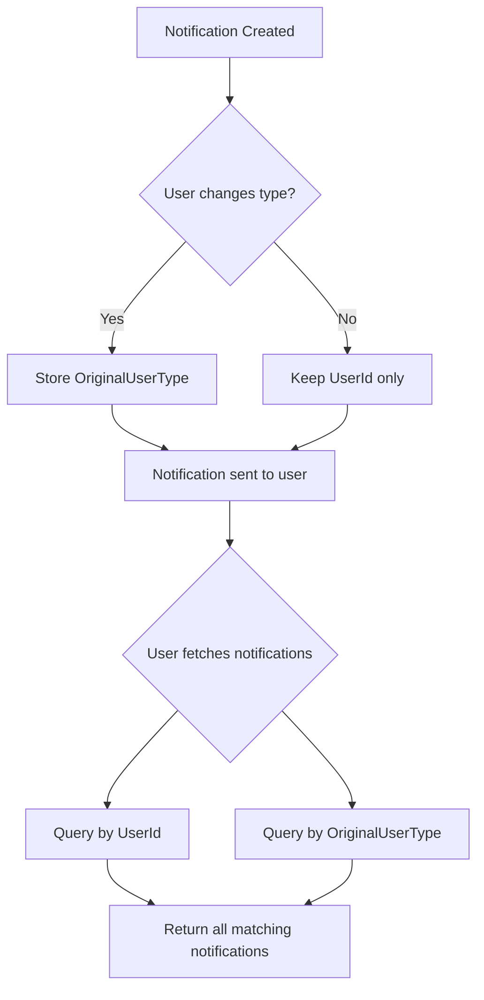

# User Type Management and Switching Feature

## Overview

This document outlines the implementation plan for adding:
1. A new user registration type called "Inventory Owner"
2. The ability for users to change their type within the application
3. View filtering based on current user type
4. Notification retention from previous user types

## Current System Analysis

### Existing UserType Enum
Located at: [`src/ConstructionManagement.Domain/Enums/UserType.cs`](src/ConstructionManagement.Domain/Enums/UserType.cs)

```csharp
public enum UserType
{
    NormalUser = 0,
    Worker = 1,
    CompanyOwner = 2
}
```

### Current User Entity
Located at: [`src/ConstructionManagement.Domain/Entities/User.cs`](src/ConstructionManagement.Domain/Entities/User.cs)

**Issue**: The User entity does NOT currently have a UserType field stored. UserType is only used during registration and not persisted.

### Current Authentication Flow
1. User registers with a UserType
2. User is assigned the "CompanyUser" role by default
3. Roles are managed through the UserRoles junction table
4. Notifications are tied to UserId only

## Implementation Plan

### Phase 1: Backend Changes

#### 1.1 Add InventoryOwner to UserType Enum

**File**: `src/ConstructionManagement.Domain/Enums/UserType.cs`

```csharp
public enum UserType
{
    NormalUser = 0,
    Worker = 1,
    CompanyOwner = 2,
    InventoryOwner = 3  // New type
}
```

#### 1.2 Add UserType Field to User Entity

**File**: `src/ConstructionManagement.Domain/Entities/User.cs`

Add after the Phone field:
```csharp
/// <summary>
/// The current type of the user (persisted for role switching)
/// </summary>
public UserType UserType { get; set; } = UserType.NormalUser;
```

#### 1.3 Create UserTypeHistory Entity (Optional but Recommended)

**File**: `src/ConstructionManagement.Domain/Entities/UserTypeHistory.cs`

```csharp
public class UserTypeHistory : BaseEntity
{
    public int UserId { get; set; }
    public UserType PreviousType { get; set; }
    public UserType NewType { get; set; }
    public DateTime ChangedAt { get; set; } = DateTime.UtcNow;
    public string? ChangedBy { get; set; }  // User ID who made the change
}
```

#### 1.4 Add OriginalUserType to Notification Entity

**File**: `src/ConstructionManagement.Domain/Entities/Notification.cs`

Add after the UserId field:
```csharp
/// <summary>
/// The user type the notification was originally created for
/// Used to track notifications that should be delivered even after user type changes
/// </summary>
public UserType? OriginalUserType { get; set; }
```

#### 1.5 Create ChangeUserTypeRequest DTO

**File**: `src/ConstructionManagement.Application/DTOs/ChangeUserTypeRequest.cs`

```csharp
using ConstructionManagement.Domain.Enums;

namespace ConstructionManagement.Application.DTOs;

public record ChangeUserTypeRequest(
    UserType NewUserType
);
```

#### 1.6 Update UserDto

**File**: `src/ConstructionManagement.Application/DTOs/UserDto.cs`

```csharp
public record UserDto(
    int UserID, 
    string FullName, 
    string Email, 
    List<string> Roles, 
    DateTime CreatedAt,
    UserType CurrentUserType  // New field
);
```

#### 1.7 Create UserTypeService

**File**: `src/ConstructionManagement.Application/Interfaces/IUserTypeService.cs`

```csharp
public interface IUserTypeService
{
    Task<bool> ChangeUserTypeAsync(int userId, UserType newType);
    Task<List<UserTypeHistory>> GetUserTypeHistoryAsync(int userId);
    Task<bool> CanSwitchToTypeAsync(int userId, UserType targetType);
}
```

**Implementation**: `src/ConstructionManagement.Infrastructure/Services/UserTypeService.cs`

#### 1.8 Update AuthService

**File**: `src/ConstructionManagement.Infrastructure/Services/AuthService.cs`

1. Include CurrentUserType in the JWT token claims
2. Update the UserDto creation to include CurrentUserType
3. Update RegisterAsync to set the initial UserType

#### 1.9 Update Notification Service

**File**: `src/ConstructionManagement.Infrastructure/Services/NotificationService.cs`

Update the GetNotificationsForUser method to:
1. Fetch notifications where UserId equals current user
2. OR where OriginalUserType matches any of the user's previous types
3. AND IsRead is false

#### 1.10 Create AuthController Endpoint

**File**: `src/ConstructionManagement.WebApi/Controllers/AuthController.cs`

```csharp
[HttpPost("change-user-type")]
public async Task<IActionResult> ChangeUserType([FromBody] ChangeUserTypeRequest request)
{
    var userId = _authService.GetCurrentUserId();
    if (!userId.HasValue)
        return Unauthorized();

    var result = await _userTypeService.ChangeUserTypeAsync(userId.Value, request.NewUserType);
    
    if (result)
        return Ok(new { success = true, message = "User type changed successfully" });
    
    return BadRequest(new { success = false, message = "Failed to change user type" });
}
```

#### 1.11 Database Migration

Create a new migration to:
1. Add UserType column to Users table
2. Add OriginalUserType column to Notifications table
3. Create UserTypeHistory table (optional)

### Phase 2: Frontend Changes

#### 2.1 Update User Interface

**File**: `construction-cms/src/app/core/auth/auth.service.ts`

```typescript
export interface User {
    userId: number;
    fullName: string;
    email: string;
    roles: string[];
    createdAt: Date;
    userType: number;  // New field
}
```

#### 2.2 Add switchUserType Method to AuthService

**File**: `construction-cms/src/app/core/services/auth.service.ts`

```typescript
switchUserType(newType: number): Observable<{ success: boolean; message: string }> {
    return this.http.post<{ success: boolean; message: string }>(`${this.apiUrl}/change-user-type`, { newUserType: newType }).pipe(
        tap(response => {
            if (response.success) {
                // Update local storage with new user type
                const user = this.getCurrentUser();
                if (user) {
                    user.userType = newType;
                    localStorage.setItem('currentUser', JSON.stringify(user));
                    this.currentUserSubject.next(user);
                }
            }
        })
    );
}
```

#### 2.3 Update Sidebar Role Switcher

**File**: `construction-cms/src/app/layout/sidebar/sidebar.component.ts`

Update the select element to include InventoryOwner:

```html
<select 
    (change)="switchUserType($event)"
    [value]="currentUserType"
    class="...">
    <option value="0">Normal User</option>
    <option value="1">Worker</option>
    <option value="2">Company Owner</option>
    <option value="3">Inventory Owner</option>  <!-- New option -->
</select>
```

Update the switchUserType method:

```typescript
switchUserType(event: Event) {
    const select = event.target as HTMLSelectElement;
    const newType = parseInt(select.value, 10);
    this.authService.switchUserType(newType).subscribe({
        next: () => {
            // Optionally reload the page or refresh the UI
            window.location.reload();
        },
        error: (err) => {
            console.error('Failed to switch user type:', err);
            // Revert selection
            select.value = this.currentUserType.toString();
        }
    });
}
```

#### 2.4 Create UserTypeSwitchComponent (Optional)

Create a dedicated component for user type switching with:
- Confirmation dialog
- Information about what will change
- Warning about view changes

#### 2.5 Update Notifications Component

**File**: `construction-cms/src/app/features/common/notifications/notifications.component.ts`

Update to fetch and display notifications from previous user types. Show a badge or indicator if notifications are from a different type.

### Phase 3: Architecture Considerations

#### 3.1 User Type vs Role

**UserType**: 
- Registration category (NormalUser, Worker, CompanyOwner, InventoryOwner)
- Determines what features/UI the user sees
- Can be changed by the user
- Affects view permissions

**Role**:
- System permissions (SuperAdmin, CompanyAdmin, CompanyUser)
- Assigned by admins
- Determines what actions the user can perform
- Affects API authorization

#### 3.2 Notification Flow



#### 3.3 View Permission Logic

The frontend sidebar should:
1. Get the current user's UserType
2. Filter menu items based on UserType
3. Show inventory-related options only for InventoryOwner
4. Show normal user options for NormalUser
5. Show worker options for Worker
6. Show company owner options for CompanyOwner

### Phase 4: Testing

#### 4.1 Unit Tests

1. Test UserType enum values
2. Test UserTypeService.ChangeUserTypeAsync
3. Test UserTypeService.CanSwitchToTypeAsync
4. Test notification filtering with OriginalUserType

#### 4.2 Integration Tests

1. Test complete user type switch flow
2. Test notification retrieval after type change
3. Test that new notifications use the new type
4. Test that pending notifications from old type are still delivered

## Files to Modify

### Backend
1. `src/ConstructionManagement.Domain/Enums/UserType.cs` - Add InventoryOwner
2. `src/ConstructionManagement.Domain/Entities/User.cs` - Add UserType field
3. `src/ConstructionManagement.Domain/Entities/Notification.cs` - Add OriginalUserType
4. `src/ConstructionManagement.Domain/Entities/UserTypeHistory.cs` - New file
5. `src/ConstructionManagement.Application/DTOs/ChangeUserTypeRequest.cs` - New file
6. `src/ConstructionManagement.Application/DTOs/UserDto.cs` - Add CurrentUserType
7. `src/ConstructionManagement.Application/Interfaces/IUserTypeService.cs` - New file
8. `src/ConstructionManagement.Infrastructure/Services/UserTypeService.cs` - New file
9. `src/ConstructionManagement.Infrastructure/Services/AuthService.cs` - Update
10. `src/ConstructionManagement.Infrastructure/Services/NotificationService.cs` - Update
11. `src/ConstructionManagement.WebApi/Controllers/AuthController.cs` - Add endpoint

### Frontend
1. `construction-cms/src/app/core/auth/auth.service.ts` - Add switchUserType, update User interface
2. `construction-cms/src/app/layout/sidebar/sidebar.component.ts` - Add InventoryOwner option
3. `construction-cms/src/app/core/auth/user.model.ts` - Create or update user model
4. `construction-cms/src/app/features/common/notifications/notifications.component.ts` - Update for previous type notifications

### Database
1. Create migration for UserType column
2. Create migration for OriginalUserType column
3. Create migration for UserTypeHistory table

## Success Criteria

1. ✅ Users can register as InventoryOwner
2. ✅ Users can change their type from the sidebar dropdown
3. ✅ UI updates to show features appropriate for the current type
4. ✅ Pending notifications from previous types are still delivered
5. ✅ New notifications use the current type
6. ✅ User type history is tracked

## Next Steps

1. Review and approve this plan
2. Begin implementation in Code mode
3. Create database migrations
4. Implement backend services
5. Update frontend components
6. Write tests
7. Verify end-to-end functionality
