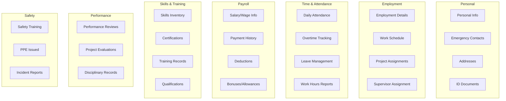

# Worker Documents & HR Module Design

## Overview

This document outlines the design for two critical features in the Construction Management System:
1. **Worker Documents** - Documents uploaded by companies for their workers
2. **Worker HR Module** - Comprehensive human resources management for construction workers

---

## Part 1: Worker Documents Feature

### Current State Analysis

The existing [`Document`](src/ConstructionManagement.Domain/Entities/DocumentManagement.cs:30) entity supports:
- Company-wide documents
- Project-specific documents
- Categories and versioning
- Approval workflows

**Gap**: No mechanism to associate documents with specific workers or for workers to view documents shared by their companies.

### Proposed Solution: WorkerDocument Entity

```mermaid
erDiagram
    WorkerDocument ||--o| Company : belongs_to
    WorkerDocument ||--o| User : uploaded_by
    WorkerDocument ||--o| User : visible_to_worker
    WorkerDocument ||--o| Project : optional_project
    
    WorkerDocument {
        int Id PK
        int CompanyId FK
        int WorkerUserId FK "User.Id of worker"
        int? ProjectId FK
        int? UploadedByUserId FK
        string Title
        string? Description
        string DocumentType
        string FileName
        string FilePath
        string FileUrl
        long FileSize
        string FileType
        bool IsVisibleToWorker
        DateTime? ExpiryDate
        DateTime UploadedAt
        bool IsDeleted
    }
```

### Document Types for Workers

| Type | Description | Auto-Expire |
|------|-------------|-------------|
| Contract | Employment contract | No |
| ID_Copy | National ID copy | No |
| WorkPermit | Work permit document | Yes |
| SafetyCertificate | Safety training certificate | Yes |
| MedicalCertificate | Medical fitness certificate | Yes |
| TrainingCertificate | Skills training certificate | Yes |
| PerformanceReview | Performance evaluation | No |
| Warning | Warning/disciplinary notice | No |
| Payroll | Payslip or payroll document | No |
| Other | Other documents | No |

### API Endpoints

```
# Company Admin - Upload document for worker
POST /api/worker-documents
{
  "workerUserId": 123,
  "title": "Employment Contract 2024",
  "documentType": "Contract",
  "projectId": 5,  // optional
  "file": <binary>
}

# Company Admin - Get all documents for a worker
GET /api/worker-documents/worker/{workerUserId}

# Worker - Get their own documents
GET /api/worker-documents/my-documents

# Worker - Download document
GET /api/worker-documents/{id}/download
```

---

## Part 2: Worker HR Module

### Comprehensive HR Features for Construction Workers



### Entity Designs

#### 1. WorkerProfile (Extended Worker Information)

```csharp
public class WorkerProfile : BaseEntity, ICompanyEntity
{
    public int? CompanyId { get; set; }
    public virtual Company? Company { get; set; }
    
    // Link to User account
    public int UserId { get; set; }
    public virtual User User { get; set; } = null!;
    
    // Personal Information
    public string? NationalId { get; set; }
    public DateTime? DateOfBirth { get; set; }
    public string? Gender { get; set; }
    public string? MaritalStatus { get; set; }
    public string? Nationality { get; set; }
    public string? ProfilePhotoUrl { get; set; }
    
    // Address Information
    public string? Address { get; set; }
    public string? City { get; set; }
    public string? Governorate { get; set; }
    public string? PostalCode { get; set; }
    
    // Employment Details
    public EmploymentType EmploymentType { get; set; } = EmploymentType.DailyWage;
    public DateTime? HireDate { get; set; }
    public DateTime? TerminationDate { get; set; }
    public string? TerminationReason { get; set; }
    public int? DepartmentId { get; set; }
    public int? SupervisorUserId { get; set; }
    
    // Compensation
    public decimal? MonthlySalary { get; set; }
    public decimal? DailyWage { get; set; }
    public decimal? HourlyRate { get; set; }
    public string? Currency { get; set; } = "EGP";
    public string? BankName { get; set; }
    public string? BankAccountNumber { get; set; }
    
    // Work Schedule
    public string? WorkSchedule { get; set; } // JSON or reference
    public int? WeeklyWorkingHours { get; set; }
    public int? AnnualLeaveDays { get; set; }
    public int? SickLeaveDays { get; set; }
    
    // Status
    public WorkerStatus Status { get; set; } = WorkerStatus.Active;
    public bool IsVerified { get; set; }
    
    // Navigation Properties
    public virtual ICollection<WorkerEmergencyContact> EmergencyContacts { get; set; }
    public virtual ICollection<WorkerAttendance> AttendanceRecords { get; set; }
    public virtual ICollection<WorkerLeave> LeaveRecords { get; set; }
    public virtual ICollection<WorkerPayment> Payments { get; set; }
    public virtual ICollection<WorkerSkill> Skills { get; set; }
    public virtual ICollection<WorkerCertification> Certifications { get; set; }
    public virtual ICollection<WorkerPerformanceReview> PerformanceReviews { get; set; }
    public virtual ICollection<WorkerSafetyRecord> SafetyRecords { get; set; }
}

public enum EmploymentType
{
    FullTime = 0,
    PartTime = 1,
    Contract = 2,
    DailyWage = 3,
    Temporary = 4
}

public enum WorkerStatus
{
    Active = 0,
    OnLeave = 1,
    Suspended = 2,
    Terminated = 3,
    Inactive = 4
}
```

#### 2. WorkerEmergencyContact

```csharp
public class WorkerEmergencyContact : BaseEntity, ICompanyEntity
{
    public int? CompanyId { get; set; }
    public int WorkerProfileId { get; set; }
    public virtual WorkerProfile WorkerProfile { get; set; } = null!;
    
    public string Name { get; set; } = string.Empty;
    public string Relationship { get; set; } = string.Empty;
    public string PhoneNumber { get; set; } = string.Empty;
    public string? AlternativePhone { get; set; }
    public string? Address { get; set; }
    public bool IsPrimary { get; set; } = false;
}
```

#### 3. WorkerAttendance

```csharp
public class WorkerAttendance : BaseEntity, ICompanyEntity
{
    public int? CompanyId { get; set; }
    public int WorkerProfileId { get; set; }
    public virtual WorkerProfile WorkerProfile { get; set; } = null!;
    
    public int? ProjectId { get; set; }
    public virtual Project? Project { get; set; }
    
    public DateTime Date { get; set; }
    public DateTime? CheckInTime { get; set; }
    public DateTime? CheckOutTime { get; set; }
    public decimal? WorkHours { get; set; }
    public decimal? OvertimeHours { get; set; }
    
    public AttendanceStatus Status { get; set; } = AttendanceStatus.Present;
    public string? Notes { get; set; }
    public string? Location { get; set; } // GPS coordinates
    
    public int? ApprovedByUserId { get; set; }
    public DateTime? ApprovedAt { get; set; }
}

public enum AttendanceStatus
{
    Present = 0,
    Absent = 1,
    Late = 2,
    EarlyLeave = 3,
    OnLeave = 4,
    Holiday = 5,
    SickLeave = 6
}
```

#### 4. WorkerLeave

```csharp
public class WorkerLeave : BaseEntity, ICompanyEntity
{
    public int? CompanyId { get; set; }
    public int WorkerProfileId { get; set; }
    public virtual WorkerProfile WorkerProfile { get; set; } = null!;
    
    public LeaveType LeaveType { get; set; }
    public DateTime StartDate { get; set; }
    public DateTime EndDate { get; set; }
    public int TotalDays { get; set; }
    
    public string? Reason { get; set; }
    public LeaveStatus Status { get; set; } = LeaveStatus.Pending;
    
    public int? RequestedById { get; set; }
    public DateTime RequestedAt { get; set; } = DateTime.UtcNow;
    
    public int? ApprovedByUserId { get; set; }
    public DateTime? ApprovedAt { get; set; }
    public string? ApprovalNotes { get; set; }
    
    public string? AttachmentUrl { get; set; }
}

public enum LeaveType
{
    Annual = 0,
    Sick = 1,
    Emergency = 2,
    Unpaid = 3,
    Maternity = 4,
    Paternity = 5,
    Marriage = 6,
    Bereavement = 7
}

public enum LeaveStatus
{
    Pending = 0,
    Approved = 1,
    Rejected = 2,
    Cancelled = 3
}
```

#### 5. WorkerPayment

```csharp
public class WorkerPayment : BaseEntity, ICompanyEntity
{
    public int? CompanyId { get; set; }
    public int WorkerProfileId { get; set; }
    public virtual WorkerProfile WorkerProfile { get; set; } = null!;
    
    public int? ProjectId { get; set; }
    public virtual Project? Project { get; set; }
    
    // Payment Period
    public DateTime PeriodStart { get; set; }
    public DateTime PeriodEnd { get; set; }
    public DateTime PaymentDate { get; set; }
    
    // Calculations
    public decimal RegularHours { get; set; }
    public decimal OvertimeHours { get; set; }
    public decimal RegularAmount { get; set; }
    public decimal OvertimeAmount { get; set; }
    public decimal BonusAmount { get; set; }
    public decimal Deductions { get; set; }
    public decimal NetAmount { get; set; }
    
    // Payment Details
    public PaymentMethod PaymentMethod { get; set; } = PaymentMethod.Cash;
    public string? ReferenceNumber { get; set; }
    public string? Notes { get; set; }
    
    public PaymentStatus Status { get; set; } = PaymentStatus.Pending;
    public int? ProcessedByUserId { get; set; }
    public DateTime? ProcessedAt { get; set; }
}

public enum PaymentMethod
{
    Cash = 0,
    BankTransfer = 1,
    Check = 2,
    MobileWallet = 3
}

public enum PaymentStatus
{
    Pending = 0,
    Paid = 1,
    Cancelled = 2,
    Reversed = 3
}
```

#### 6. WorkerSkill

```csharp
public class WorkerSkill : BaseEntity, ICompanyEntity
{
    public int? CompanyId { get; set; }
    public int WorkerProfileId { get; set; }
    public virtual WorkerProfile WorkerProfile { get; set; } = null!;
    
    public string SkillName { get; set; } = string.Empty;
    public string Category { get; set; } = string.Empty; // Masonry, Electrical, Plumbing, etc.
    public SkillLevel Level { get; set; } = SkillLevel.Intermediate;
    public int? YearsOfExperience { get; set; }
    public DateTime? LastUsedDate { get; set; }
    public string? Notes { get; set; }
    public bool IsVerified { get; set; }
}

public enum SkillLevel
{
    Beginner = 0,
    Intermediate = 1,
    Advanced = 2,
    Expert = 3
}
```

#### 7. WorkerCertification

```csharp
public class WorkerCertification : BaseEntity, ICompanyEntity
{
    public int? CompanyId { get; set; }
    public int WorkerProfileId { get; set; }
    public virtual WorkerProfile WorkerProfile { get; set; } = null!;
    
    public string CertificationName { get; set; } = string.Empty;
    public string IssuingOrganization { get; set; } = string.Empty;
    public string? CertificateNumber { get; set; }
    
    public DateTime IssueDate { get; set; }
    public DateTime? ExpiryDate { get; set; }
    public bool DoesExpire { get; set; }
    
    public string? DocumentUrl { get; set; }
    public CertificationStatus Status { get; set; } = CertificationStatus.Active;
    public string? Notes { get; set; }
}

public enum CertificationStatus
{
    Active = 0,
    Expired = 1,
    RenewalPending = 2,
    Revoked = 3
}
```

#### 8. WorkerPerformanceReview

```csharp
public class WorkerPerformanceReview : BaseEntity, ICompanyEntity
{
    public int? CompanyId { get; set; }
    public int WorkerProfileId { get; set; }
    public virtual WorkerProfile WorkerProfile { get; set; } = null!;
    
    public int? ProjectId { get; set; }
    public virtual Project? Project { get; set; }
    
    public DateTime ReviewDate { get; set; }
    public string ReviewPeriod { get; set; } = string.Empty; // "Q1 2024", "2024 Annual"
    
    // Ratings (1-5 scale)
    public int QualityOfWork { get; set; }
    public int Productivity { get; set; }
    public int SafetyCompliance { get; set; }
    public int Teamwork { get; set; }
    public int Punctuality { get; set; }
    public int Communication { get; set; }
    public decimal OverallRating { get; set; }
    
    public string? Strengths { get; set; }
    public string? AreasForImprovement { get; set; }
    public string? Goals { get; set; }
    public string? Comments { get; set; }
    
    public int ReviewerUserId { get; set; }
    public virtual User Reviewer { get; set; } = null!;
    
    public int? AcknowledgedByUserId { get; set; }
    public DateTime? AcknowledgedAt { get; set; }
}
```

#### 9. WorkerSafetyRecord

```csharp
public class WorkerSafetyRecord : BaseEntity, ICompanyEntity
{
    public int? CompanyId { get; set; }
    public int WorkerProfileId { get; set; }
    public virtual WorkerProfile WorkerProfile { get; set; } = null!;
    
    public int? ProjectId { get; set; }
    public virtual Project? Project { get; set; }
    
    public SafetyRecordType RecordType { get; set; }
    public DateTime RecordDate { get; set; }
    public string Title { get; set; } = string.Empty;
    public string? Description { get; set; }
    
    // For Training
    public DateTime? ExpiryDate { get; set; }
    public string? TrainingProvider { get; set; }
    public bool IsPassed { get; set; }
    
    // For PPE
    public string? PPEType { get; set; }
    public string? PPEQuantity { get; set; }
    
    // For Incidents
    public IncidentSeverity? Severity { get; set; }
    public string? RootCause { get; set; }
    public string? CorrectiveAction { get; set; }
    
    public string? DocumentUrl { get; set; }
    public int? RecordedByUserId { get; set; }
}

public enum SafetyRecordType
{
    SafetyTraining = 0,
    PPEIssued = 1,
    Incident = 2,
    NearMiss = 3,
    Violation = 4,
    SafetyAward = 5
}

public enum IncidentSeverity
{
    Minor = 0,
    Moderate = 1,
    Serious = 2,
    Critical = 3,
    Fatal = 4
}
```

---

## Part 3: Worker Portal UI Structure

### Sidebar Navigation for Workers

```
📊 Dashboard
   └── Overview & Quick Stats

📁 My Documents
   ├── Contracts
   ├── Certificates
   ├── Payslips
   └── Other Documents

⏰ Attendance
   ├── Check In/Out
   ├── My Attendance History
   └── Overtime Summary

🏖️ Leave Management
   ├── Request Leave
   ├── My Leave Balance
   └── Leave History

💰 Payroll
   ├── Payment History
   ├── Current Month Details
   └── Tax Documents

📝 My Projects
   ├── Active Projects
   ├── Project Details
   └── Daily Logs

🏆 Skills & Certifications
   ├── My Skills
   ├── Certifications
   └── Training Records

⚙️ Profile Settings
   ├── Personal Information
   ├── Emergency Contacts
   └── Bank Details
```

---

## Part 4: Implementation Priority

### Phase 1: Core HR (Critical)
1. WorkerProfile entity and CRUD
2. WorkerAttendance with check-in/out
3. WorkerPayment basic payroll
4. WorkerDocument integration

### Phase 2: Leave & Time Management
1. WorkerLeave with approval workflow
2. Leave balance calculations
3. Overtime tracking
4. Attendance reports

### Phase 3: Skills & Compliance
1. WorkerSkill inventory
2. WorkerCertification with expiry alerts
3. WorkerSafetyRecord
4. Training tracking

### Phase 4: Performance Management
1. WorkerPerformanceReview
2. Rating system
3. Performance reports
4. Goal tracking

---

## Part 5: Database Migration Summary

### New Tables Required
| Table | Purpose |
|-------|---------|
| WorkerProfiles | Extended worker information |
| WorkerEmergencyContacts | Emergency contact details |
| WorkerDocuments | Documents for workers |
| WorkerAttendances | Daily attendance tracking |
| WorkerLeaves | Leave management |
| WorkerPayments | Payroll records |
| WorkerSkills | Skills inventory |
| WorkerCertifications | Professional certifications |
| WorkerPerformanceReviews | Performance evaluations |
| WorkerSafetyRecords | Safety training and incidents |

### Relationships
- All tables link to `Companies` via `CompanyId` (multi-tenant)
- All tables link to `WorkerProfiles` via `WorkerProfileId`
- `WorkerProfiles` links to `Users` via `UserId`
- Optional links to `Projects` for project-specific records

---

## Part 6: API Endpoints Summary

### Worker Documents
```
POST   /api/worker-documents              - Upload document for worker
GET    /api/worker-documents/worker/{id}  - Get worker's documents (admin)
GET    /api/worker-documents/my-documents - Get own documents (worker)
GET    /api/worker-documents/{id}/download - Download document
DELETE /api/worker-documents/{id}         - Delete document
```

### Worker Profile
```
GET    /api/worker-profiles               - List all workers (admin)
GET    /api/worker-profiles/{id}          - Get worker details
POST   /api/worker-profiles               - Create worker profile
PUT    /api/worker-profiles/{id}          - Update worker profile
GET    /api/worker-profiles/me            - Get own profile (worker)
PUT    /api/worker-profiles/me            - Update own profile (worker)
```

### Attendance
```
POST   /api/worker-attendance/check-in    - Check in
POST   /api/worker-attendance/check-out   - Check out
GET    /api/worker-attendance/my-history  - Own attendance history
GET    /api/worker-attendance/project/{id} - Project attendance
POST   /api/worker-attendance/bulk        - Bulk attendance entry
```

### Leave Management
```
POST   /api/worker-leave                  - Request leave
GET    /api/worker-leave/my-requests      - Own leave requests
GET    /api/worker-leave/my-balance       - Leave balance
PUT    /api/worker-leave/{id}/approve     - Approve leave (admin)
PUT    /api/worker-leave/{id}/reject      - Reject leave (admin)
```

### Payroll
```
GET    /api/worker-payments/my-payments   - Own payment history
GET    /api/worker-payments/{id}          - Payment details
POST   /api/worker-payments               - Create payment (admin)
POST   /api/worker-payments/calculate     - Calculate payment
GET    /api/worker-payrolls               - Payroll reports (admin)
```

---

## Next Steps

1. **Review and approve this design**
2. **Create database migration scripts**
3. **Implement backend entities and services**
4. **Create API controllers**
5. **Build frontend components**
6. **Write tests**
