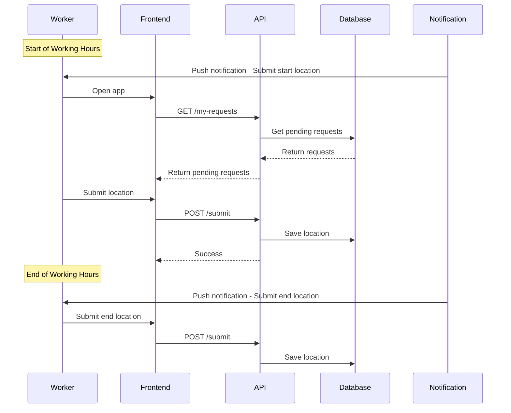
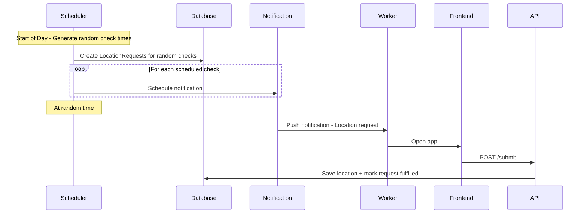
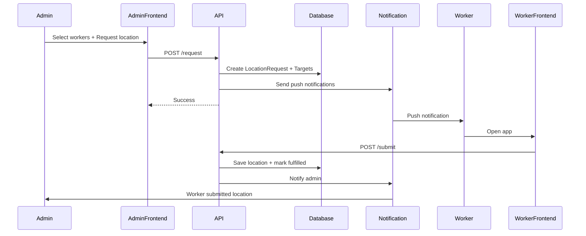
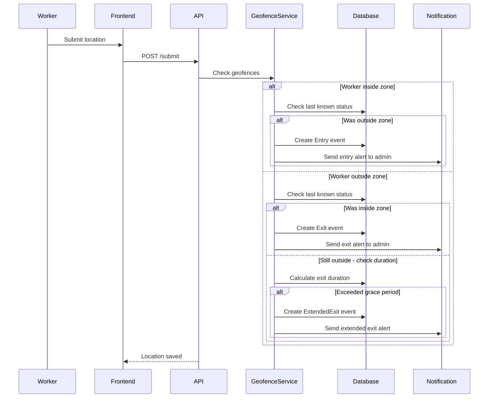

# Worker Location Tracking System Design

## Overview

A comprehensive location tracking system that allows company owners to track worker locations during working hours. The system supports two tracking modes and on-demand location requests.

## Requirements Summary

### Tracking Modes

1. **Start/End Mode**: Worker submits location at start and end of workday
2. **Random Interval Mode**: System requests location X times (3-5) at random times during working hours

### Additional Features
- Company owner can request on-demand location from one or more workers
- Working hours configuration per company
- Location history and reporting

## Database Schema

### 1. CompanyLocationSettings
```sql
CREATE TABLE CompanyLocationSettings (
    Id INT PRIMARY KEY IDENTITY,
    CompanyId INT UNIQUE NOT NULL, -- One setting per company
    IsLocationTrackingEnabled BIT NOT NULL DEFAULT 0,
    TrackingMode NVARCHAR(20) NOT NULL DEFAULT 'StartEnd', -- 'StartEnd' or 'RandomInterval'
    WorkingHoursStart TIME NOT NULL DEFAULT '08:00',
    WorkingHoursEnd TIME NOT NULL DEFAULT '17:00',
    RandomCheckCount INT NOT NULL DEFAULT 3, -- 3-5 random checks per day
    WorkingDays NVARCHAR(50) NOT NULL DEFAULT '1,2,3,4,5', -- Monday=1 to Sunday=7
    RequirePhoto BIT NOT NULL DEFAULT 0, -- Optional: require photo with location
    CreatedAt DATETIME2 NOT NULL,
    UpdatedAt DATETIME2 NULL,
    FOREIGN KEY (CompanyId) REFERENCES Companies(Id)
);
```

### 2. WorkerLocation
```sql
CREATE TABLE WorkerLocations (
    Id INT PRIMARY KEY IDENTITY,
    CompanyId INT NOT NULL,
    UserId INT NOT NULL,
    Latitude DECIMAL(10, 8) NOT NULL,
    Longitude DECIMAL(11, 8) NOT NULL,
    Accuracy DECIMAL(10, 2) NULL, -- GPS accuracy in meters
    LocationType NVARCHAR(50) NOT NULL, -- 'StartOfDay', 'EndOfDay', 'RandomCheck', 'OnDemand'
    RequestId INT NULL, -- Reference to LocationRequest if applicable
    PhotoUrl NVARCHAR(500) NULL, -- Optional photo
    Notes NVARCHAR(500) NULL, -- Optional notes from worker
    DeviceInfo NVARCHAR(500) NULL, -- Device info for audit
    RecordedAt DATETIME2 NOT NULL,
    CreatedAt DATETIME2 NOT NULL,
    FOREIGN KEY (CompanyId) REFERENCES Companies(Id),
    FOREIGN KEY (UserId) REFERENCES Users(Id)
);

CREATE INDEX IX_WorkerLocations_CompanyId ON WorkerLocations(CompanyId);
CREATE INDEX IX_WorkerLocations_UserId ON WorkerLocations(UserId);
CREATE INDEX IX_WorkerLocations_RecordedAt ON WorkerLocations(RecordedAt);
```

### 3. LocationRequest
```sql
CREATE TABLE LocationRequests (
    Id INT PRIMARY KEY IDENTITY,
    CompanyId INT NOT NULL,
    RequestedByUserId INT NOT NULL, -- Company admin who requested
    RequestType NVARCHAR(50) NOT NULL, -- 'OnDemand', 'RandomScheduled'
    ScheduledFor DATETIME2 NULL, -- For scheduled random checks
    Status NVARCHAR(20) NOT NULL DEFAULT 'Pending', -- 'Pending', 'Fulfilled', 'Expired', 'Cancelled'
    ExpiresAt DATETIME2 NULL, -- When the request expires
    FulfilledAt DATETIME2 NULL,
    Notes NVARCHAR(500) NULL,
    CreatedAt DATETIME2 NOT NULL,
    FOREIGN KEY (CompanyId) REFERENCES Companies(Id),
    FOREIGN KEY (RequestedByUserId) REFERENCES Users(Id)
);
```

### 4. LocationRequestTarget
```sql
CREATE TABLE LocationRequestTargets (
    Id INT PRIMARY KEY IDENTITY,
    RequestId INT NOT NULL,
    UserId INT NOT NULL,
    Status NVARCHAR(20) NOT NULL DEFAULT 'Pending', -- 'Pending', 'Fulfilled', 'Expired'
    LocationId INT NULL, -- Reference to submitted location
    CreatedAt DATETIME2 NOT NULL,
    FOREIGN KEY (RequestId) REFERENCES LocationRequests(Id),
    FOREIGN KEY (UserId) REFERENCES Users(Id),
    FOREIGN KEY (LocationId) REFERENCES WorkerLocations(Id)
);

CREATE INDEX IX_LocationRequestTargets_RequestId ON LocationRequestTargets(RequestId);
CREATE INDEX IX_LocationRequestTargets_UserId ON LocationRequestTargets(UserId);
```

## API Endpoints

### Company Settings (Admin)

| Method | Endpoint | Description |
|--------|----------|-------------|
| GET | `/api/location-tracking/settings` | Get company location settings |
| PUT | `/api/location-tracking/settings` | Update company location settings |

### Location Submission (Worker)

| Method | Endpoint | Description |
|--------|----------|-------------|
| POST | `/api/location-tracking/submit` | Submit location (start/end/random/ondemand) |
| GET | `/api/location-tracking/my-requests` | Get pending location requests for current worker |
| GET | `/api/location-tracking/my-history` | Get location history for current worker |

### Location Management (Admin)

| Method | Endpoint | Description |
|--------|----------|-------------|
| POST | `/api/location-tracking/request` | Request on-demand location from workers |
| GET | `/api/location-tracking/requests` | Get all location requests |
| PUT | `/api/location-tracking/requests/{id}/cancel` | Cancel a location request |
| GET | `/api/location-tracking/workers` | Get workers with their location status |
| GET | `/api/location-tracking/workers/{userId}/history` | Get location history for specific worker |
| GET | `/api/location-tracking/today` | Get today's location data for all workers |

## DTOs

### CompanyLocationSettingsDto
```csharp
public class CompanyLocationSettingsDto
{
    public int Id { get; set; }
    public bool IsLocationTrackingEnabled { get; set; }
    public string TrackingMode { get; set; } // "StartEnd" or "RandomInterval"
    public TimeSpan WorkingHoursStart { get; set; }
    public TimeSpan WorkingHoursEnd { get; set; }
    public int RandomCheckCount { get; set; } // 3-5
    public List<int> WorkingDays { get; set; } // 1=Monday, 7=Sunday
    public bool RequirePhoto { get; set; }
}

public class UpdateLocationSettingsRequest
{
    public bool IsLocationTrackingEnabled { get; set; }
    public string TrackingMode { get; set; }
    public TimeSpan WorkingHoursStart { get; set; }
    public TimeSpan WorkingHoursEnd { get; set; }
    public int RandomCheckCount { get; set; }
    public List<int> WorkingDays { get; set; }
    public bool RequirePhoto { get; set; }
}
```

### SubmitLocationRequest
```csharp
public class SubmitLocationRequest
{
    public double Latitude { get; set; }
    public double Longitude { get; set; }
    public double? Accuracy { get; set; }
    public string LocationType { get; set; } // "StartOfDay", "EndOfDay", "RandomCheck", "OnDemand"
    public int? RequestId { get; set; } // If responding to a request
    public string? Notes { get; set; }
    public IFormFile? Photo { get; set; }
}
```

### RequestLocationRequest
```csharp
public class RequestLocationRequest
{
    public List<int> UserIds { get; set; } // Workers to request location from
    public string? Notes { get; set; }
    public int? ExpiresInMinutes { get; set; } // Default 30 minutes
}
```

### WorkerLocationStatusDto
```csharp
public class WorkerLocationStatusDto
{
    public int UserId { get; set; }
    public string UserName { get; set; }
    public bool HasSubmittedStartLocation { get; set; }
    public bool HasSubmittedEndLocation { get; set; }
    public int RandomChecksCompleted { get; set; }
    public int RandomChecksExpected { get; set; }
    public DateTime? LastLocationTime { get; set; }
    public WorkerLocationDto? LastLocation { get; set; }
    public List<PendingLocationRequestDto> PendingRequests { get; set; }
}
```

## Background Jobs

### RandomLocationCheckJob
- Runs every minute
- Checks for companies with RandomInterval mode enabled
- Generates random check times for workers at start of day
- Creates LocationRequest records for scheduled checks
- Sends notifications to workers

### LocationRequestExpiryJob
- Runs every 5 minutes
- Marks expired location requests
- Sends notifications for expired requests

## Notification Flow

1. **Start of Day**: Notify workers to submit start location
2. **Random Checks**: Notify workers at scheduled random times
3. **On-Demand**: Immediate notification when admin requests
4. **End of Day**: Notify workers to submit end location
5. **Reminders**: If not submitted within X minutes, send reminder

## Frontend Components

### Admin Components

1. **LocationTrackingSettingsComponent**
   - Enable/disable tracking
   - Select tracking mode
   - Configure working hours
   - Set random check count
   - Select working days

2. **WorkersLocationDashboardComponent**
   - View all workers' location status
   - See who has submitted start/end locations
   - View random check progress
   - Request on-demand location

3. **WorkerLocationHistoryComponent**
   - View location history for specific worker
   - Map view of locations
   - Filter by date range

### Worker Components

1. **LocationSubmitComponent**
   - Submit current location
   - View pending requests
   - Location history

2. **LocationRequestNotificationComponent**
   - Handle location request notifications
   - Quick submit button

## Sequence Diagrams

### Start/End Mode Flow



### Random Interval Mode Flow



### On-Demand Location Request



## Geofencing Support

### Overview
Geofencing allows companies to define virtual boundaries around job sites. When workers enter or exit these zones, the system can trigger alerts and log events.

### Database Schema

#### GeofenceZone
```sql
CREATE TABLE GeofenceZones (
    Id INT PRIMARY KEY IDENTITY,
    CompanyId INT NOT NULL,
    ProjectId INT NULL, -- Optional: link to specific project
    Name NVARCHAR(200) NOT NULL,
    Description NVARCHAR(500) NULL,
    ZoneType NVARCHAR(50) NOT NULL, -- 'Circle', 'Polygon'
    
    -- For Circle type
    CenterLatitude DECIMAL(10, 8) NULL,
    CenterLongitude DECIMAL(11, 8) NULL,
    RadiusMeters INT NULL,
    
    -- For Polygon type (stored as GeoJSON)
    PolygonGeoJson NVARCHAR(MAX) NULL,
    
    IsActive BIT NOT NULL DEFAULT 1,
    AlertOnEntry BIT NOT NULL DEFAULT 0,
    AlertOnExit BIT NOT NULL DEFAULT 1,
    AllowedExitDurationMinutes INT NOT NULL DEFAULT 30, -- Grace period before alert
    CreatedAt DATETIME2 NOT NULL,
    UpdatedAt DATETIME2 NULL,
    FOREIGN KEY (CompanyId) REFERENCES Companies(Id),
    FOREIGN KEY (ProjectId) REFERENCES Projects(Id)
);

CREATE INDEX IX_GeofenceZones_CompanyId ON GeofenceZones(CompanyId);
CREATE INDEX IX_GeofenceZones_ProjectId ON GeofenceZones(ProjectId);
```

#### GeofenceEvent
```sql
CREATE TABLE GeofenceEvents (
    Id INT PRIMARY KEY IDENTITY,
    CompanyId INT NOT NULL,
    UserId INT NOT NULL,
    ZoneId INT NOT NULL,
    LocationId INT NOT NULL, -- Reference to WorkerLocation
    EventType NVARCHAR(50) NOT NULL, -- 'Entry', 'Exit', 'ExtendedExit'
    EventTime DATETIME2 NOT NULL,
    DurationMinutes INT NULL, -- For exit events, how long outside
    IsAlerted BIT NOT NULL DEFAULT 0, -- Whether alert was sent
    Notes NVARCHAR(500) NULL,
    CreatedAt DATETIME2 NOT NULL,
    FOREIGN KEY (CompanyId) REFERENCES Companies(Id),
    FOREIGN KEY (UserId) REFERENCES Users(Id),
    FOREIGN KEY (ZoneId) REFERENCES GeofenceZones(Id),
    FOREIGN KEY (LocationId) REFERENCES WorkerLocations(Id)
);

CREATE INDEX IX_GeofenceEvents_CompanyId ON GeofenceEvents(CompanyId);
CREATE INDEX IX_GeofenceEvents_UserId ON GeofenceEvents(UserId);
CREATE INDEX IX_GeofenceEvents_ZoneId ON GeofenceEvents(ZoneId);
CREATE INDEX IX_GeofenceEvents_EventTime ON GeofenceEvents(EventTime);
```

#### WorkerGeofenceAssignment
```sql
CREATE TABLE WorkerGeofenceAssignments (
    Id INT PRIMARY KEY IDENTITY,
    ZoneId INT NOT NULL,
    UserId INT NOT NULL,
    AssignedAt DATETIME2 NOT NULL,
    AssignedBy INT NOT NULL, -- Admin who assigned
    IsActive BIT NOT NULL DEFAULT 1,
    FOREIGN KEY (ZoneId) REFERENCES GeofenceZones(Id),
    FOREIGN KEY (UserId) REFERENCES Users(Id),
    FOREIGN KEY (AssignedBy) REFERENCES Users(Id)
);

CREATE UNIQUE INDEX IX_WorkerGeofenceAssignments_Unique 
    ON WorkerGeofenceAssignments(ZoneId, UserId) 
    WHERE IsActive = 1;
```

### Geofence Types

1. **Circle Zone**: Defined by center point and radius
   - Simple to configure
   - Good for general site boundaries
   
2. **Polygon Zone**: Defined by multiple vertices
   - More precise boundaries
   - Good for irregular site shapes

### Geofencing Workflow



### Geofencing API Endpoints

| Method | Endpoint | Description |
|--------|----------|-------------|
| GET | `/api/geofences` | Get all geofence zones for company |
| POST | `/api/geofences` | Create new geofence zone |
| PUT | `/api/geofences/{id}` | Update geofence zone |
| DELETE | `/api/geofences/{id}` | Delete geofence zone |
| POST | `/api/geofences/{id}/assign` | Assign workers to zone |
| DELETE | `/api/geofences/{id}/assign/{userId}` | Remove worker from zone |
| GET | `/api/geofences/{id}/workers` | Get workers assigned to zone |
| GET | `/api/geofences/events` | Get geofence events |
| GET | `/api/geofences/events/today` | Get today's geofence events |
| GET | `/api/geofences/worker/{userId}/status` | Get worker's current zone status |

### Geofencing DTOs

```csharp
public class CreateGeofenceZoneRequest
{
    public int? ProjectId { get; set; }
    public string Name { get; set; }
    public string? Description { get; set; }
    public string ZoneType { get; set; } // "Circle" or "Polygon"
    
    // For Circle
    public double? CenterLatitude { get; set; }
    public double? CenterLongitude { get; set; }
    public int? RadiusMeters { get; set; }
    
    // For Polygon
    public string? PolygonGeoJson { get; set; }
    
    public bool AlertOnEntry { get; set; }
    public bool AlertOnExit { get; set; }
    public int AllowedExitDurationMinutes { get; set; } = 30;
}

public class GeofenceZoneDto
{
    public int Id { get; set; }
    public int? ProjectId { get; set; }
    public string ProjectName { get; set; }
    public string Name { get; set; }
    public string? Description { get; set; }
    public string ZoneType { get; set; }
    public double? CenterLatitude { get; set; }
    public double? CenterLongitude { get; set; }
    public int? RadiusMeters { get; set; }
    public string? PolygonGeoJson { get; set; }
    public bool IsActive { get; set; }
    public bool AlertOnEntry { get; set; }
    public bool AlertOnExit { get; set; }
    public int AllowedExitDurationMinutes { get; set; }
    public int AssignedWorkerCount { get; set; }
}

public class GeofenceEventDto
{
    public int Id { get; set; }
    public int UserId { get; set; }
    public string UserName { get; set; }
    public int ZoneId { get; set; }
    public string ZoneName { get; set; }
    public string EventType { get; set; }
    public DateTime EventTime { get; set; }
    public int? DurationMinutes { get; set; }
    public bool IsAlerted { get; set; }
    public double Latitude { get; set; }
    public double Longitude { get; set; }
}

public class WorkerZoneStatusDto
{
    public int UserId { get; set; }
    public string UserName { get; set; }
    public int? CurrentZoneId { get; set; }
    public string CurrentZoneName { get; set; }
    public bool IsInsideZone { get; set; }
    public DateTime? LastLocationTime { get; set; }
    public DateTime? ExitTime { get; set; }
    public int? MinutesOutside { get; set; }
    public bool IsOverdue { get; set; }
}
```

### Frontend Components for Geofencing

#### Admin Components

1. **GeofenceMapComponent**
   - Interactive map to draw zones
   - Circle and polygon drawing tools
   - Preview zone boundaries

2. **GeofenceListComponent**
   - List all geofence zones
   - Enable/disable zones
   - View assigned workers

3. **GeofenceEventsComponent**
   - Real-time event feed
   - Filter by zone, worker, event type
   - Export events

4. **WorkerZoneStatusComponent**
   - Dashboard showing all workers' zone status
   - Color-coded indicators (inside/outside/overdue)
   - Click to view location on map

#### Worker Components

1. **WorkerZoneInfoComponent**
   - Show current zone status
   - Distance to zone boundary
   - Time remaining if outside

### Background Jobs

#### GeofenceMonitorJob
- Runs every minute
- Checks workers who have been outside zones
- Creates ExtendedExit events when grace period exceeded
- Sends escalation alerts

### Alert Configuration

| Alert Type | Trigger | Recipients |
|------------|---------|------------|
| Entry | Worker enters zone | Project manager (optional) |
| Exit | Worker exits zone | Project manager |
| Extended Exit | Outside > grace period | Project manager + Company owner |
| Return | Worker returns to zone | Project manager (optional) |

### Integration with Location Tracking

When a worker submits a location (any mode), the system automatically:
1. Saves the location record
2. Checks all active geofence zones the worker is assigned to
3. Determines if entry/exit events occurred
4. Creates events and sends alerts as configured
5. Updates real-time worker status

## Security Considerations

1. **Location Privacy**: Only company admins can view worker locations
2. **Data Retention**: Location data retained for X days (configurable)
3. **Consent**: Workers must accept location tracking policy
4. **Accuracy Validation**: Server validates GPS accuracy thresholds
5. **Rate Limiting**: Prevent location spamming
6. **Geofence Privacy**: Workers can view their assigned zones

## Implementation Order

### Phase 1: Core Location Tracking
1. Create database entities (CompanyLocationSettings, WorkerLocation, LocationRequest, LocationRequestTarget)
2. Implement DTOs and interfaces
3. Create LocationTrackingService
4. Create LocationTrackingController
5. Run database migration

### Phase 2: Background Jobs
6. Implement RandomLocationCheckJob
7. Implement LocationRequestExpiryJob
8. Configure Hangfire recurring jobs

### Phase 3: Geofencing
9. Create geofencing entities (GeofenceZone, GeofenceEvent, WorkerGeofenceAssignment)
10. Implement GeofenceService with circle/polygon detection
11. Create GeofenceController
12. Implement GeofenceMonitorJob
13. Run database migration for geofencing

### Phase 4: Frontend - Admin
14. Create LocationTrackingSettingsComponent
15. Create WorkersLocationDashboardComponent
16. Create GeofenceMapComponent (with drawing tools)
17. Create GeofenceListComponent
18. Create GeofenceEventsComponent
19. Create WorkerZoneStatusComponent

### Phase 5: Frontend - Worker
20. Create LocationSubmitComponent
21. Create WorkerZoneInfoComponent
22. Add location request notifications

### Phase 6: Finalization
23. Add translations (English/Arabic)
24. Integration testing
25. Documentation
